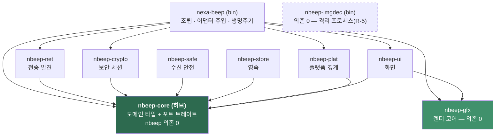
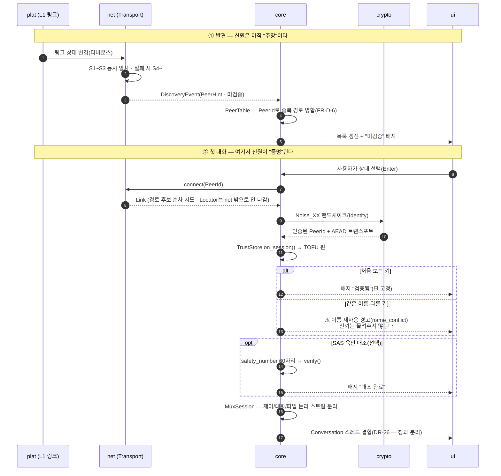
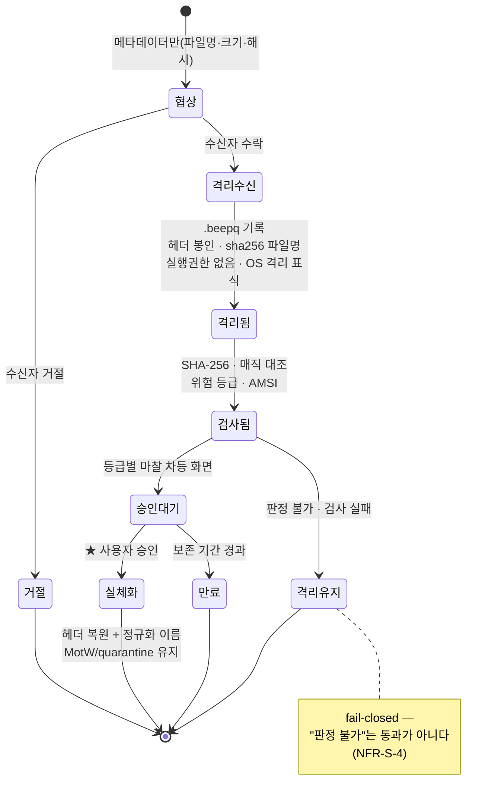
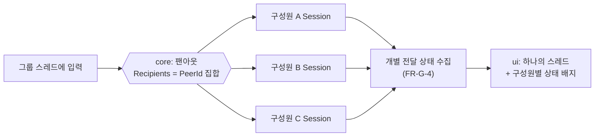
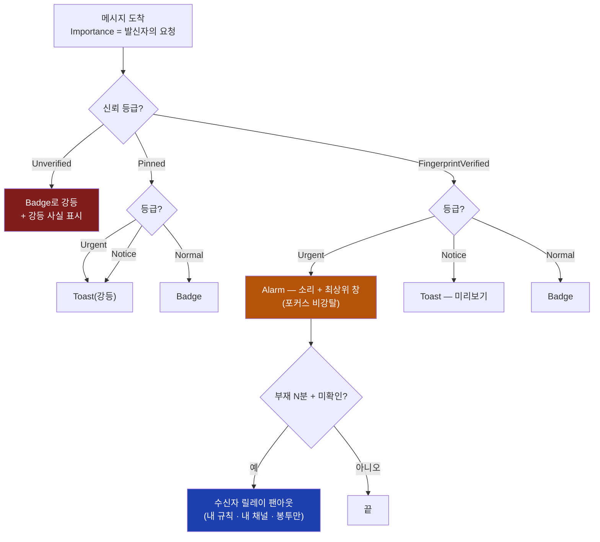
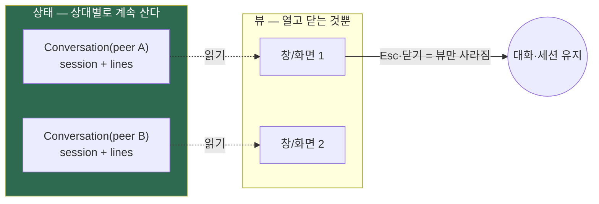
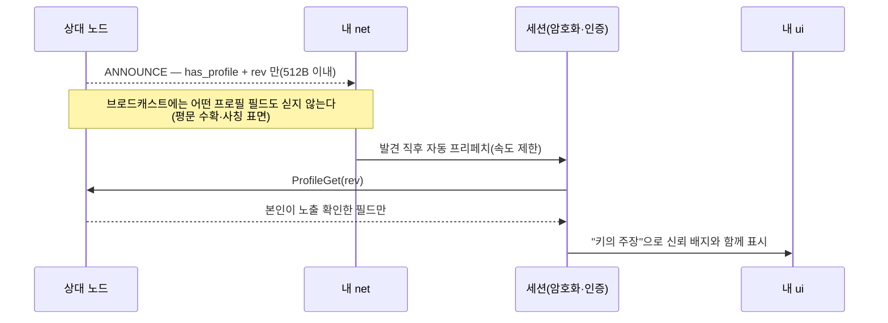
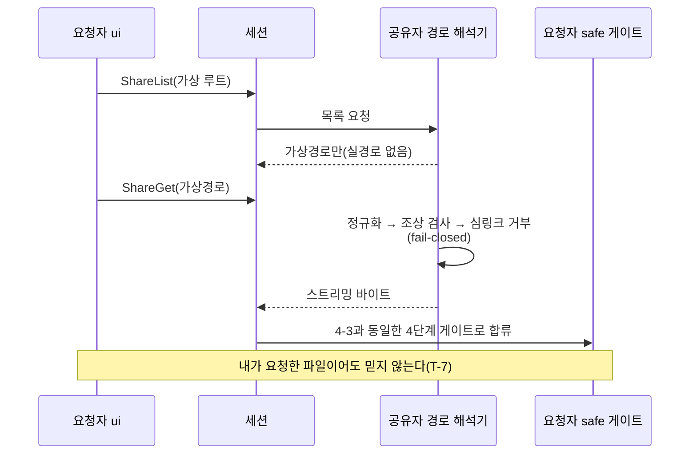
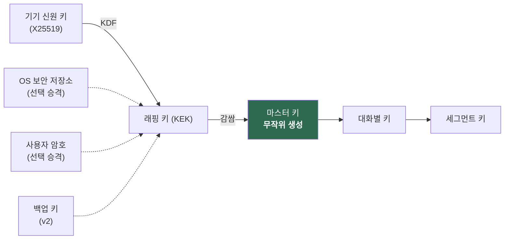

# 01 · 아키텍처 — 크레이트 구조 · 스레딩 · 데이터 흐름 · 영속성

> **ADR-0001~0010을 모듈 구조로 옮긴 문서** — 0001(Rust·자체 렌더링)→`gfx`/`ui`/`plat` · 0002(프로토콜)·0003(전송 경계)→`net`/`core` · 0004(무해화)→`safe` · 0005(기록 암호화)→`store` · 0006(수동 엔드포인트)→`net` · 0007(다중 기기)→`core`+`store` · 0008(프로필)→`core`/`store`/`ui` · 0009(공유 폴더)→`safe`+경로 해석기 · 0010(등급·알림·릴레이)→`core`+`plat` 포트.
> **작성 2026-08-08 · 현행화 2026-08-08(M3-12 시점).** 이 문서가 구조의 SSOT다 — 구조를 바꾼 커밋에서 함께 고친다([16 §2-4](16-doc-git-conventions.md)).
> **범례**: ✅ 구현됨 · 🚧 일부 구현 · 📐 설계만(코드 없음).

---

## 1. 설계 원리 — 네 개의 축

| 축 | 규칙 | 근거 |
|---|---|---|
| **플랫폼 중립 우선** | 플랫폼 의존 코드는 `plat` 하나에 격리. 나머지는 전부 4타깃 공통 | NFR-C-3 |
| **신원 중심** | 상위 계층은 `PeerId`만 안다. IP·소켓·경로는 `net` 안에서만 | [ADR-0003](09-adr-0003-transport-abstraction.md) 규칙 1~5 |
| **암호는 전송 위** | `crypto`는 **core의 `Link`(바이트 관) 위**에 앉고 **`net`을 모른다**(M2-1a에서 `Link`를 net→core로 이관해 크레이트 경계로 강제). 전송 구현이 무엇이든 평문은 두 단말에만 | DR-7 · FR-R-3 |
| **신뢰 못 할 입력은 격리** | 이미지 디코드는 **별도 프로세스**. 수신 파일은 `safe` 게이트를 통과해야 실체가 됨 | FR-S-12 · R-5 |

---

## 2. 크레이트 구조

```
nexa-beep/                     (bin)  진입 · 조립 · 생명주기
├── nbeep-core     도메인+횡단   ActionKind 단일 통로 · 인터셉터 · 포트 4종 · 신원(PeerId/UserId)
│                               Link/Session/Mux 경계 · 피어 테이블 · 메시지 봉투/시퀀스/팬아웃
│                               TOFU 판정 · 텍스트 무해화(SafeText)
├── nbeep-net      전송·발견     Transport 경계 · LocalDirect · InMemory · L1~L4
├── nbeep-crypto   보안 세션     Noise_XX 핸드셰이크(snow) · AEAD · Identity(X25519=PeerId) · SAS 파생
├── nbeep-safe     수신 안전     .beepq 격리 컨테이너 · 위험 등급 · 검사 · 실체화
├── nbeep-store    영속          대화 기록 · 설정 · TOFU 핀 · 그룹 · 데이터 경로 결정
├── nbeep-gfx      렌더 코어     CPU 래스터라이저 · 텍스트 스택 · 픽셀 버퍼
├── nbeep-ui       화면          컨트롤 · 레이아웃 · 화면 조립 (gfx 위, 플랫폼 중립)
├── nbeep-plat     플랫폼 경계   창 · 입력/IME · 폰트 열거+mmap · DPI · 트레이 · 알림 · **소리 포트** ·
│                               OS 격리 표식 · 링크 상태 구독(L1) · AMSI
└── nbeep-imgdec   (bin) 이미지 디코드 전용 — 권한 강등 별도 프로세스
```

> ⚠️ **현재 경계 위반 1건(정정 08-08)** — **창·입력·DPI는 아직 `plat`이 아니라 bin(`winit`/`softbuffer`)에 있다.** `plat`에 실제로 있는 것은 `font`(시스템 폰트 열거 + memmap2 매핑)뿐이고, **이관은 M3**다([10 §3](10-decision-record.md)).
> **소리 재생도 `plat` 포트**로 들어온다(ADR-0010 · M3-8) — Win `winmm` / mac `NSSound` / **Linux는 D-Bus 알림 데몬 `sound-name`**(libcanberra는 LGPL이라 DR-12 금지) · 없으면 무음 폴백을 표시.

**전부 rlib 정적 링크 → 산출물은 실행 파일 2개**(본체 + `imgdec`). `imgdec`을 분리한 대가는 파일 2개이고, 얻는 것은 **파서 취약점이 본체를 못 건드린다**는 성질이다(R-5).

### 의존 방향 (단방향 — 역참조 금지 · **의존성 역전**)

> **정정(08-08 · M0-1 구현)**: 초판 다이어그램이 `core → crypto → net` 화살표로 읽혀 본문("core는 net·gfx·plat을 모른다")과 어긋났다. 실제 카고 의존은 **의존성 역전**([13 §2-4](13-code-design-standards.md)) — **core가 포트를 선언하고 어댑터가 core에 의존**한다. 화살표는 **"cargo 의존" 방향**으로 통일한다(A→B = A가 B에 의존).



> 화살표 = **cargo 의존 방향**(A→B는 A가 B에 의존). **`core`로만 화살표가 모이는 모양 자체가 의존성 역전의 그림**이다.

- **`core`는 어떤 nbeep 크레이트에도 의존하지 않는다**(`cargo tree -p nbeep-core` = 자기 자신뿐). 순수 도메인 — 네트워크·화면 없이 테스트된다.
- **어댑터(`net`/`crypto`/`safe`/`store`)가 `core`에 의존**하고 core가 선언한 포트를 구현한다. 본체(`nexa-beep`)가 조립 시점에 주입한다.
- `ui`는 `core` 상태를 읽어 `gfx`로 그린다. `net`을 직접 부르지 않는다.
- **`net`의 `Locator`(IP·포트)는 크레이트 밖으로 나가지 않는다** — 모듈 가시성으로 강제([ADR-0003 §3](09-adr-0003-transport-abstraction.md)).

### 크레이트별 책임

| 크레이트 | 하는 일 | 하지 않는 일 | 실제 모듈 (2026-08-08) | 상태 |
|---|---|---|---|:--:|
| **core** | 피어 목록·대화 스레드·그룹·메시지 시퀀스·차단/속도 제한 판정 | I/O 일절 | `action` `pipeline` `ports` `identity` `trust` `trusted` `session` `mux` `link` `chat` `peers` `name` `safetext` `redact` `testkit` | ✅ |
| **net** | 발견 S1~S6 · 인터페이스 열거/바인딩 · TCP `Link` 생성 · 재연결 | 암호화 · 메시지 의미 해석 | `transport` `inmem`(fake) | 🚧 경계·fake만 — **실물 소켓은 M1-2~4** |
| **crypto** | Noise `XX` 핸드셰이크 · AEAD · `Identity`(X25519 정적키=`PeerId`) · SAS `safety_number` 파생 | 소켓 · 저장 · **신뢰 판정**(TOFU는 core `trust`/`trusted` — 세션과 신뢰가 서로를 모르게) | `noise`(snow) `sas` `plain`(스텁) | ✅ |
| **safe** | `.beepq` 컨테이너 · 매직 대조 · 위험 등급 · 승인 실체화 · 아카이브 검증 | 실행(코드에 실행 API 자체가 없다 — FR-S-9) | — | 📐 **M4** |
| **store** | 기록·설정·핀·그룹 영속 · **포터블/폴백 경로 결정** · **at-rest 암호화·블라인드 인덱스·크립토 셰레딩**([ADR-0005](17-adr-0005-history-at-rest.md)) | 도메인 판단 | — | 📐 **M2-5** |
| **gfx** | 픽셀 버퍼 래스터화 · 폰트 셰이핑/글리프 · 무효화 사각형 | 창 · 입력 | `surface` `text`(ab_glyph) | ✅ |
| **ui** | 컨트롤·레이아웃·화면 · 입력 라우팅 | 플랫폼 API | `widget` `draw` `raster` `event` `geom` `theme` `typeahead` `peer_list` `chat_view` `settings` | 🚧 M3 진행 |
| **plat** | 창/입력/IME/폰트열거/DPI/트레이/알림/링크상태/격리표식/AMSI | 도메인 판단 | `font`(mmap — R-15) · 창·입력은 bin의 winit 경유 | 🚧 폰트만 |

---

## 3. 스레딩 모델

| 스레드 | 역할 | 규칙 |
|---|---|---|
| **UI 스레드 (1)** | 입력 처리 · 렌더 · 상태 표시 | **블로킹 금지.** 파일·소켓·암호 연산을 여기서 하지 않는다. **창은 N개일 수 있으나 스레드는 1개** — 입력·레이아웃·그리기를 `WindowId` 단위로 라우팅한다(DR-26 · M3-12) |
| **네트워크 워커** | 발견 송수신 · 세션 I/O · 핸드셰이크 | 인터페이스별 병렬(S1~S3 동시 — [08 §5](08-adr-0002-discovery-transport.md)) |
| **파일 I/O 워커** | 전송 스트리밍 · 해시 · 무해화 | 상한 있는 풀. 전체 파일 메모리 적재 금지(FR-X-5) |
| **타이머** | 발표 주기 · 타임아웃 · 디바운스 | 저빈도(NFR-B-7) |
| **릴레이 워커**(📐 M3-10) | 수신자 릴레이 외부 채널 **병렬 발송** | 채널별 **개별 타임아웃** · **상한 큐**(초과 시 억제 후 앱 안에서 요약) · 부분 실패 정상 종료 · 자격 증명은 사용 후 zeroize |
| **`imgdec` 프로세스** | 이미지 디코드 | 권한 강등 · 상한 · 크래시해도 본체 무사 |

**통신은 채널(메시지 패싱)** — 공유 잠금을 최소화한다. UI로 올라가는 것은 **이벤트 + 무효화 사각형**뿐이고, UI는 `core` 상태의 스냅샷을 읽는다.

> **누수 방지(NFR-B-6)는 여기서 결판난다.** 모든 워커·타이머·소켓·세션은 **소유자가 명확한 핸들**로 관리하고, 종료 경로를 테스트한다. 상한 없는 큐는 금지.

---

## 4. 데이터 흐름

### 4-1. 발견 → 목록 → 첫 대화 (✅ 08-08 InMemory 종단 데모로 실증)



| 단계 | 판정 | 근거 |
|---|---|---|
| 발견 패킷 | **미검증 힌트** — 신원을 주장하지 않는다 | [08 §2](08-adr-0002-discovery-transport.md) |
| 핸드셰이크 성립 | 상대가 **그 개인키를 갖고 있음**이 증명됨 | [21 §4-2](21-identity-spec.md) |
| TOFU 핀 | *"이 키를 처음 봤다"* 를 기억 — 신뢰는 **키에만** 쌓인다 | [21 P-8](21-identity-spec.md) |
| SAS 대조(선택) | 최초 접촉 MITM까지 닫는 유일한 수단. **60자리**(12자리=40비트는 생일 공격 2²⁰) | FR-S-4 · M2-2b |

> ⚠️ **v1에 "지문 불일치 차단"은 성립하지 않는다** — `PeerId`가 곧 공개키라 **키가 다르면 애초에 다른 항목**이다. v1의 실제 보호는 **신뢰 불상속 + 이름 재사용 경고**이고, 원래 시나리오는 **v2 `UserId` 핀**에서 실체가 된다(FR-S-30 · [21 §3-4](21-identity-spec.md)).

### 4-3. 파일 수신 (무해화 게이트)



> **원본 파일명은 승인 전까지 파일시스템에 쓰지 않는다**(FR-S-7). **앱은 어떤 단계에서도 수신 파일을 실행하지 않는다** — 실행 API가 코드에 없다(FR-S-9).

### 4-4. 그룹 전송 (v1 팬아웃)



> ★ **이 팬아웃 하나가 세 곳에서 재사용된다** — 1:1(원소 1개) · 그룹 · (v2)다중 기기(FR-G-6 · DR-20 V1-2). [24 §6-4](24-adr-0010-message-priority-notification.md)의 **수신자 릴레이 채널 팬아웃도 같은 모양**이고 원소만 `RelayChannel`로 바뀐다.

### 4-5. 메시지 도착 → 알림 강도 판정 (📐 [ADR-0010](24-adr-0010-message-priority-notification.md))



> **발신자가 정하는 것은 왼쪽 하나뿐**이고, 나머지 분기는 전부 수신자 쪽 값이다([24 §2](24-adr-0010-message-priority-notification.md)).

### 4-6. 대화 상태와 창의 분리 (✅ DR-26 · [14 §11](14-control-ux-architecture.md))



> **창 모드(Single/Separate)는 뷰 계층만의 문제**다 — M3-12에서 다중 창으로 전환할 때 `Conversation`·세션·도메인 코드 변경이 **0**이었던 것이 이 분리의 증명이다.

---

### 4-7. 프로필 조회 (📐 [ADR-0008](22-adr-0008-profile-disclosure.md))



### 4-8. 공유 폴더 pull (📐 [ADR-0009](23-adr-0009-shared-folders.md))



> ★ **실경로는 공유자 프로세스 밖으로 나가는 어떤 화살표에도 실리지 않는다.**

## 5. 영속성 (store)

### 데이터 경로 결정 (DR-4 · FR-P-3)

```
1) 실행 파일 옆 data/ 에 쓰기 가능?  → 포터블 모드로 사용
2) 불가(설치본·읽기 전용 매체)      → 사용자 데이터 폴더로 폴백
3) 어느 쪽을 썼는지 UI에서 확인 가능
```

### 키 계층 (FR-S-32 · [17 §3](17-adr-0005-history-at-rest.md))



> **✂ 크립토 셰레딩 지점** — 세그먼트 키 폐기 = 그 조각 삭제 · 대화별 키 폐기 = 그 대화 삭제 · 마스터 키 폐기 = 전체 초기화(FR-S-21).
> ⚠️ **화살표가 `KEK`에서 갈리는 것이 핵심**이다 — 보호 수준을 바꿔도 **마스터 키를 다시 감싸기만** 하면 되므로 **전 기록 재암호화가 없다**. `UserId` 키는 **이 그림에 없다**(서명 전용 — FR-S-36).

### 저장 항목

| 항목 | 내용 | 주의 |
|---|---|---|
| 신원 키 | X25519 정적 키쌍 | **개인키는 로컬에만**(NFR-S-1) · 파일 권한 최소 · **포터블이면 매체와 함께 이동**([08 §4](08-adr-0002-discovery-transport.md)) · ⚠️ **R-12 — 이 파일이 곧 신원이다**: 폴더 복사·골든 이미지·VM 클론이면 같은 `PeerId`가 둘이 되고 **복제본이 원본 기록을 연다**. 방지는 불가(막으면 DR-1·DR-4가 깨진다) → **탐지**(U-P1·U-P2 · 🔴 D-22) → [21 §5](21-identity-spec.md) |
| TOFU 핀 | PeerId → 공개키 · 최초 확인 시각 · 변경 이력 | 이력은 지우지 않는다 |
| 대화 기록 | 스레드·메시지·시퀀스 | **암호화 세그먼트**(AEAD·논스 base+seq·AAD 인증). 첨부는 별도 블랍 |
| 검색 인덱스 | 블라인드 역색인(HMAC 토큰) | **평문 인덱스 금지**(FR-S-19) |
| 저장 키 | **기기 키 → 래핑 키(KEK) → [래핑된] 마스터 키 → 대화별·세그먼트별 데이터 키** | ⚠️ **마스터 키를 기기 키에서 직접 파생하지 않는다**(FR-S-32 · DR-20 V1-4) — 재래핑만으로 보호 수준을 바꾸고 **데이터 재암호화가 없다**. `UserId` 키는 **서명 전용**이라 래핑에 쓰지 않는다(FR-S-36). **키 폐기 = 삭제**(크립토 셰레딩) |
| 그룹 | 로컬 그룹 정의(FR-G-1) | 서버 개념 없음 |
| 설정 | 표시 이름·테마·언어·발견 옵션(S5 동의 여부) | **기본값만으로 동작**해야 함(FR-D-1) |
| 격리 보관소 | `.beepq` 컨테이너 | 보존 기간 후 자동 삭제 |

> 저장 형식은 M0/M1에서 확정한다. 기준은 **크기·의존성 최소**(DR-5) 와 **손상 복원력**.

---

## 6. UI 구조

```
┌─ plat / bin ────────────────────────────────────────────────┐
│  창 · 입력/IME · DPI 배율   (현재 bin의 winit/softbuffer)     │
│  WinEntry 맵: WindowId → 역할(Main | Chat(peer))  ← DR-26    │
└──────────────────────┬──────────────────────────────────────┘
                       │ 이벤트(플랫폼 중립 타입) ↕ 픽셀 버퍼
┌──────────────────────▼──────────────────────────────────────┐
│  ui: Widget 트리 → 레이아웃 → 무효화 사각형만 다시 그림       │
│         │                                                    │
│         ▼  ★ 위젯은 백엔드를 모른다 (DR-21의 UI판)            │
│      DrawCtx  (그리기 "어휘" — 추상)                          │
│         ▲                                                    │
│      RasterCtx (어휘의 CPU 구현)                              │
└──────────────────────┬──────────────────────────────────────┘
                       ▼
        gfx: Surface(픽셀) + Font/text(ab_glyph)
```

**화면 목록**

| 화면 | 근거 | 상태 |
|---|---|:--:|
| 피어 목록(타입어헤드·신뢰 배지) | FR-D-2 · FR-U-4 | ✅ |
| 대화(스레드·입력·한글 IME) | FR-M-1 | ✅ |
| **상대별 별도 대화 창**(옵션) | DR-26 · FR-U-18 | ✅ M3-12 |
| **설정(VS Code 방식)** | DR-24 | 🚧 M3-11 |
| SAS 대조 | FR-S-4 | ☐ M3-6 |
| 전송 승인(등급별 마찰) | FR-S-10 | ☐ M4 |
| **프로필 노출 확인(미리보기)** | ADR-0008 | ☐ M3-7 |
| **공유 목록 관리** | ADR-0009 | ☐ M4-7 |
| **알림 정책 · 릴레이 규칙** | ADR-0010 | ☐ M3-8/10 |
| 그룹 | FR-G-1 | ☐ M5 |
| 기기 관리 | ADR-0007 §9-2 | ⏸ v2 |

- **`nexa-dir2`의 `nexa-gui` 인프라(`DrawCtx`·`Widget`·`event`·`geom`·`theme`·`edit`·`typeahead` — 1,187 LOC)를 이식**하고, `ctl` 14종의 **시각 규약**(`Style` 팔레트·공통 자동 높이·`behind` 배후색)을 계승한다. **`ctl` 코드 자체는 HWND 모델이라 재사용하지 않는다** — 실측 근거 [12 차용 자산 평가](12-asset-reuse.md).
- 가시 영역만 그린다 — `nexa-dir2`가 100k 행에서 검증한 방식(NFR-B-12).
- 텍스트는 **표시 전에 무해화**(RLO·제어문자 — FR-S-13). `ui`가 아니라 `core`/`safe` 경계에서 처리해 한 곳에서만 한다.

---

## 7. 오류·실패 정책

| 원칙 | 내용 |
|---|---|
| **fail-closed** | 검사 실패·판정 불가는 "통과"가 아니라 "격리 유지"(NFR-S-4) |
| 부분 실패 허용 | 인터페이스 하나가 실패해도 나머지로 계속. 피어 하나가 실패해도 그룹 전송은 진행 |
| 사용자 표시 | **사실만.** "안전함" 보증 금지(NFR-S-5) |
| 로그 | 로컬에만. **외부 전송 금지**(NFR-O-5) |

---

## 8. 테스트 전략

| 층 | 방법 |
|---|---|
| `core` | 순수 단위 테스트(I/O 없음) — 대화·그룹·시퀀스·중복 제거·속도 제한 |
| `crypto` | 핸드셰이크·TOFU 전이(핀 없음/일치/불일치)·SAS 결정성 |
| `safe` | **회귀 필수** — 격리물이 실행 불가한가 · 복원 후 격리 표식이 남는가 · Zip Slip/압축폭탄 거부 · RLO 파일명 · **가상경로 traversal·심링크 탈출 거부**(ADR-0009 fail-closed) |
| 세션·App 전체 | **`InMemoryTransport`로 네트워크 없이**([ADR-0003 §1](09-adr-0003-transport-abstraction.md)) — 4타깃 CI에서 실행 |
| `net` 실제 | **실기 2대 이상**(NFR-O-3) · [06 §7](06-network-stack.md) E-1~E-9 |
| `ui` | 위젯 단위 — 레이아웃·이벤트 라우팅·**무효화 최소성**(캐럿 이동 = 행 2개 rect만 — FR-U-13) |
| bin 조립 | `tests/draw_backend.rs`·`tests/text_stack.rs` — **조립 지점에서만 가능한 통합**(gfx는 파일을 못 읽고 plat은 gfx를 모른다) |
| 예산 | CI 게이트 — 크기·유휴 RSS·**24h 상주 누수** |

---

> 다음: [02 로드맵](02-roadmap.md).
