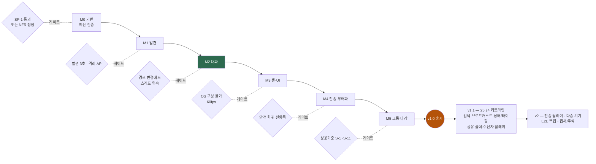

# 02 · 로드맵 — M0 ~ M5 + 포스트

> [01 아키텍처](01-architecture.md)를 **순서**로 옮긴 문서. 각 마일스톤은 **수직 슬라이스**로 자르고, 끝에 **게이트 실측**을 둔다([15](15-dev-methodology.md)).
> 진행 상태의 SSOT는 [MILESTONES](MILESTONES.md)·[TODO](TODO.md) — 이 문서는 **원안**이다.
> **작성 2026-08-08.**

---

> **정정(2026-08-08 · ADR-0007~0010 · DR-24/25/26 반영)** — 원안 이후 추가된 계획 항목: **M0-2b**(SP-2 TLS 크기) · **M2-2b**(SAS 60자리) · **M2-4b**(등급·ack 프로토콜 자리) · **M3-7~M3-12**(프로필·알림 강도·수신확인·수신자 릴레이·설정 화면·다중 창) · **M4-7/8**(공유 폴더) · **M1-9**(링크로컬 직결). 리스크 **R-10~R-15**도 아래 표에 반영했다([16 §2-5](16-doc-git-conventions.md) — 과거 항목은 지우지 않는다).

> ★ **M2가 초록인 이유** — **M2 종료 = 자체 사용(dogfooding) 시작점**이다(발견 + 암호화 대화 + 기록). [25 §4](25-feature-scope.md): *"M2를 앞당기는 것이 기능 목록 전체보다 중요하다."*

## 편성 원리

1. **가장 무서운 것부터.** 예산(SP-1)과 발견 도달(E-3)이 실패하면 제품 자체가 성립하지 않는다. 뒤로 미루면 늦게 안다.
2. **각 마일스톤 끝에 "쓸 수 있는 것"이 남는다.** M1이 끝나면 목록이 뜨고, M2가 끝나면 대화가 된다.
3. **보안은 기능 뒤에 붙이지 않는다.** 무해화·TOFU는 해당 기능과 **같은 마일스톤**에 들어간다.
4. **예산 게이트는 마일스톤마다 잰다.** 마지막에 몰아서 최적화하는 것은 실패 경로다.
5. **횡단 구조는 기능보다 먼저.** 로그·검증·계측·정책은 나중에 끼워 넣으면 반드시 구멍이 생긴다 — M0-1b에서 골격부터 세운다([13](13-code-design-standards.md)).

---

## M0 — 기반 · 예산 검증

> **목표: "이 예산이 가능한가"에 답한다.**

| # | 내용 |
|---|---|
| M0-1 | Cargo 워크스페이스 스캐폴딩 · `rust-toolchain.toml` · release 프로파일 · 4타깃 · 린트/테스트 러너. **최소 지원 OS·MSRV 확정**([07 §8](07-adr-0001-stack.md)) |
| M0-1b | **★ 횡단 골격 선구축**([13](13-code-design-standards.md)) — `ActionKind` · `ActionCtx` · `Interceptor` 파이프라인 · 포트 스켈레톤(`Clock`/`Rng`/`Meter`/`Tracer`). **기능보다 먼저** |
| M0-2 | **★ SP-1 스파이크**(D-15) — 빈 창 4타깃 크기·RSS · 텍스트 스택 증가분 · **한글 IME** · 500행 60fps · **의존성 라이선스 전수** |
| M0-3 | CI — 4타깃 build/test/lint + **예산 게이트**(크기·RSS·임포트 화이트리스트) |
| M0-4 | [18 빌드&테스트](18-build-and-test.md) SSOT 실내용 · [10 §3 의존성 원장](10-decision-record.md) 개시 |
| **M0-2b** | **SP-2 TLS 크기 실측**(R-14 · Q-24-1) — `rustls`+`webpki-roots` vs OS TLS 4타깃 증가분. **초과 시 FR-S-43(수신자 릴레이)을 v2로** |

**게이트** — SP-1 통과 또는 [05 NFR-B](05-requirements.md) 정정 확정. ⚠️ **R-8은 크기 차원만 해소**(08-08 · 릴리스 0.76MB vs 10MB · CI 4타깃 게이트 발효) — **메모리 차원 미해소**(mac 유휴 RSS 85.7MB vs NFR-B-1 30MB · phys_footprint 재실측 필요) · SP-1b/d/e는 **실기 대기**.

---

## M1 — 발견 (첫 수직 슬라이스)

> **목표: 두 대를 켜면 서로 목록에 뜬다.** 대화는 아직 안 된다.

| # | 내용 |
|---|---|
| M1-1 | `net` 골격 — `Transport` 경계 · `InMemoryTransport`(테스트용) |
| M1-2 | L1 링크 상태 **구독** 3구현(D-13) + 디바운스 |
| M1-3 | 와이어 포맷 확정 · 인터페이스별 바인딩(`IP_MULTICAST_IF`/`IP_PKTINFO`) · **소켓 옵션 검증표**(D-14) ⚠️ **🔴 D-22(R-12 `instance` 필드) 확정이 선행 조건** — 이후엔 포맷 변경이다 |
| M1-4 | 발견 **S1~S3**(IPv6/IPv4 멀티캐스트 · 브로드캐스트) 동시 시도 |
| M1-5 | `core` 피어 목록 — PeerId 병합(FR-D-6) · 이탈 판정(FR-D-8) |
| M1-6 | 최소 UI — 목록 1줄 표시(gfx/ui 최소 경로) |
| M1-7 | **★ D-8 스파이크 E-1~E-9** → 타이밍 파라미터 확정 → [ADR-0002 §8](08-adr-0002-discovery-transport.md) 정정 |
| M1-8 | **S4**(ARP/NDP 유니캐스트 프로브) — E-3 결과 기반 |

**게이트** — 발견 ≤3초(P95, NFR-B-8) · **클라이언트 격리 AP에서 S4로 발견 성공**(S-3) · 유휴 RSS·CPU 예산.

---

## M2 — 대화 (신원 확정)

> **목표: 목록에서 고르면 암호화된 1:1 대화가 된다.**
> ★ **M2 종료 = 자체 사용(dogfooding) 시작점** — 발견 + 암호화 대화 + 기록이 갖춰진다. [25 §4](25-feature-scope.md): *"M2를 앞당기는 것이 기능 목록 전체보다 중요하다."*

| # | 내용 |
|---|---|
| M2-1 | `crypto` — Noise_XX 핸드셰이크 · AEAD 트랜스포트 |
| M2-2 | **TOFU** — 핀 저장 · 지문 불일치 시 차단·경고·이력([08 §4](08-adr-0002-discovery-transport.md)) |
| M2-3 | `Session` 다중화(제어/대화) · 프레임 상한 · 백프레셔 |
| M2-4 | 1:1 텍스트 송수신 · 논리 시퀀스 · 중복 제거 |
| M2-5 | `store` — 데이터 경로 결정(포터블/폴백) · **암호화 대화 기록 저장**([ADR-0005](17-adr-0005-history-at-rest.md)) · 키 계층 · **동기화 폴더 감지 경고** · 크립토 셰레딩 |
| M2-6 | 텍스트 **무해화**(RLO·제어문자 — FR-S-13) · 링크 자동 열기 금지(FR-S-14) |
| **M2-2b** | **SAS 60자리 상향** — 12자리(40비트)는 MITM 생일 공격 **2²⁰**. Signal 규격으로(✅ 완료) |
| **M2-4b** | **등급·확인 프로토콜 자리**(N-1~N-4) — 봉투 `importance` 1B · `ack` 제어 타입 · 기록 상태 필드 · `ActionKind` 5종. ⚠️ **M2-4와 같은 슬라이스**(나중이면 포맷 변경) · 🔴 D-23 종속 |
| M2-7 | UI 상태 배지 — **미검증 / 검증됨 / 대조 완료** |

**게이트** — 재연결·경로 변경에도 **대화 스레드 연속**(ADR-0003 규칙 3) · `InMemoryTransport`로 상위 계층 테스트 green.

---

## M3 — 셸 · UI 본체

> **목표: 매일 켜 둘 수 있는 프로그램이 된다.**

| # | 내용 |
|---|---|
| M3-1 | **위젯 세트 신규 구현** — `nexa-gui` 인프라 이식 + `ctl` 시각 규약 계승([12](12-asset-reuse.md)). ⚠️ `ctl` 코드는 재사용하지 않으므로 **규모를 이 전제로 산정** |
| M3-2 | 트레이 상주 · 알림 팝업/사운드(FR-U-2) |
| M3-1b | **OS 동작 어댑터**(`PlatformConventions`) — 수정 키·표준 단축키·스크롤·컨텍스트 메뉴·창 닫기([14 §6](14-control-ux-architecture.md)) |
| M3-1c | **macOS 시각 언어 수치표 확정** — 라운드 반경·간격·타이포 단계. 시안 대조 후([14 §9](14-control-ux-architecture.md)) |
| M3-3 | **IME 완성**(FR-U-7) · 고DPI(FR-U-6) · 다크/라이트(FR-U-5) |
| M3-4 | 다국어 한/영(FR-U-3) · 키보드 우선 조작(FR-U-4) |
| M3-5 | 상태(자리비움)·타이핑 표시(FR-M-5) · **블라인드 인덱스 전문 검색**(FR-M-4/S-19 — 한국어 음절 n-gram) |
| M3-6 | **SAS 지문 대조 UX**(FR-S-4) |
| **M3-7** | **프로필**(ADR-0008) — 노출 확인 UX(미리보기) · 세션 경유 프리페치 |
| **M3-8** | **알림 강도 UI**(ADR-0010) — 배지/토스트/**최상위 창(포커스 비강탈)** · **소리 포트 3어댑터**(Linux는 D-Bus 알림 데몬) · 신뢰 강등표 |
| **M3-9** | **수신 확인 UX** — 확인 버튼(자동 금지) · 발신자 쪽 전달/확인 상태 |
| **M3-10** | **수신자 릴레이**(ADR-0010 §6) — `RelayChannel` 포트 + Webhook/SMTP · **다중 어댑터 팬아웃** · 규칙 `조건→채널 집합`. ⚠️ **M0-2b 결과 종속** · **25 §4는 v1.1 권고** |
| **M3-11** | **설정 화면(VS Code 방식)**(DR-24) — Entry 레지스트리 · AND 토큰 검색 · 즉시 적용 |
| **M3-12** | **상대별 별도 대화 창**(DR-26 · FR-U-18) — 상태-뷰 분리 · 창 모드 옵션 (✅ 구현 · 잔여 = 설정 연동) |

**게이트** — S-7(스크린샷 대조로 OS 구분 불가) · 60fps · 유휴 RSS.

---

## M4 — 전송 · 무해화

> **목표: 파일을 안전하게 주고받는다.**

| # | 내용 |
|---|---|
| M4-1 | **ADR-0004 확정**(D-12) — `.beepq` 포맷·위험 등급·승인 UX |
| M4-2 | 파일 드래그앤드롭 · **폴더 전송**(FR-X-1/2) · 스트리밍·진행률·취소 |
| M4-3 | **무해화 게이트 4단계**(FR-S-5~10) + OS 격리 표식(MotW/quarantine) + AMSI |
| M4-4 | 아카이브 안전 처리 — Zip Slip·압축폭탄(FR-S-11) |
| M4-5 | **`imgdec` 별도 프로세스** — 이미지 격리 디코드·재인코딩(FR-S-12) |
| M4-6 | 오프라인 큐(FR-M-3) |
| **M4-7** | **공유 목록 + 가상경로 서버**(ADR-0009) — 등록·범위 확인 UX · `ShareList`/`ShareGet` · **fail-closed 경로 해석기**. ⚠️ **25 §4는 v1.1 권고** |
| **M4-8** | **pull 다운로드 수신 경로** — 브라우즈 UI → **동일 4단계 게이트 합류** |

**게이트** — [18](18-build-and-test.md) 안전 회귀 전항목 통과(**격리물 실행 불가 · 복원 후 표식 유지**) · 전송 처리량 링크 70%(NFR-B-10) · **가상경로 traversal·심링크 탈출 거부**(ADR-0009) · **데이터 폴더 문자열 스캔 평문 0**(ADR-0005).

---

## M5 — 그룹 · 마감 · 배포

> **목표: v1 출시.**

| # | 내용 |
|---|---|
| M5-1 | **그룹 관리 + 그룹 전송**(FR-G-1~4) — 팬아웃 + 단일 스레드 UI |
| M5-2 | 전체 브로드캐스트 공지(FR-M-6) |
| M5-3 | **스팸·플러딩 방어**(FR-S-16) — 속도 제한·차단 목록·미확인 발신자 격리 |
| M5-3b | **수동 엔드포인트 등록**([ADR-0006](19-adr-0006-manual-endpoint.md)) — 직접 IP/IPv6/DDNS 등록 · 원격 신뢰 등급(대조 전 파일 차단) · **인바운드 요청 대기** · 백오프 재연결. M5-3 스팸 방어 기반 위에 |
| M5-4 | **배포 2채널**(DR-4) — 포터블 + 설치본, 4타깃 |
| M5-5 | **24h 상주 누수 실측**(E-9) · 100대 규모(E-8) |
| M5-6 | 문서 마감 — 사용 안내 · 알려진 한계(TOFU가 못 막는 것 등) |

**게이트** — [00 §5](00-vision.md) **성공 기준 S-1~S-8 전항목** · [05 NFR-B](05-requirements.md) 예산 전항목.

---

## v1.1 — [25 §4](25-feature-scope.md) 커트라인 (🔴 D-24 확정 대기)

> **v1.0 커트라인 제안** = 🅐입장권 + 🅑정체성 + 🅒경쟁채택 4 + 🅓사용자확장 4 → **v1 FR 94건이 약 65건**.
> ⚠️ **미루는 것은 구현이지 설계가 아니다** — 모델·프로토콜 자리(N-1~N-4 · V1-1~4)는 **v1.0에 함께 넣는다**(나중이면 포맷 변경).

| 미루는 항목 | 원래 위치 | 미뤄도 되는 이유 |
|---|---|---|
| 기록 전문 검색(블라인드 인덱스) | M3-5 | 저장과 분리 가능 — 뒤에 얹어도 마이그레이션 없음 |
| 브로드캐스트 공지 | M5-2 | 그룹(FR-G-2)이 실질 대체 |
| 상태·타이핑 표시 | M3-5 | 프레즌스 트래픽 대비 체감 작음 |
| 공유 폴더 pull | M4-7/8 | push(파일 전송)가 이미 입장권 충족 |
| 수신자 릴레이 | M3-10 | 등급+수신확인이 "확실성"의 8할 · **SP-2 결과 종속** |

> 반대로 **서브넷 너머(ADR-0006)는 v1.0으로 앞당긴다** — 발견 폴백 **S6과 같은 코드 경로**라 따로 만들 일이 없다.

## 포스트 v1

| 항목 | 비고 |
|---|---|
| **`nexa-beepd` 릴레이 서버**(DR-9) + `RelayTransport` | 별도 저장소. 메타데이터 노출 사실을 UI에 명시([09 §5](09-adr-0003-transport-abstraction.md)) |
| S5 스캔 폴백 · 서브넷 너머 발견(FR-D-10) | 사용자 동의 UX 포함 |
| QR·초대 링크로 노드 등록 | [19 §8](19-adr-0006-manual-endpoint.md) — v1은 주소 입력만 |
| 진짜 그룹 채팅(FR-G-5) | 구성원 간 상태 동기 |
| 화면 캡처·주석 전송(FR-M-7) · 화면 공유 | IPMsg 강점 항목 |
| 접근성(FR-U-8) | 자체 렌더링의 남은 빚(R-9) |
| 전송 재개(FR-X-7) · 자동 업데이트(FR-P-6) | |
| mDNS/DNS-SD 광고(상호운용) | 정본은 여전히 자체 포맷 |
| 모바일 | 범위 밖이었던 항목 재검토 |
| **E2E 암호화 백업 · 기기 이전 · 다중 기기 동기화** | [17 §8](17-adr-0005-history-at-rest.md) — 릴레이가 평문을 못 보므로 서버 보관이 불가능하다. 사용자가 키를 쥐는 별도 설계 필요 |

---

## 마일스톤별 리스크 소멸 시점

| 리스크 | 해소되는 곳 | 상태 | 잔여 노출 |
|---|---|:--:|---|
| **R-8** 예산 달성 불가 | M0-2 (SP-1) | 🚧 **부분** | **크기 축 ✅**(0.76MB) / **RSS 축 미해소**(85.7 vs 30MB) |
| **R-2** 사내망 발견 실패 | M1-7/M1-8 (E-3 → S4) | 🔴 | **실기 2대 필요**(대행 불가) |
| **R-7** 소켓 옵션 플랫폼 차이 | M1-3 (D-14 검증표) | ☐ | — |
| **R-12** 키 파일 복제 | **M1-3 이전 — 🔴 D-22 확정**(`instance` 필드는 와이어 포맷 확정 전에 넣어야 공짜) · U-P2는 한 줄 | 🔴 | ⚠️ **탐지일 뿐 해소 불가** — 방지하면 DR-1·DR-4가 깨진다 |
| **R-1** 최초 접촉 MITM | M2-2 ✅ + M3-6(대조 UX) | 🚧 **완화** | **원천 해소 불가**(신뢰 앵커 부재) |
| **R-15** 폰트 힙 로드 RSS 잠식 | M3 (memmap2) | ✅ **해소** | — |
| **R-9** IME | M3-3 (SP-1d 조기 확인) | 🚧 | 한글 조합 실기 확인 진행 |
| **R-3** 자체 렌더링 비용 | M3 전반 | 🚧 **완화** | 위젯 세트 신규 구현분 |
| **R-14** TLS 크기 | **M0-2b (SP-2)** | ☐ | 초과 시 **FR-S-43을 v2로** |
| **R-13** 릴레이 남용 | M3-10 | ☐ **완화만** | 안전한 기본값 + **끌 수 없는 상한** + 기본 비활성 |
| **R-5** 이미지 파서 RCE | M4-5 (`imgdec` 분리) | ☐ | — |
| **R-4** 스팸 폭탄 | M5-3 | ☐ | — |
| **R-10 · R-11** `UserId` 단일 실패점 · 기기 수만큼 팬아웃 | **v2**(X-6) | ⏸ | v1은 제약 4건(V1-1~4)만 |
| **R-6** L2 권한 | ✅ 설계에서 해소(T0/T1/T2) | ✅ | — |
