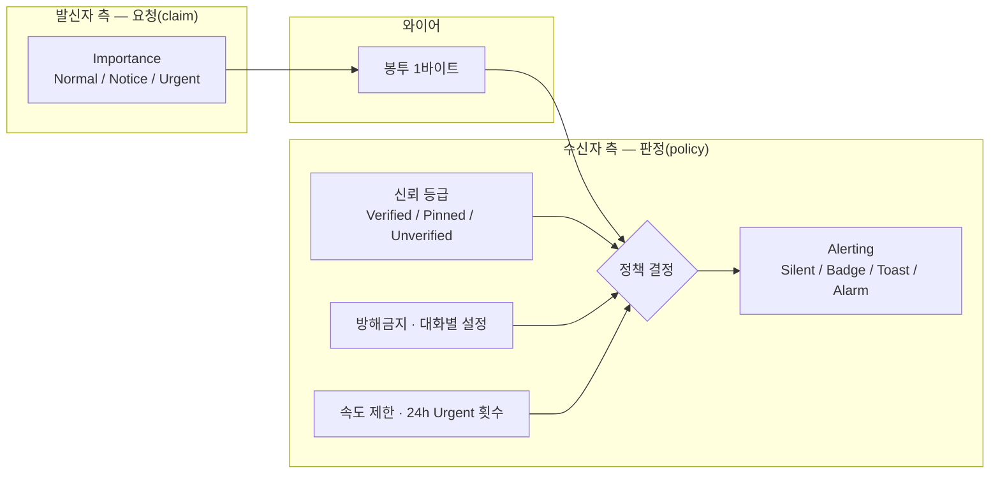
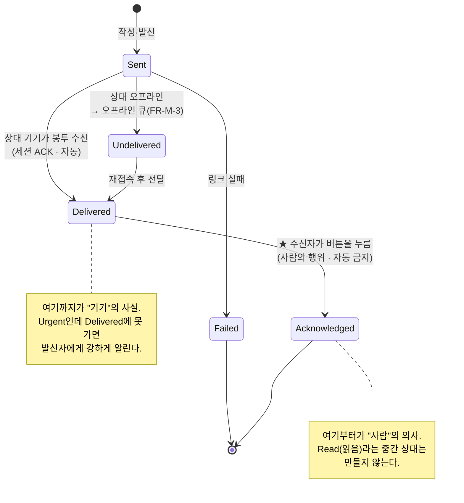
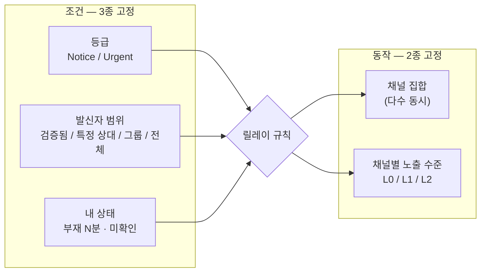
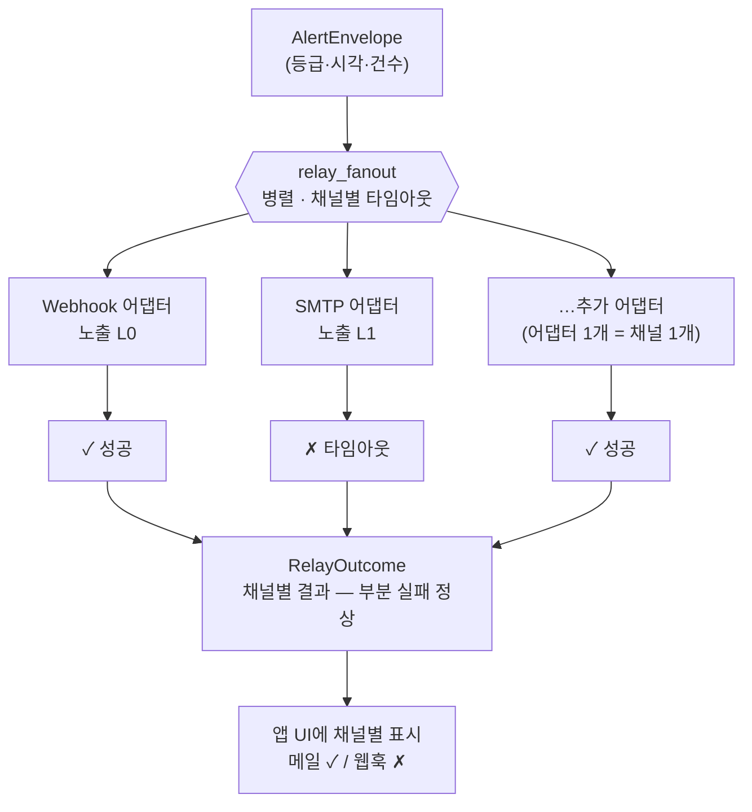
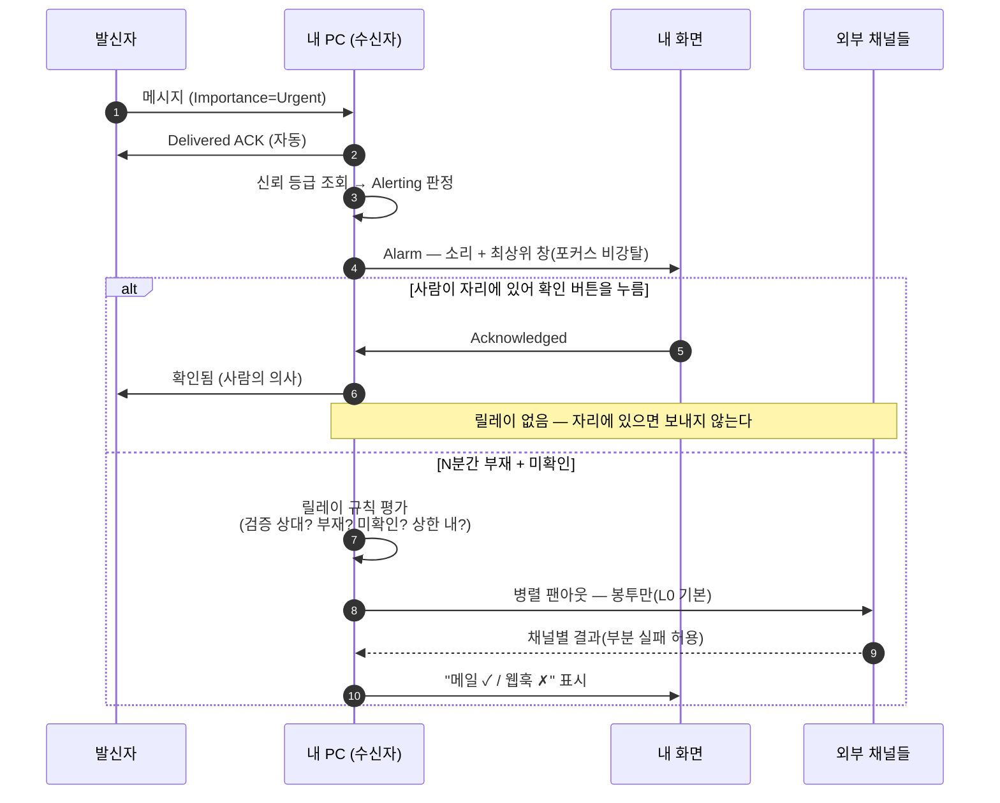

# 24 · ADR-0010 — 메시지 등급 · 알림 강도 · 수신 확인 · 수신자 릴레이

> **상태: ✅ Accepted** (D-23 확정 2026-08-17) · 제안자 Claude · 결정 원장 **[DR-25](10-decision-record.md)**
> **v1/v2 범위(08-17 확정)**: v1 = 메시지 등급(N-1)·**신뢰 게이트 알림 강도**·**수동 수신확인**(LAN 로컬). **수신자 릴레이(§6 · 외부 채널·Webhook·FR-S-43~46)는 v2로 미룸**(TLS 스택 예산 미지수 Q-24-1 · Linux 소리 문제 · **설계만 유지·TODO/개발 제외**). ★ **웹훅 양방향(인바운드: 웹훅→우리 대화창 표시 / 아웃바운드: 우리 대화·접속을 다른 메신저로 후킹)도 v2 설계 검토 대상**(§6-9 · 사용자 08-17) — 설계 레벨만.
> **사용자 요구(2026-08-08)**:
> ① *"메시지 송수신 시 **등급 개념**을 적용 — 일반은 특별한 알림 없이 앱 내에서 수신이 확인되는 수준의 식별만. **알림** 수준은 화면에 **미리보기**를 띄우고 클릭 시 상세 확인. **긴급**은 소리·최상위 창 등 눈에 띌 수밖에 없는 기법으로 즉시 전달됨을 확인."*
> ② *"**반드시 수신 확인이 필요하진 않다.** 하지만 수신자가 **수신확인 버튼**을 누르면 송신자에게 전달되었음을 알릴 수 있는 체계는 설계에 반영."*
> ③ *"**대체 알림 기능**을 설계에 넣어 달라 — **Webhook·이메일 발송·다른 메신저 연계** 등을 통해 확실성 있는 프로그램으로."*
> ④ *"증폭·유출이 목적이 아니라 **수신자가 본인의 메시지 처리를 스스로 결정해 외부로 Relay**하는 개념. 송신자가 메일을 보내는 게 아니라 **수신자 설정에 따라** 릴레이된다. 메일·웹훅·메신저 등 **다수 어댑터가 동시에 동작**하면 좋겠다."*
> 관련: [05](05-requirements.md) FR-M·FR-U·FR-S-16 · [11 ADR-0004](11-adr-0004-quarantine.md)(등급별 마찰) · [13 §6](13-code-design-standards.md)(계측)·[§2-4 규칙 7](13-code-design-standards.md)(DR-21 이음새) · [17 ADR-0005](17-adr-0005-history-at-rest.md)(FR-S-20) · [22 ADR-0008](22-adr-0008-profile-disclosure.md)(연락처 노출)

---

## 1. 무엇이 실제 문제인가

요구 자체는 흔한 기능처럼 보이지만, **이 제품의 전제 두 개와 정면으로 만난다.**

| 전제 | 이 기능이 만드는 긴장 |
|---|---|
| **DR-1 제로 컨피그** — 등록·승인 없이 **누구나 즉시 발신**할 수 있다 | 등급을 발신자가 정하면 **무인증 상대가 내 스피커와 화면 최상단을 직접 제어**하게 된다. R-4(스팸 폭탄)가 소리를 얻는다 |
| **DR-7 E2E 필수** · **FR-S-20** 기록을 네트워크로 보내는 코드 경로를 두지 않는다 | Webhook·이메일·외부 메신저는 **제3자 서버로 나간다.** 내용을 실으면 E2E가 그 지점에서 끝난다 |

**이 ADR의 대부분은 이 두 긴장을 푸는 방법이다.** 기능을 어떻게 만들지는 어렵지 않다 — 어렵지 않은 쪽으로 만들면 **스팸 확성기**와 **평문 유출 경로**가 된다.

---

## 2. ★ 핵심 판단 ① — 축이 두 개다: **발신자의 중요도**와 **수신자에게 일어나는 강도**

하나의 값으로 합치면 안 된다. 합치는 순간 *"소리를 낼지 말지"* 를 **상대가 결정**하게 된다.



> **와이어를 건너오는 것은 `Importance` 하나뿐**이고 `Alerting`은 **전송되지 않는 로컬 값**이다. 그래서 발신자는 내 스피커를 켤 수 없다.

| | **Importance — 발신자가 붙인다** | **Alerting — 수신자에서 결정된다** |
|---|---|---|
| 성격 | **주장** | **판정** |
| 값 | `Normal` / `Notice` / `Urgent` | `Silent` / `Badge` / `Toast` / `Alarm` |
| 신뢰 | 검증 대상 아님(그냥 상대의 표시) | **내 정책이 만든 값** |
| 와이어 | 메시지 봉투 1바이트 | **전송되지 않는다**(로컬 개념) |

> **이 프로젝트는 같은 패턴을 이미 세 번 썼다** — 발견 패킷은 **미검증 힌트**([08 §2](08-adr-0002-discovery-transport.md)) · `UserId`는 **상대가 믿어야 하는 주장**([20 §2](20-adr-0007-multi-device-identity.md)) · 수신 파일은 **보낸 사람이 누구든 믿지 않는다**([04](04-safe-transfer.md) T-7).
> **메시지 등급도 같은 부류다: 상대가 보낸 것은 언제나 요청이고, 결정은 내 쪽에서 한다.**

---

## 3. 등급 3종과 기본 강도 정책

### 3-1. Importance (발신자)

| 값 | 발신자의 뜻 | 발신 UI |
|---|---|---|
| **`Normal` 일반** | 기본값. 상대의 흐름을 끊지 않는다 | 별도 조작 없음 |
| **`Notice` 알림** | 지금 봐 줬으면 한다 | 전송 버튼 옆 등급 선택 |
| **`Urgent` 긴급** | 지금 **당장** 봐야 한다 | ⚠️ **확인 마찰 1단계** — *"상대의 화면을 가로채고 소리를 냅니다"* ([11 §4](11-adr-0004-quarantine.md) 등급별 마찰과 같은 원칙) |

### 3-2. Alerting (수신자에서 결정)

| 값 | 실제 동작 |
|---|---|
| `Silent` | 목록 갱신만. 아무 표시 없음 |
| **`Badge`** | **앱 내 배지 · 트레이 배지 · 목록 강조.** 소리 없음 ← *"특별한 알림 없이 수신이 확인되는 수준"*(요구 ①) |
| **`Toast`** | **미리보기 토스트** + 클릭 시 해당 스레드 열기 |
| **`Alarm`** | **소리 + 최상위 알림 창**(지속 표시) + 토스트 |

### 3-3. 기본 매핑 — ★ **신뢰 등급이 세로축이다**

| Importance ↓ / 신뢰 → | `FingerprintVerified` (SAS 대조) | `Pinned` (TOFU) | `Unverified` | **원격**(FR-S-24) · 미승인 인바운드(FR-S-25) |
|---|---|---|---|---|
| `Normal` | `Badge` | `Badge` | `Badge` | `Badge` |
| `Notice` | **`Toast`** | `Toast`(내용 숨김) | **`Badge`로 강등** | `Badge` |
| `Urgent` | **`Alarm`** | **`Toast`**(강등) | **`Badge`로 강등** | **`Badge`** |

**규칙**
- **미검증 상대는 소리를 얻지 못한다.** 자동 강등이며 사용자가 대화별로 올릴 수 있다(옵트인).
- **속도 제한이 등급별로 다르다**(FR-S-16 확장) — 같은 발신자의 `Urgent`는 N분 1회를 넘기면 `Toast`로, 계속되면 `Badge`로 강등하고 **강등 사실을 표시**한다(조용히 버리지 않는다).
- **그룹·브로드캐스트의 `Urgent`는 기본 1단계 강등**한다. 팬아웃(FR-G-2·FR-M-6)에 알람이 붙으면 한 번의 실수가 조직 전체의 스피커를 울린다.
- **최근 24시간 `Urgent` 사용 횟수를 수신자 UI에 표시**한다 — 남용은 기술이 아니라 **사회적 문제**라서, 막기보다 **보이게** 하는 편이 낫다.
- 사용자는 대화·그룹별로 **정책을 고정**할 수 있다(항상 조용히 / 항상 알람).
- **방해금지(OS DND)는 기본 존중.** *"`Urgent`는 방해금지를 뚫는다"* 는 **옵트인**이다.

---

## 4. 알림 UX — 미리보기와 최상위 창

### 4-1. 미리보기에 실을 수 있는 것 (요구 ①의 "화면에 바로 미리보기")

| 항목 | 규칙 |
|---|---|
| 텍스트 | ✅ **무해화 필수**(RLO·제어문자·0폭 — FR-S-13, `DisplayName`과 같은 처리) · **길이 상한 후 말줄임** · 줄바꿈 접기 |
| 발신자 이름 | ✅ 단 **미검증이면 배지 동반**("미검증") — 이름은 신원이 아니다(FR-S-2) |
| **이미지** | ❌ **미리보기 금지.** 디코드는 격리 프로세스 + 재인코딩본만(FR-S-12)이라 토스트 경로에 둘 수 없다. *"이미지 1장"* 으로 표기 |
| **파일명** | ❌ **원본 파일명 금지**(FR-S-7 — 승인 전 파일명은 파일시스템에도 화면에도 최소화). *"파일 1개(승인 필요)"* |
| 링크 | ❌ 클릭 가능하게 만들지 않는다(FR-S-14) |

> **잠금 화면 · 화면 공유 · 발표 모드에서는 내용을 숨기고 *"새 메시지"* 만 표시**한다. 미리보기는 **어깨너머·화면공유로 새는 경로**다 — [17](17-adr-0005-history-at-rest.md)이 디스크에서 지키는 것을 화면에서 흘리면 의미가 없다.

### 4-2. 최상위 창 — ★ **포커스는 훔치지 않는다**

`Urgent`의 최상위 창은 **항상 위(topmost)** 이되 **키보드 포커스를 가져오지 않는다.**

- 포커스를 훔치면 **사용자가 타이핑하던 문자와 Enter가 팝업으로 들어간다.** 자기도 모르게 기본 버튼이 눌린다.
- [11 ADR-0004 §4](11-adr-0004-quarantine.md)의 *"기본 버튼은 항상 취소"* 와 같은 계열의 문제다. 여기서는 아예 **입력을 받지 않는 것**이 답이다.
- 창은 **자체 렌더링**(DR-6)으로 그린다 — 4타깃 동일 UI. 트레이 알림(FR-U-2)만 OS 기능을 쓴다.
- 닫기 전까지 남고, **클릭하면 해당 스레드로 이동**(요구 ①).

### 4-3. ⚠️ 소리 — **Linux가 실제 문제다**

| 타깃 | 수단 | 판정 |
|---|---|:--:|
| Windows | `MessageBeep` / `PlaySound`(winmm — 인박스) | ✅ |
| macOS | `NSSound` / `AudioServicesPlaySystemSound`(인박스) | ✅ |
| **Linux** | **표준 인박스 오디오가 없다** — ALSA/PulseAudio/PipeWire로 갈리고, 표준 경로인 **libcanberra는 LGPL → DR-12 위반** | 🔴 |

**권고**: Linux는 **D-Bus `org.freedesktop.Notifications`에 `sound-name` 힌트를 넘겨 알림 데몬이 소리를 내게** 한다 — 우리가 오디오 스택을 건드리지 않으므로 NFR-B-5(런타임 의존 0)를 지킨다. 데몬이 없으면 **무음 폴백 + UI에 "이 환경에서는 소리를 낼 수 없습니다" 표시**(조용히 실패하지 않는다).
⇒ **소리 재생도 포트 뒤에 둔다**(DR-21) — `Sound` 포트, 어댑터 3종 + 무음 어댑터.

---

## 5. 수신 확인 — ★ 핵심 판단 ②: **세 가지 사실을 절대 섞지 않는다**

요구 ②는 *"반드시 필요하진 않지만, 버튼을 누르면 알릴 수 있는 체계"* 다. 이 문장이 이미 정답을 담고 있다 — **자동이 아니라 행위**다.

| 상태 | 무엇을 뜻하나 | 누가 만드나 | 채택 |
|---|---|---|:--:|
| **`Delivered` 전달됨** | 상대 **기기**가 봉투를 받았다 | 세션 계층(자동 ACK) | ✅ v1 |
| **`Acknowledged` 확인됨** | 상대 **사람**이 **버튼을 눌렀다** | 사용자 행위 | ✅ v1 (요구 ②) |
| ~~`Read` 읽음~~ | 창이 열렸다 | 자동 | ❌ **만들지 않는다** |

### ⚠️ 개정(08-17 · 사용자 확정) — **읽음을 만든다**(자동 · 전달과 독립)

> 아래 원안은 "읽음을 만들지 않는다"였으나, **사용자 확정으로 자동 읽음을
> 도입**한다: 대화창을 열어 보면 전달과 **완전히 독립적으로** 읽음이 발신자에게
> 간다. 원안의 우려(*"읽고 씹었네"* 사회적 압력)는 **수신자 설정으로 완화** —
> `chat.send_read`(기본 on)를 끄면 읽음을 안 보내고, **검증된 상대에게만**
> 나간다(프라이버시 게이트). 전달(`chat.send_delivered`)과 읽음(`chat.send_read`)은
> 각각 독립 토글·독립 축(전달 없이 읽음만도 가능). 표시 = 자체 렌더 점 마크
> (전달 = 점 1 dim · 읽음 = 점 2 강조 · 색맹 안전 이중 부호화). 원안은 수동
> Acknowledged였고, 개정으로 **자동 Read**가 됐다(수동 버튼은 폐기).

### (원안) 왜 "읽음"을 만들지 않는가

- **창이 열린 것은 사람의 의사가 아니다.** 알림을 잘못 눌러도 "읽음"이 되고, 그걸 근거로 *"읽고 씹었네"* 가 성립한다.
- 자동 읽음은 **상대의 행동을 지속적으로 관찰**하는 채널이다 — 이 제품의 관통 원리(*"필요한 만큼만 본다"*)에 정면으로 어긋난다.
- **`Delivered`가 이미 기술적 사실을 준다.** 사람의 의사는 `Acknowledged`가 준다. 그 사이에 애매한 세 번째를 끼울 이유가 없다.

### 규칙

| # | 규칙 | 이유 |
|---|---|---|
| 1 | **확인은 언제나 수동.** 자동 전송 코드 경로를 두지 않는다 | 요구 ②의 핵심. 자동화하는 순간 감시 도구가 된다 |
| 2 | 발신자는 **"확인 요청"을 표시할 수 있으나 강제할 수 없다** — 수신자는 무시할 수 있고 그것이 정상이다 | *"반드시 필요하진 않다"*(요구 ②) |
| 3 | **미확인 상태는 발신자 쪽에만 표시**한다. 수신자 화면에 붉은 미확인 배지를 쌓지 않는다 | 미확인 표시는 쉽게 **압박 도구**가 된다 |
| 4 | 확인 응답(ack)은 **항상 무음**이며 등급을 갖지 않는다 | ack에 등급이 있으면 ack 폭탄이 된다 |
| 5 | 확인 응답은 **제어 스트림**으로 보낸다([08 §3](08-adr-0002-discovery-transport.md) 다중화) — 대화 스트림을 막지 않는다 | 파일 전송 중에도 즉시 전달 |
| 6 | 그룹은 **구성원별 확인 상태**를 FR-G-4 표시에 합류시킨다 | 팬아웃의 필연 |
| 7 | (v2) 어느 기기에서 확인했는지 `sender_device`로 남기고 **내 다른 기기에도 전파**한다 | [20 §6](20-adr-0007-multi-device-identity.md) sender copy |
| 8 | 확인 시각은 기록에 남지만 **암호화 대상**이다([17 §4](17-adr-0005-history-at-rest.md) 범위) | 시각도 보호 대상 |

### 상태 기계



> ⚠️ **`Urgent`인데 `Undelivered`면 발신자에게 강하게 알린다.** 요구 ①의 *"즉시 전달됨을 확인"* 은 **닿지 않았을 때 그것을 아는 것**까지 포함한다. v1은 릴레이가 없으므로 **상대 PC가 꺼져 있으면 방법이 없고**, 그 사실을 숨기지 않는 것이 유일하게 정직한 처리다.

---

## 6. 수신자 릴레이 (요구 ③·④) — 내 메시지를 내가 정한 외부 채널로

> **요구 ④(2026-08-08 추가)**: *"증폭 공격이나 정보 유출이 목적이 아니라 **수신자 입장에서 본인이 직접 본인의 메시지 처리에 대한 의사 결정을 통해 Relay하는 개념**. 송신자가 메일을 보내는 게 아니라 **수신자의 설정에 따라 외부로 릴레이**된다. 메일·웹훅·메신저 연결 등 어댑터 연결 시 **다수 어댑터가 동작**하면 좋겠다."*

### 6-0. ⚠️ 먼저 용어 — 이 프로젝트에는 이미 "릴레이"가 있다

**[DR-8](10-decision-record.md) ②의 릴레이(전송 릴레이 · `nexa-beepd`)와 이름이 겹친다.** 문서·코드에서 한정어 없이 "릴레이"라고 쓰면 두 개념이 섞이므로 **항상 한정어를 붙인다.**

| | **전송 릴레이**(DR-8 ② · v2) | **수신자 릴레이**(이 절) |
|---|---|---|
| 무엇을 바꾸나 | **경로** — 같은 메시지가 **같은 수신자**에게 다른 길로 | **매체** — 내 알림이 **나에게** 다른 채널로 |
| 누가 정하나 | 발신·수신 양쪽의 연결 설정 | **수신자 혼자** |
| 무엇이 나가나 | 암호화된 봉투(서버는 목적지만 본다) | **"알림이 있다"는 사실**([§6-2](#6-2-★-핵심-판단--외부-채널에도-봉투만-나간다)) |
| 상대가 아나 | 안다(경로를 함께 쓴다) | **모른다 — 알 필요도 없다** |

> 코드 타입은 `RelayRule`·`RelayChannel`·`RelayOutcome`처럼 쓰되, **전송 릴레이는 `TransportRelay`/`ServerId` 계열**로 이름을 갈라 둔다.

### 6-1. ★ 핵심 판단 ③ — 릴레이의 **주체는 수신자**다

| | 발신자가 보낸다 | **✅ 수신자가 릴레이한다 (채택)** |
|---|---|---|
| 뜻 | *"상대가 안 받으니 내가 상대 이메일로 보낸다"* | *"**내 메시지**를 **내가 정한 규칙**으로 **내 채널**에 흘린다"* |
| 상대 연락처 | **내가 갖고 있어야 한다** → [22 ADR-0008](22-adr-0008-profile-disclosure.md)의 노출 문제와 얽힌다 | **필요 없다 — 존재 자체를 모른다** |
| 동의 주체 | 어긋난다(내 설정으로 남의 채널을 쓴다) | **일치한다**(내 설정·내 채널·내 데이터) |
| 발신자가 아는 것 | 상대의 메일 주소·폰 | **아무것도.** 등급을 붙였을 뿐이고 그 뒤는 내 영역이다 |
| 발신자의 요구 | — | **`Delivered` + 수신확인으로 이미 충족**([§5](#5-수신-확인--★-핵심-판단--세-가지-사실을-절대-섞지-않는다)) |

> **즉 이것은 전송 기능이 아니라 "내 수신함을 내가 어떻게 처리할지"에 대한 규칙이다.** 메일 클라이언트의 **필터·전달 규칙**과 같은 성격이고, 그렇게 놓으면 동의·프라이버시·악용이 한꺼번에 정리된다.

### 6-2. ★ 핵심 판단 ④ — 외부 채널에도 **"봉투만"** 나간다

[10 §0 관통 원리](10-decision-record.md)를 이 계층에 적용하면 답이 바로 나온다. **외부 채널의 봉투 = "알림이 있다"는 사실.**

| 수준 | 내보내는 것 | 기본값 |
|---|---|:--:|
| **L0 사실만** | 등급 + 시각 + 건수 — *"긴급 1건 도착 · 14:32"* | **✅ 기본** |
| L1 + 발신자 | 위 + 발신자 표시 이름 | 옵트인 |
| L2 + 본문 | 위 + 미리보기 텍스트(무해화·길이 상한) | 옵트인 + 별도 고지 |

> ★ **노출 수준은 채널마다 따로 정한다**([§6-4](#6-4-★-다중-어댑터-팬아웃-요구-)) — *"내 개인 메일에는 본문까지, 팀 웹훅에는 사실만"* 이 자연스러운 요구다. 채널 하나가 L2라고 다른 채널까지 L2가 되면 안 된다.
> ⚠️ L1·L2를 켜는 화면에는 ***"이 채널은 종단 암호화가 아닙니다 — 메일 서버·Webhook 수신처가 내용을 봅니다"*** 를 문장으로 표시한다(NFR-S-5). 유출이 목적이 아니어도 **사실은 사실대로 알린다.** L0 기본이면 DR-7과 충돌하지 않는다.

### 6-3. ★ 핵심 판단 ⑤ — 규칙은 **수신자의 의사 결정**이다: `조건 → 채널 집합`

요구 ④의 *"본인이 직접 본인의 메시지 처리에 대한 의사 결정"* 을 **규칙 표 하나**로 표현한다. 룰 엔진을 만들지 않는다 — 조건 3개, 동작 2개로 고정한다.



| 예시 규칙 | 조건 | 채널 |
|---|---|---|
| "긴급은 무조건 폰까지" | `Urgent` · 검증된 상대 · 즉시 | **웹훅(L0) + 메일(L1)** 동시 |
| "팀 공지는 팀 채널로" | `Notice` · 그룹 `개발팀` · 부재 5분 | 웹훅(팀 Slack · L1) |
| "밤에는 조용히 메일만" | 전부 · 22:00~08:00 | 메일(L0) |

> **수동 릴레이도 둔다** — 목록에서 메시지를 고르고 *"이 알림을 내 메일로"* 를 누르는 **1회성 동작**. 자동 규칙보다 이쪽이 *"본인이 직접 의사 결정"* 의 가장 순수한 형태이고, 규칙을 만들기 전에 시험해 보는 경로도 된다.

### 6-4. ★ 다중 어댑터 팬아웃 (요구 ④)

**여러 어댑터가 동시에 동작한다.** 그런데 이 구조는 이 프로젝트에 이미 있다 — [FR-G-6](05-requirements.md)이 *"발신 경로는 `수신자 = PeerId 집합` 하나로 일반화"* 라고 못 박아 1:1·그룹·다중 기기를 **한 팬아웃 함수**로 모았다([20 §7](20-adr-0007-multi-device-identity.md) V1-2).

> **수신자 릴레이는 `채널 = 어댑터 집합` 팬아웃이다 — 같은 모양의 두 번째 적용이다.** 원소가 `PeerId`에서 `RelayChannel`로 바뀔 뿐이라 개념이 늘지 않는다.

| # | 규칙 | 이유 |
|---|---|---|
| **F-1** | **기본은 동시(병렬) 발송.** 한 채널의 지연이 다른 채널을 막지 않는다 — 채널마다 **개별 타임아웃** | 요구 ④ *"다수 어댑터가 동작"*. 순차로 하면 느린 SMTP 하나가 전체를 잡는다 |
| **F-2** | **부분 실패를 정상 취급**한다 — 하나가 실패해도 나머지는 진행하고, 결과를 **채널별로** 표시(*"메일 ✓ / 웹훅 ✗ 타임아웃"*) | 전부-아니면-전무로 만들면 채널을 늘릴수록 실패율이 올라간다 |
| **F-3** | **채널별 독립 설정** — 노출 수준(L0~L2) · 조건 · 재시도 · 사용 여부 | [§6-2](#6-2-★-핵심-판단--외부-채널에도-봉투만-나간다) |
| **F-4** | **메시지당 채널당 1회**(중복 억제 창) | 재시도·경로 중복으로 폰이 여러 번 울리지 않게 |
| **F-5** | **묶음(coalescing)은 채널별로** — 짧은 시간의 다건은 *"긴급 3건"* 하나로. 채널마다 묶음 간격이 다를 수 있다(웹훅은 즉시, 메일은 5분 묶음) | 메일 3통 vs 웹훅 3줄은 체감이 다르다 |
| **F-6** | **재시도는 지수 백오프 + 상한**, 상한 초과는 포기하고 **앱에 남긴다**(조용히 사라지지 않는다). **큐에 명시적 상한**(NFR-B-6 — 무한 큐 = 누수) | |
| **F-7** | **순차 단계(escalation ladder)는 옵션** — *"웹훅 먼저, 10분 내 미확인이면 메일"*. 기본은 동시이고 단계는 사용자가 켤 때만 | 동시가 기본이어야 "확실성"이라는 요구에 맞는다 |
| **F-8** | 어댑터는 **전부 같은 포트 뒤**(DR-21). 새 채널 추가 = **어댑터 1개**, 도메인 코드 변경 0 | [13 §2-4 규칙 7](13-code-design-standards.md) |
| **F-9** | **채널별 성공·실패·억제를 계측**한다(횟수·결과만 · 목적지는 솔티드 해시) | [13 §6](13-code-design-standards.md) |



> ★ **`Recipients`(PeerId 집합) 팬아웃과 같은 모양**이다 — 원소가 `PeerId`에서 `RelayChannel`로 바뀌었을 뿐이라 개념이 늘지 않는다(FR-G-6 재사용).

```rust
// nbeep-core (도메인) — 외부 크레이트 타입이 시그니처에 없다(DR-21 판정 질문)
pub struct AlertEnvelope { level: Importance, at: Timestamp, count: u32,
                           sender: Option<DisplayName>, preview: Option<RedactedText> }

pub trait RelayChannel {                       // 어댑터 1개 = 채널 1개
    fn kind(&self) -> ChannelKind;             // Webhook | Smtp | ...
    fn disclosure(&self) -> Disclosure;        // L0 | L1 | L2 (채널별)
    fn deliver(&self, env: &AlertEnvelope) -> Result<(), RelayError>;
}

/// 팬아웃 — Recipients(PeerId 집합)와 같은 모양. 부분 실패를 결과로 돌려준다.
pub struct RelayOutcome { per_channel: Vec<(ChannelKind, Result<(), RelayError>)> }
pub fn relay_fanout(chs: &[&dyn RelayChannel], env: &AlertEnvelope) -> RelayOutcome;
```

### 6-5. 채널 목록 — **Webhook 하나가 "메신저 연결"의 대부분이다**

| 채널 | 우선 | 판단 |
|---|:--:|---|
| **Webhook (HTTPS POST · JSON)** | **P0** | ★ **이것 하나로 Slack·Discord·Teams·Telegram·IFTTT·n8n·자체 서버가 전부 커버된다.** 개별 메신저 SDK를 넣으면 크기·의존성·API 변경 유지보수가 채널 수만큼 늘어난다 — **넣지 않는다** |
| **이메일 (SMTP)** | P1 | 보편적이지만 실사용 마찰이 크다 — STARTTLS·인증·앱 비밀번호(Gmail)·스팸 필터·발송 지연 |
| 데스크톱 로컬 명령 실행 | ✗ | 임의 명령 실행은 공격면이 과하다. 필요하면 사용자가 webhook 수신처에서 한다 |
| 모바일 푸시 | v2 | 푸시 서비스는 서버를 요구한다(`nexa-beepd`) |
| 외부 메신저 **네이티브 연동** | ✗ | Webhook으로 충분하고, 각 사의 API 정책 변화가 우리 릴리스를 흔든다 |

### 6-5b. 전체 흐름 — 도착부터 릴레이까지



### 6-6. 남용 방지 — **목적이 아니어도 결과는 막아야 한다**(R-13)

**설계 의도가 수신자 통제라는 점이 이미 위험의 대부분을 없앤다** — 발신자는 채널을 고를 수 없고 존재조차 모른다. 그러나 **무인증 상대가 `Urgent`를 쏘아 내 규칙을 격발시키는 것**은 여전히 가능하고, 그러면 **내가 켠 규칙이 나를 때린다.** 그래서 남는 방어는 두 가지 목적을 갖는다: **① 나를 내 과잉 규칙으로부터 보호** ② **외부 서비스에 우리가 폭주 발송원이 되지 않게.**

| 방어 | 규칙 | 끌 수 있나 |
|---|---|:--:|
| **기본 규칙 범위** | 신규 규칙의 발신자 범위 기본값 = **`FingerprintVerified` 이상**. 사용자가 **넓힐 수 있다**(전체 허용도 가능) — 차단이 아니라 **안전한 기본값**이다 | ✅ 사용자 선택 |
| **속도·일일 상한** | 발신자별 · 채널별 · 전체 일일 상한 | ❌ **항상 켜짐** — 외부 서비스 보호 |
| 묶음 발송 | [§6-4](#6-4-★-다중-어댑터-팬아웃-요구-) F-5 | ❌ |
| 차단 우선 | 차단 상대·미승인 인바운드(FR-S-25)는 **무조건 제외** | ❌ |
| 억제 보고 | 상한으로 억제된 건은 **앱 안에서 요약 보고** | ❌ |

> **차단이 아니라 기본값으로 푼 이유** — 요구 ④가 말한 것은 **수신자의 결정권**이다. 하드 차단은 그 결정권을 뺏는다. 반면 **속도 상한은 끌 수 없게** 두었는데, 그건 내 결정권 밖(외부 서비스·타인)에 영향을 주기 때문이다.

### 6-7. ⚠️ 이 기능이 실제로 바꾸는 것 — 정직하게 적는다

| 항목 | 지금까지 | 이 기능 이후 |
|---|---|---|
| **네트워크 성격** | **LAN 전용 제품** | **인터넷으로 나가는 코드 경로가 생긴다** — 기업 방화벽·보안 검토의 대상이 된다. **기본 비활성 · 켤 때 고지 · 목적지 표시 · 전량 계측** |
| **FR-S-20** | *"기록·인덱스·레저를 네트워크로 보내는 코드 경로를 두지 않는다"* | ⚠️ **예외를 만든다.** 나가는 것은 **기록이 아니라 알림 사실**이고 **사용자가 켠 채널로만** 나가지만, 개정 없이 슬쩍 넘어가면 안 되는 조항이다 → [§9](#9-요구사항-반영) FR-S-20 단서 |
| **의존성** | `snow` · `winit`/`softbuffer` | **TLS 스택이 처음 들어온다**(HTTPS·SMTPS) — `rustls`+`webpki-roots`는 퍼미시브(DR-12 ✅)지만 **크기 실측 필요** → [§8](#8-예산성능-영향-dr-5) · R-14 |
| **비밀 취급** | 신원 키 · 기록 키 | **Webhook URL·SMTP 자격 증명이 새 비밀**이다(URL에 토큰이 박힌다) — [17](17-adr-0005-history-at-rest.md) 암호화 저장 필수 · 로그·계측에는 **해시로만**(`redact`) |

### 6-8. 정직한 한계

- **수신자 PC가 꺼져 있으면 릴레이도 나가지 않는다** — 규칙을 실행하는 주체가 내 PC이기 때문이다. **v1이 푸는 것은 *"PC는 켜져 있는데 사람이 자리에 없다"* 뿐**이고, 꺼진 경우는 전송 릴레이(v2 · 오프라인 큐)의 영역이다. 설정 화면에 그대로 쓴다.
- **외부 채널의 도달은 우리가 보장하지 못한다** — 메일은 스팸함으로 가고 웹훅 수신처는 죽어 있을 수 있다. 그래서 **채널별 결과 표시**(F-2)가 기능의 일부다.

### 6-9. 웹훅 양방향 — v2 설계 검토(사용자 08-17 · 개발 제외)

수신자 릴레이(§6)의 자연 확장으로 **양방향 웹훅**을 v2 후보로 검토한다(구현
아님 · 설계 레벨만):

- **아웃바운드(있음의 확장)**: 내 대화·**접속 여부**를 다른 메신저(Slack/Discord/
  자체 웹훅)로 후킹. §6-2 "봉투만" 원칙 그대로 — 외부엔 내용 없이 봉투(누구
  에게서·언제·등급). 접속 상태 후킹은 새 축(프레즌스 이벤트 → 채널) · §6-3
  "조건 → 채널" 규칙에 프레즌스 조건 추가.
- **인바운드(신규)**: 외부 웹훅이 보낸 메시지를 **우리 대화창에 표시**. ⚠️
  경계 필수 — 인바운드는 **E2E 밖**이라 우리 신원 모델(키 지문)에 없다:
  ① 별도 시각 표기(외부 출처 · 검증 안 됨) ② 회신 불가 or 웹백 회신 ③
  스팸·인젝션 방어(R-13) ④ S-3(서버가 평문 못 봄)과의 관계 — 인바운드는
  애초에 평문 외부 소스라 E2E 대상이 아님을 UI가 정직하게 표시.
- **선행 관문**: 아웃바운드는 §6의 TLS(v2) · 인바운드는 **수신 엔드포인트**
  (로컬 HTTP 리슨 or 폴링)가 필요 — 서버리스 LAN 정체성과의 정합 검토가
  먼저(Managed Server 모드와 겹칠 수 있음 · ADR-0013).

> **개발 제외** — v2 설계 검토 대상. 명시 요청 시 TODO 편입.

## 7. 프로토콜·저장 영향 — **지금 넣으면 필드, 나중이면 포맷 변경**

> [20 §7](20-adr-0007-multi-device-identity.md) V1-1~4, [21 §5](21-identity-spec.md) U-P1과 **같은 논리**다. M2-4(1:1 송수신)가 아직 시작 전이라 **지금이 거의 공짜인 시점**이다.

| # | 지금 넣을 것 | 없으면 |
|---|---|---|
| **N-1** | 메시지 봉투에 **`importance: u8`**(1바이트 · 미지 값은 `Normal`로 취급) | 나중에 메시지 포맷 변경 + 구버전 호환 처리 |
| **N-2** | **`ack` 제어 메시지 타입**(대상 메시지 ID + 종류: `Delivered`/`Acknowledged`) | 제어 스트림 스키마를 다시 만든다 |
| **N-3** | 기록 레코드에 **전달·확인 상태와 시각** 자리 | 저장 포맷 마이그레이션([17 §4](17-adr-0005-history-at-rest.md)) |
| **N-4** | `ActionKind` 신규 — `NotificationRaised(AlertLevel)` · `AckSent` · `AckReceived` · `EscalationSent(ChannelKind)` · `EscalationSuppressed(Reason)` | 계측 레저에 이 축이 영영 안 남는다. **`stable_code` 대역 배정 필요**([13 §6](13-code-design-standards.md) · M0-1c 규칙 — 부여 후 불변) |

> `ActionKind`에는 **행위 정체성만** 넣고 메시지 본문·URL·주소는 넣지 않는다(M0-1c에서 세운 규칙). 채널은 **종류만**(`Webhook`/`Smtp`), 목적지는 **솔티드 해시**.

---

## 8. 예산·성능 영향 (DR-5)

| 항목 | 영향 | 통제 |
|---|---|---|
| **TLS 스택** | 🔴 **가장 큰 미지수** — `rustls`+`webpki-roots`가 릴리스 크기에 얼마나 붙는지 모른다(현재 0.40MB · 상한 10MB) | **SP-2 스파이크로 실측**([§11](#11-열린-질문) Q-24-1). OS TLS(schannel/Security.framework) 대안은 **Linux에서 또 갈린다** |
| 최상위 창·토스트 | 창이 늘면 유휴 RSS·핸들 증가(NFR-B-1/B-6) | **알림이 없을 때는 창을 만들지 않는다**(지연 생성·닫으면 해제). 24h 누수 0 회귀에 포함 |
| 소리 | Linux는 D-Bus 클라이언트가 필요 | 포트 뒤 어댑터 · 없으면 무음 폴백 |
| 발송 대기 | 외부 채널 발송이 UI를 막으면 안 된다 | **워커 스레드 + 타임아웃 + 재시도 상한**. 큐에 명시적 상한(NFR-B-6 — 무한 큐 = 누수) |
| 와이어 | `importance` 1B · ack 제어 메시지 | 무시할 수준 |

---

## 9. 요구사항 반영

| ID | 요구 | 우선 | 범위 |
|---|---|:--:|:--:|
| **FR-M-10** | 메시지는 **`Normal`/`Notice`/`Urgent` 등급**을 갖는다. 등급은 **발신자의 요청**이며 실제 알림 강도는 **수신자 정책**이 결정한다 | P0 | v1 |
| **FR-M-11** | **전달(`Delivered`)과 확인(`Acknowledged`)을 구분**한다. 확인은 **수신자의 명시적 버튼 조작**으로만 발생하며 **자동 전송 경로를 두지 않는다.** "읽음"은 만들지 않는다 | P0 | v1 |
| **FR-M-12** | 발신자는 확인을 **요청**할 수 있으나 강제할 수 없다. 미확인 상태는 **발신자 쪽에만** 표시한다 | P1 | v1 |
| **FR-U-15** | 알림 강도 4종(`Silent`/`Badge`/`Toast`/`Alarm`) · 미리보기 토스트 클릭 시 스레드 이동 · **`Urgent`는 최상위 창 + 소리** | P0 | v1 |
| **FR-U-16** | 최상위 알림 창은 **키보드 포커스를 가져오지 않는다.** 잠금 화면·화면 공유·발표 모드에서는 **내용을 숨긴다** | P0 | v1 |
| **FR-U-17** | 미리보기는 **무해화된 텍스트만**(FR-S-13) — **이미지·원본 파일명·활성 링크 금지**(FR-S-7/12/14) | P0 | v1 |
| **FR-S-41** | 알림 강도는 **신뢰 등급으로 게이트**된다 — 미검증 상대는 소리·최상위 창을 얻지 못하고 자동 강등된다. 강등 사실은 표시한다 | P0 | v1 |
| **FR-S-42** | 등급별 **속도 제한**(FR-S-16 확장) — `Urgent` 남용은 자동 강등 · **최근 24h `Urgent` 횟수를 수신자에게 표시** · 그룹·브로드캐스트의 `Urgent`는 1단계 강등 | P0 | v1 |
| **FR-S-43** | **수신자 릴레이** — 알림을 **수신자 본인이 정한 규칙에 따라 본인의 외부 채널로** 내보낸다(Webhook P0 · SMTP P1). **발신자는 채널을 고를 수 없고 존재도 모른다.** 기본 노출은 **L0 = 사실만**(등급·시각·건수)이며 **노출 수준은 채널마다 따로** 정한다. L1·L2는 옵트인 + **"이 채널은 E2E가 아니다"** 고지. ⚠️ 용어 — **전송 릴레이(DR-8 ②)와 다른 개념**이므로 한정어를 붙여 쓴다 | P1 | v1 |
| **FR-S-44** | 릴레이 규칙은 **`조건 → 채널 집합`** 이다 — 조건 3종(등급 · 발신자 범위 · 내 상태[부재·미확인]) · 동작 2종(채널 집합 · 채널별 노출 수준). **1회성 수동 릴레이**도 제공한다. 룰 엔진으로 확장하지 않는다 | P0 | v1 |
| **FR-S-45** | ★ **다중 어댑터 팬아웃** — 여러 채널이 **동시(병렬) 발송**되며 **채널별 개별 타임아웃**을 갖는다. **부분 실패는 정상 취급**하고 결과를 **채널별로 표시** · **메시지당 채널당 1회**(중복 억제) · **묶음은 채널별** · 재시도는 지수 백오프 + 상한, 큐 상한 필수. 순차 단계(escalation ladder)는 **옵션**. 구조는 **`수신자 = PeerId 집합` 팬아웃(FR-G-6)과 같은 모양** — 원소만 `RelayChannel`로 바뀐다 | P0 | v1 |
| **FR-S-46** | 릴레이 남용 보호 — **신규 규칙의 발신자 범위 기본값은 `FingerprintVerified` 이상**(사용자가 넓힐 수 있다 · **차단이 아니라 안전한 기본값**) · **속도·일일 상한과 차단 상대 제외는 끌 수 없다**(외부 서비스·타인에게 영향을 주므로) · **억제한 건은 앱 안에서 요약 보고** | P0 | v1 |
| **FR-S-20** *(단서 추가)* | 기존 조항 유지 + ⚠️ **예외 1건 명시** — FR-S-43의 **수신자 릴레이**는 **기록이 아니라 알림 사실**을 사용자가 켠 채널로만 내보낸다. 기본 비활성 · 목적지 표시 · 전량 계측 | P0 | v1 |
| **R-13** *(신규 위험)* | **내가 켠 릴레이 규칙이 나를 때린다** — 발신자는 채널을 고를 수 없지만 **무인증 상대의 `Urgent`가 내 규칙을 격발**시킬 수 있고, 그러면 내 폰·메일이 폭격당하며 **앱을 꺼도 계속된다.** 동시에 우리가 **외부 서비스에 폭주 발송원**이 된다 | 높음 | FR-S-46 — 안전한 기본값(검증된 상대) + **끌 수 없는 상한**(외부 영향은 내 결정권 밖) + 묶음 + 억제 보고 |

---

## 10. 결과 (Consequences)

### 긍정
- **요구 3건이 전부 성립**하되, 각각이 이 제품의 기존 원칙(미검증 힌트 · 봉투만 본다 · 이음새 뒤로)의 **재적용**이라 새 개념이 늘지 않는다.
- **Webhook 어댑터 하나로 "메신저 연계"가 사실상 해결**된다 — 의존성·크기·유지보수를 채널 수와 분리했다.
- **릴레이 채널 팬아웃이 `Recipients` 팬아웃과 같은 모양**이라 개념이 늘지 않는다(FR-G-6 재사용 · 원소만 다르다).
- 주체를 수신자로 두어 **상대 연락처를 한 건도 수집하지 않고** "확실성"을 얻는다 — [22 ADR-0008](22-adr-0008-profile-disclosure.md)의 노출 문제와 얽히지 않는다.
- 수신 확인을 **수동으로 못 박아** 감시 기능이 되는 흔한 실패를 피한다.
- `Delivered`/`Acknowledged` 분리가 **그룹 전달 상태**(FR-G-4)와 **다중 기기 sender copy**(v2)에 그대로 재사용된다.

### 부정 · 감수
- **인터넷으로 나가는 코드 경로가 처음 생긴다** — LAN 전용이라는 제품 성격이 옵션 하나만큼 흐려진다. 기업 보안 검토의 대상이 된다.
- **TLS 스택으로 크기 예산이 흔들릴 수 있다**(SP-2에서 확인).
- **Linux 소리는 알림 데몬에 의존**한다 — 데몬이 없으면 무음이다.
- 알림 정책이 **표 하나로 안 끝난다**(신뢰 × 등급 × DND × 대화별 설정 × **릴레이 규칙 × 채널**) — 설정 화면이 커진다. **"릴레이"라는 말이 두 뜻**([§6-0](#6-0-⚠️-먼저-용어--이-프로젝트에는-이미-릴레이가-있다))이 된 것도 감수한다. DR-1의 감각은 **기본값이 전부 안전한 쪽**이라는 것으로만 지킨다.
- 등급 남용은 **기술로 못 막는다.** 강등·표시·계측으로 **보이게** 할 뿐이다.

---

## 11. 열린 질문

| # | 항목 | 시점 |
|---|---|---|
| **Q-24-1** | 🔴 **SP-2 — TLS 스택 크기 실측.** `rustls`+`webpki-roots` vs OS TLS. 결과에 따라 FR-S-43을 v1에 둘지 v2로 미룰지 결정 | **M2 전** |
| **Q-24-2** | `Urgent` 확인 마찰의 세기 — 매번 확인 대화상자인가, 첫 사용 1회 안내인가 | M3 |
| **Q-24-3** | 에스컬레이션 지연 시간 기본값(부재 판정 N분 · 미확인 대기 N분) | M3 실사용 |
| **Q-24-4** | 알림 강도 기본 매핑([§3-3](#3-3-기본-매핑--★-신뢰-등급이-세로축이다))에서 `Pinned`(TOFU만·SAS 미대조) 상대에게 `Urgent`를 허용할지 — 표는 **강등**으로 두었으나 실사용에서 답답할 수 있다 | M3 |
| **Q-24-5** | 소리 파일을 **번들할 것인가**(크기 +) vs OS 기본 알림음 사용(4타깃 소리가 달라짐 — S-7 "OS 구분 불가"와 상충) | M3 |
| **Q-24-7** | 릴레이 규칙 UI를 **어디에 둘 것인가** — 설정 화면([14 §10](14-control-ux-architecture.md) VS Code 방식 · DR-24) 안의 한 카테고리인가, 대화별 컨텍스트 메뉴에서도 만들 수 있게 할 것인가 | M3 |
| **Q-24-8** | 채널 수 상한을 둘 것인가 — 팬아웃이라 10개도 등록 가능하지만 **발송 워커·큐·유휴 RSS**가 채널 수에 비례한다(NFR-B-1/B-6) | M3 |
| **Q-24-6** | Webhook 페이로드 스키마를 **고정**할 것인가(Slack/Discord 형식은 서로 다르다) — 사용자 템플릿 문자열을 허용하면 유연하지만 인젝션·복잡도가 늘어난다 | M3 |

---

> **다음 단계**: 🔴 **사용자 확정** → Accepted 시 ⓐ **N-1~N-4를 M2-3/M2-4에 같이 넣는다**(나중이면 포맷 변경) ⓑ **SP-2 TLS 실측**(Q-24-1)이 FR-S-43의 v1 포함 여부를 가른다 ⓒ 알림 UI(FR-U-15~17)는 M3, **수신자 릴레이(FR-S-43~46)** 는 M3 후반.
