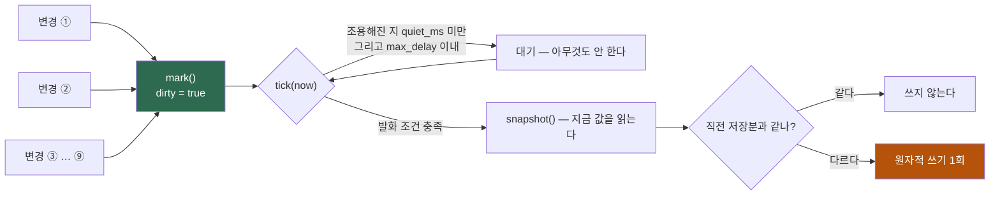
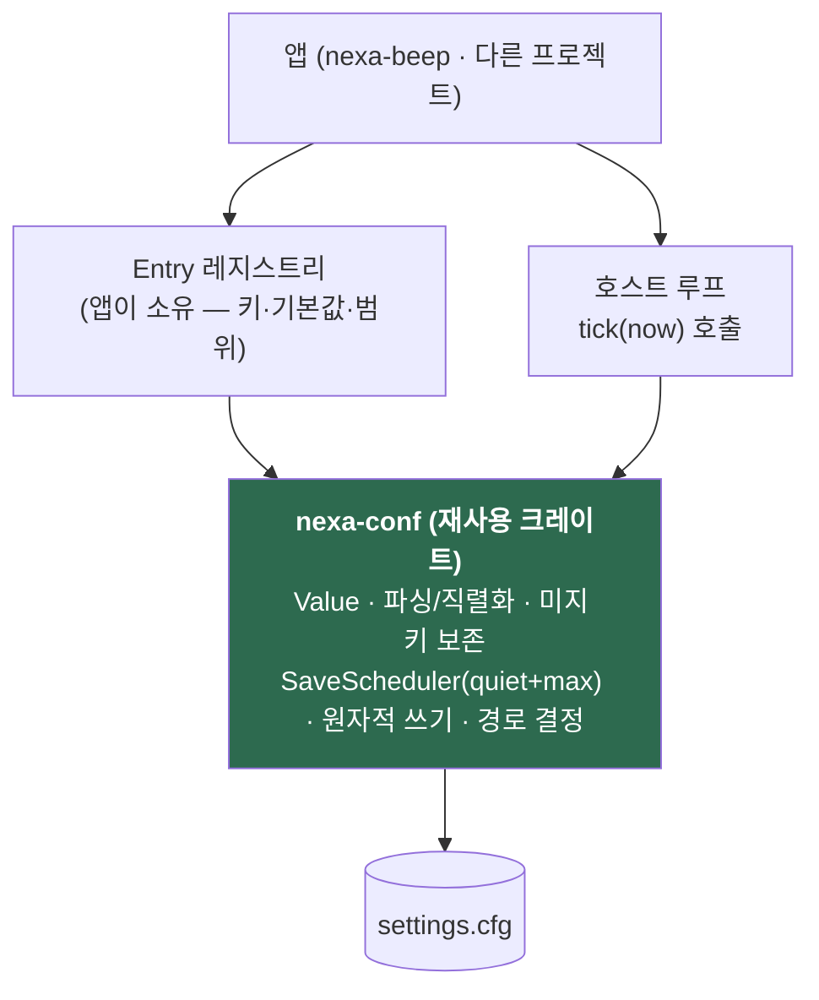

# 28 · ADR-0011 — 설정 직렬화·영속 표준 (재사용 모듈)

> **상태: ✅ Accepted** (2026-08-11 · **D-25 사용자 확정** — 제안 2026-08-09) · 결정 원장 **DR-27**
> **구현: [`crates/nexa-conf`](../crates/nexa-conf/src/lib.rs)**(Q-28-1 확정 — 이 저장소 안, 추후 분리 가능 상태 유지) + 앱 배선 = M3-15 완료(08-11).
> 구현이 설계와 다른 지점 1: `SaveScheduler::mark`가 **`now`를 받는다** — §3-2 trait 스케치는 무인자지만 quiet 판정에 변경 시각이 필요하다. 시계 비소유 원칙은 동일(호스트가 주입).
> **사용자 요구(2026-08-09)**:
> ① *"설정값에 대한 **Serializing 기법을 표준화**해서 **다른 프로젝트에서도 잘 사용할 수 있도록 모듈화**해 달라. Rust로 여러 프로그램을 개발하는데 설정 저장·읽기를 매번 개발해야 한다."*
> ② ★ *"특히 중요한 점은 **여러 변경 요인이 발생하더라도 특정 Tick에 1번씩만 저장**되도록 **최종 저장 요청만 남기고 나머진 버리는** 과부하 방지 로직이다."*
> ③ *"`nexa-dir2`에서 이 기법을 도입했었다. 조사해서 설계에 반영해 달라."*
> 관련: [14 §10](14-control-ux-architecture.md)(DR-24 설정 화면 Entry 레지스트리) · [17](17-adr-0005-history-at-rest.md)(비밀은 여기로) · [13 §2-4](13-code-design-standards.md)(DR-21 이음새) · **선행 사례** `nexa-dir2` `docs/20-session-coalescing.md` · `crates/nexa-app/src/config.rs`

---

## 1. 선행 조사 — `nexa-dir2`는 이미 이걸 했고, 문서까지 남겼다

전수 조사 결과 **핵심 기법은 그대로 차용할 가치가 있고, 결함 네 개는 고쳐야 한다.**

### 1-1. 차용할 것 (검증된 것)

| 기법 | `nexa-dir2` 구현 | 왜 좋은가 |
|---|---|---|
| **외부 crate 0** | 손수 만든 `key=value` 텍스트 · 파서 **9줄**(`config.rs:359`) | serde·toml 없이 성립. DR-5(크기)와 정확히 맞는다 |
| ★ **요청과 실행의 분리** | 변경 지점은 **`session_dirty = true`** 플래그 하나만 세운다(13곳) | 변경 지점이 직렬화를 모른다 |
| ★ **큐를 만들지 않는다** | 중간 상태를 **저장하지 않으므로 버릴 것도 없다** | *"최종 요청만 남기고 나머지는 버린다"* 를 **자료구조 없이** 달성 |
| ★ **스냅샷은 flush 시점에** | `current_session(st)`를 발화할 때 읽는다 | 중간 상태 폐기 비용이 **0** |
| **단일 수거 지점** | `update_status()` 하나가 모든 상호작용의 깔때기 | 호출처마다 훅을 달 필요가 없다 |
| **`mem::take` 수거** | `take_session_dirty()` | 읽기와 비우기가 한 동작 — 누락이 구조적으로 불가 |
| **종료 시 강제 flush** | `WM_DESTROY`에서 **같은 스냅샷 헬퍼** 사용 | 디바운스가 마지막 변경을 삼키지 않는다. 두 경로의 포맷이 갈릴 수 없다 |
| **관용 파싱** | 기본값 시드 + 아는 키만 덮어씀 + **클램프** · `parse`는 실패할 수 없다 | 손상 파일에도 앱이 뜬다 |
| **포터블/폴백 경로** | 실행 파일 옆 `data/` 쓰기 가능 검사 → 불가 시 사용자 폴더 | 우리 FR-P-3과 같은 요구 |

### 1-2. ⚠️ 원문이 남긴 함정 두 개 (문서에 명시돼 있다 — 그대로 계승)

1. **`|` 이지 `||` 가 아니다** — `take_a() | take_b()`. 단축 평가(`||`)면 **왼쪽이 참일 때 오른쪽 플래그가 비워지지 않아** 나중에 엉뚱한 시점에 새어 나온다. **양쪽을 항상 소비**해야 한다.
2. **`KillTimer` 를 먼저** — Win32 `SetTimer`는 주기적이라 죽이지 않으면 매초 발화한다.

### 1-3. 🔴 고쳐야 할 결함 네 개

| # | `nexa-dir2`의 결함 | 우리 결정 |
|:--:|---|---|
| **F-1** | **미지 키가 소실된다** — 신버전이 쓴 키를 구버전이 저장하면 사라진다(passthrough 없음). 조사에서 *"재사용 추출 전 가장 큰 정합성 결함"* 으로 지목 | ★ **미지 키를 보존**한다([§4-4](#4-4-미지-키-보존--f-1-정정)) |
| **F-2** | **덮어쓰기가 원자적이지 않다** — `remove_file` → `rename` 사이에 **파일이 없는 창**이 있다 · **fsync 없음** · temp 이름이 고정이라 **동시 인스턴스 충돌** | ★ 셋 다 정정([§4-5](#4-5-원자적-쓰기--f-2-정정)) |
| **F-3** | **최대 지연 상한이 없다** — 1초보다 빠르게 변경이 계속 오면 **영원히 저장되지 않는다**(원문 §5가 스스로 한계로 적어 뒀다) | ★ **`max_delay` 상한**을 처음부터 넣는다([§3-3](#3-3-★-starvation-방지--f-3-정정)) |
| **F-4** | **스키마가 둘로 갈려 설정 1개 추가에 11~16곳을 고친다** — `Settings`·`PrefValues`·`State`·디스크 키 **4중 표현** · 클램프 범위가 두 곳(parse·sanitize)에 있어 **드리프트 가능** | ★ **Entry 레지스트리 단일 원천**([§2](#2-스키마-─-entry-레지스트리-하나가-곧-저장-스키마다)) |

> ⚠️ 또 하나 — `nexa-dir2`는 **세션만 디바운스하고 설정은 매 변경 동기 쓰기**다. 그게 폭주하지 않은 이유는 UI가 `EN_KILLFOCUS`(포커스 잃을 때만 적용)로 눌러줬기 때문이고, **영속 계층의 보호가 아니라 UI 정책**이었다. 우리는 **영속 계층에서 보장**한다.

---

## 2. 스키마 — Entry 레지스트리 **하나가 곧 저장 스키마**다

우리에겐 이미 [DR-24 설정 화면](14-control-ux-architecture.md)의 `Entry` 레지스트리가 있다. **거기에 저장까지 태운다.**

```rust
pub struct Entry {
    pub key: &'static str,          // 디스크 키 = UI 키 (하나뿐)
    pub default: Value,             // 기본값 — 단일 원천
    pub kind: Kind,                 // 컨트롤 선택 + 파싱 규칙
    pub range: Option<Range>,       // ★ 클램프를 여기 한 곳에만
}
pub enum Value { Bool(bool), Int(i64), Float(f64), Str(String), List(Vec<String>) }
```

**설정 하나 추가 = `Entry` 한 줄.** 저장 코드·파싱 코드·기본값·클램프를 따로 쓰지 않는다.

| | `nexa-dir2` | **이 설계** |
|---|---:|---:|
| 설정 1개 추가 시 수정 지점 | **11~16곳** | **1곳** |
| 값의 표현 | 4중(`Settings`/`PrefValues`/`State`/키) | **1중**(레지스트리 + 값 맵) |
| 클램프 정의 | 2곳(드리프트 가능) | **1곳**(`Entry::range`) |

---

## 3. ★ 저장 과부하 방지 — 요구 ②의 핵심

### 3-1. 네 단계



| 단계 | 규칙 |
|---|---|
| **① mark** | 변경 지점은 **플래그 하나만** 세운다. 직렬화도, 값 복사도 하지 않는다 |
| **② 수거** | `take()`(= `mem::take`)로 **읽기와 비우기를 한 동작**으로. ⚠️ 여러 출처를 합칠 때 **`\|` 이지 `\|\|` 가 아니다**([§1-2](#1-2-⚠️-원문이-남긴-함정-두-개-문서에-명시돼-있다--그대로-계승)) |
| **③ tick** | 호스트가 주기적으로 `tick(now)` 호출. **발화 조건을 만족할 때만** 참을 돌려준다 |
| **④ flush** | 발화 시 **그 시점의 값을 스냅샷** → 직렬화 → 원자적 쓰기 **1회** |

> ★ **"최종 요청만 남기고 나머지를 버린다"는 자료구조 없이 달성된다.** 중간 상태를 **애초에 저장하지 않기 때문**이다 — 버릴 것이 없다. 큐를 두면 그 큐가 무한히 자라 NFR-B-6(상한 없는 큐 금지)을 깬다.

### 3-2. 시계는 호스트가 준다 (재사용의 핵심)

`nexa-dir2`는 **Win32 `SetTimer`가 곧 메커니즘**이었다 — 같은 `(hwnd, id)`로 재호출하면 대기 중 타이머가 **교체**되는 성질에 의존한다. 그래서 다른 플랫폼·다른 앱으로 못 옮긴다(조사의 재사용 블로커 #2).

**우리는 시계를 소유하지 않는다.** 이미 [`Debouncer`](../crates/nbeep-core/src/linkwatch.rs)(M1-2 링크 이벤트용)가 그 형태다 — `MonoInstant`를 받아 판정만 한다.

```rust
pub trait SaveScheduler {
    fn mark(&mut self);                       // 변경 발생
    fn tick(&mut self, now: MonoInstant) -> bool; // 지금 저장할 때인가
    fn flush_now(&mut self);                  // 종료 등 — 조건 무시하고 강제
}
```

- winit 이벤트 루프 · 별도 스레드 · `recv_timeout` 어느 쪽이든 **호스트가 `tick`만 불러주면** 된다.
- 플랫폼 타이머 API가 API 표면에 **나오지 않는다** → DR-21 판정 질문("갈아끼울 때 도메인 코드가 바뀌는가")을 통과한다.
- ★ **링크 이벤트 디바운스와 같은 부품의 두 번째 적용**이다 — 개념이 늘지 않는다.

### 3-3. ★ starvation 방지 — F-3 정정

순수 trailing debounce는 **변경이 `quiet_ms`보다 빠르게 계속 오면 영원히 저장되지 않는다.** `nexa-dir2` 문서가 스스로 한계로 남긴 지점이고, 우리는 **처음부터 상한을 넣는다.**

| 파라미터 | 기본 | 뜻 |
|---|---:|---|
| `quiet_ms` | **1,000ms** | 마지막 변경 후 이만큼 조용하면 발화(trailing) |
| **`max_delay_ms`** | **10,000ms** | ★ **첫 미저장 변경으로부터** 이 시간이 지나면 **조용하지 않아도 발화** |

**두 조건은 OR**다 — `조용해짐 OR 상한 초과`. 상한이 없으면 드래그처럼 연속되는 변경에서 종료 전까지 한 번도 저장되지 않는다.

### 3-4. 잃지 않기 위한 규칙

| # | 규칙 | 이유 |
|:--:|---|---|
| **S-1** | **종료 시 강제 flush** — [`plat::shutdown`](../crates/nbeep-plat/src/shutdown.rs)(FR-P-7 · R-16) 훅에 건다 | 디바운스가 마지막 변경을 삼키면 안 된다 |
| **S-2** | 종료 경로와 주기 경로가 **같은 스냅샷·같은 직렬화**를 쓴다 | 두 경로의 포맷이 갈리는 사고를 원천 차단(`nexa-dir2`가 지킨 규율) |
| **S-3** | 직렬화 결과가 **직전 저장분과 같으면 쓰지 않는다** | 무의미한 디스크 쓰기·SSD 마모 방지 |
| **S-4** | 저장 실패는 **치명적이지 않다**(로그만) — 단 **종료 경로 실패는 사용자에게 알린다** | 자동 저장은 편의, 종료 저장은 마지막 방어선 |

---

## 4. 파일 규격

### 4-1. 포맷 — 손수 만든 `key=value` (외부 crate 0)

```
_schema=1
theme=dark
chat.window_mode=single
notify.urgent_sound=true
```

| 항목 | 결정 |
|---|---|
| 인코딩 | UTF-8 · 한 줄 = 한 키 · `#` 주석 · `=` 최초 1회로 분할 |
| **serde·toml 미채택** | 의존성·컴파일 시간·크기(DR-5). 파서가 **10줄 미만**이면 얻는 것이 없다 |
| 목록 | `key.0=` `key.1=` **인덱스 키**로. ⚠️ `nexa-dir2`의 `|` 구분자 + 이스케이프(`label.replace('\|',"/")`)는 **값을 손상**시킨다 — 채택하지 않는다 |
| **버전** | ★ **주석이 아니라 실제 키 `_schema`** — `nexa-dir2`는 `# v1` 주석이라 파서가 건너뛰어 **버전을 읽을 수 없었다**. 마이그레이션 디스패치 자리를 확보한다 |

### 4-2. 경로 — 포터블/폴백 (FR-P-3)

실행 파일 옆 `data/` 쓰기 가능 검사(PID 접미 프로브 파일) → 불가하면 사용자 데이터 폴더.
⚠️ **싱글톤으로 두지 않는다** — `nexa-dir2`의 `data_dir()`은 전역 `OnceLock`이라 여섯 모듈이 서로 다른 목적으로 끌어다 썼다(재사용 블로커 #5). **경로는 인자로 받는다.**

### 4-3. 관용 파싱 + 클램프

기본값을 시드하고 아는 키만 덮어쓴다. **파싱은 실패할 수 없다**(`Result` 없음) — 손상 파일에도 앱이 뜬다. 범위 초과는 **거부가 아니라 클램프**, 클램프 범위는 **`Entry::range` 한 곳**([§2](#2-스키마-─-entry-레지스트리-하나가-곧-저장-스키마다) · F-4 정정).

### 4-4. 미지 키 보존 — F-1 정정

```
파싱: 아는 키 → 값 맵 · 모르는 키 → unknown: Vec<(String, String)>
직렬화: 아는 키 전부 → 그 뒤에 unknown 그대로 재방출
```

**구버전이 신버전 파일을 저장해도 신규 키가 살아남는다.** `nexa-dir2`는 이걸 하지 않아 버전이 섞이면 설정이 조용히 사라진다.

### 4-5. 원자적 쓰기 — F-2 정정

| # | `nexa-dir2` | 우리 |
|:--:|---|---|
| 1 | `remove_file` → `rename` **사이에 파일이 없는 창** | **덮어쓰기 rename**(Unix `rename`은 원자적 · Windows는 `MoveFileExW(MOVEFILE_REPLACE_EXISTING)`) — remove 하지 않는다 |
| 2 | **fsync 없음** — 프로세스 크래시는 견디나 **전원 손실은 못 견딘다** | temp 파일 `sync_all()` **+ 부모 디렉터리 fsync**(rename 내구성) |
| 3 | temp 이름 고정(`{name}.tmp`) — **동시 인스턴스 충돌** | **PID·난수 접미** temp |

### 4-6. ⚠️ 비밀은 여기 저장하지 않는다

Webhook URL·SMTP 자격 증명([ADR-0010](24-adr-0010-message-priority-notification.md) FR-S-43)처럼 **비밀을 품은 값은 설정 파일에 넣지 않는다** — [ADR-0005](17-adr-0005-history-at-rest.md)의 암호화 저장으로 보낸다. 설정 파일은 **평문**이고 동기화 폴더·백업에 딸려 간다(H-1·H-4).
`nexa-dir2`도 같은 판단을 했다(DPAPI `secret.rs` 분리).

---

## 5. 모듈 경계 — 다른 프로젝트에서 쓰려면



| 규칙 | 내용 |
|---|---|
| **도메인 타입 0** | 크레이트 API에 앱 타입이 **나오지 않는다**. `nexa-dir2`는 `CloudConn`·`LauncherItem`·`TOOLBAR_BLOCKS`가 config 모듈 안에 있어 추출이 막혔다 |
| **시계 비소유** | 타이머 API가 표면에 없다([§3-2](#3-2-시계는-호스트가-준다-재사용의-핵심)) |
| **경로 비소유** | 앱 이름·경로를 **인자로** 받는다(싱글톤 금지) |
| **UI 비의존** | 설정 **화면**은 앱에 남는다. 크레이트는 `Kind`(컨트롤 힌트)를 **값 타입으로만** 들고 렌더링을 모른다 |
| **분리 가능** | 처음부터 **별도 저장소로 뽑을 수 있는 상태**로 유지한다([DR-9](10-decision-record.md) `nexa-beepd` 선례) |

---

## 6. 요구사항 반영

| ID | 요구 | 우선 | 범위 |
|---|---|:--:|:--:|
| **FR-P-8** | 설정은 **`Entry` 레지스트리 단일 원천**으로 정의되고, **설정 1개 추가 = Entry 1줄**이다(저장·파싱·기본값·클램프를 따로 쓰지 않는다) | P0 | v1 |
| **FR-P-9** | ★ **저장 과부하 방지** — 변경은 **플래그만** 세우고(중간 상태를 저장하지 않는다), **`quiet_ms`(기본 1s) 경과 OR `max_delay_ms`(기본 10s) 초과** 시 **그 시점 스냅샷으로 1회만** 쓴다. 시계는 **호스트가 `tick(now)`으로 주입**한다(플랫폼 타이머 API가 표면에 없다). **종료 시 강제 flush**(FR-P-7 훅) · 직전 저장분과 같으면 **쓰지 않는다** | P0 | v1 |
| **FR-P-10** | 저장은 **원자적**이다 — PID·난수 접미 temp → `sync_all` → **덮어쓰기 rename** → **부모 디렉터리 fsync**. 파싱은 **실패하지 않는다**(기본값 시드 + 관용 파싱 + `Entry::range` 클램프) | P0 | v1 |
| **FR-P-11** | **미지 키를 보존**한다 — 구버전이 신버전 설정 파일을 저장해도 모르는 키가 사라지지 않는다. 버전은 **주석이 아니라 `_schema` 키** | P0 | v1 |
| **FR-P-12** | 설정 모듈은 **도메인 타입·타이머 API·경로 싱글톤·UI에 의존하지 않는다** — 다른 프로젝트로 **별도 크레이트로 분리 가능한 상태**를 유지한다 | P1 | v1 |
| **FR-S-48** | **비밀을 품은 값**(Webhook URL·SMTP 자격 증명 등)은 **설정 파일에 저장하지 않는다** — 암호화 저장([17](17-adr-0005-history-at-rest.md))으로 보낸다 | P0 | v1 |

---

## 7. 결과 (Consequences)

### 긍정
- **설정 추가 비용이 11~16곳 → 1곳**으로 떨어진다(F-4 정정).
- *"최종 요청만 남기고 버린다"* 가 **큐 없이** 성립한다 — 상한 없는 큐(NFR-B-6 위반)를 만들지 않는다.
- 시계를 호스트가 주므로 **`nexa-dir2`가 못 넘은 재사용 장벽(Win32 종속)을 처음부터 넘는다.**
- 링크 이벤트 디바운서와 **같은 부품의 두 번째 적용** — 개념이 늘지 않는다.
- 외부 crate 0 — DR-5·NFR-B-5 무손상.

### 부정 · 감수
- `Value` 열거로 값을 다루므로 **컴파일 타임 타입 안전성이 구조체 필드보다 약하다**. 대신 `Entry`가 단일 원천이라 **불일치가 한 곳에서만 생긴다**.
- 호스트가 `tick`을 **불러줘야 한다** — 안 부르면 저장이 안 된다. 종료 flush가 최후 방어선이지만, **`tick` 호출을 잊는 것**이 이 설계의 유일한 발등이다 → 테스트로 잠근다([§8](#8-테스트로-잠글-것)).
- 손수 만든 포맷이라 **외부 도구로 편집·검증하기 어렵다**(toml/json 대비).

---

## 8. 테스트로 잠글 것

| # | 불변식 |
|:--:|---|
| T-1 | 변경 **N회 → 디스크 쓰기 1회**(가짜 시계로 검증) |
| T-2 | **`max_delay` 초과 시 조용하지 않아도 발화**(starvation 없음) |
| T-3 | **종료 flush가 마지막 변경을 반영**한다 |
| T-4 | 값이 안 바뀌었으면 **쓰지 않는다** |
| T-5 | ★ **미지 키가 왕복 후에도 남아 있다** |
| T-6 | 손상·쓰레기 파일에도 **파싱이 실패하지 않고** 기본값으로 뜬다 |
| T-7 | 범위 초과 값이 **클램프**된다(거부 아님) |
| T-8 | 저장 중 크래시를 흉내내도 **기존 파일이 온전**하다(`.tmp` 잔여 없음) |
| T-9 | 여러 출처의 dirty 플래그가 **전부 소비**된다(`\|` vs `\|\|` 함정) |

---

## 9. 열린 질문

| # | 항목 | 시점 |
|---|---|---|
| ~~Q-28-1~~ | ✅ **확정(08-11)** — **이 저장소 안 `crates/nexa-conf`**, 안정화 후 별도 저장소로 분리([DR-9](10-decision-record.md) `nexa-beepd` 선례와 같은 순서). 분리 가능 상태 유지가 §5의 규칙 | 확정 |
| Q-28-2 | `quiet_ms` 1s · `max_delay_ms` 10s 기본값이 적절한가(실사용 후 조정) | M3 |
| Q-28-3 | 설정 파일을 **사람이 손으로 편집**하는 것을 지원할 것인가 — 지원하면 **주석 보존**이 필요해진다(현 설계는 재작성 시 주석 소실) | M3 |
| Q-28-4 | 세션 상태(창 위치·마지막 대화 등)를 설정과 **같은 파일**에 둘지 분리할지 — `nexa-dir2`는 분리했고 저장 빈도가 크게 다르다 | M3 |

---

> ~~다음 단계~~ → **구현 완료(08-11 · M3-15)**: ⓐ `SettingsState`(레지스트리 값 맵)에 저장을 태웠다 — `known_pairs()`(키 정렬 스냅샷)·`set_by_name()`(관용 검증 — 무효 값은 무시=기본값 유지) ⓑ `SaveScheduler`는 `nexa-conf` 자체 구현(재사용 크레이트라 nbeep-core `Debouncer`를 물 수 없다 — 같은 개념) ⓒ 종료 flush는 winit `exiting` 훅 ⓓ 부팅 반영 `apply_boot_settings`(테마·타입어헤드·툴바·전송 정책 — ★ **`timed` 승인은 복원하지 않고 manual로 정규화**: 시작 시각 없이 되살리면 재시작마다 기간이 연장된다) ⓔ 경로 = 실행 파일 옆 `data/` 쓰기 가능(포터블) → 사용자 폴더 → 임시 폴더(⚠️ **08-19 — 마지막 칸은 안전하지 않다**: macOS `tmp_cleaner`가 그 아래 `identity.key`를 지워 신원이 조용히 바뀐다 → [TODO M5-4e](TODO.md)). 실측: 부팅 왕복에서 전체 스냅샷 35키 · 미지 키 보존 · 손상 파일 정상 기동.
