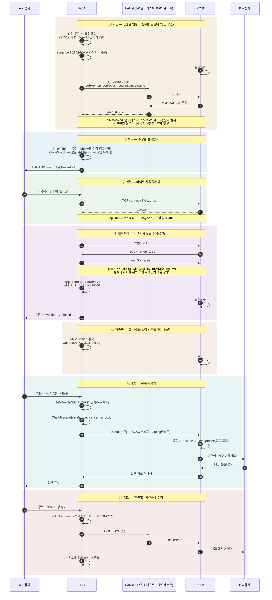
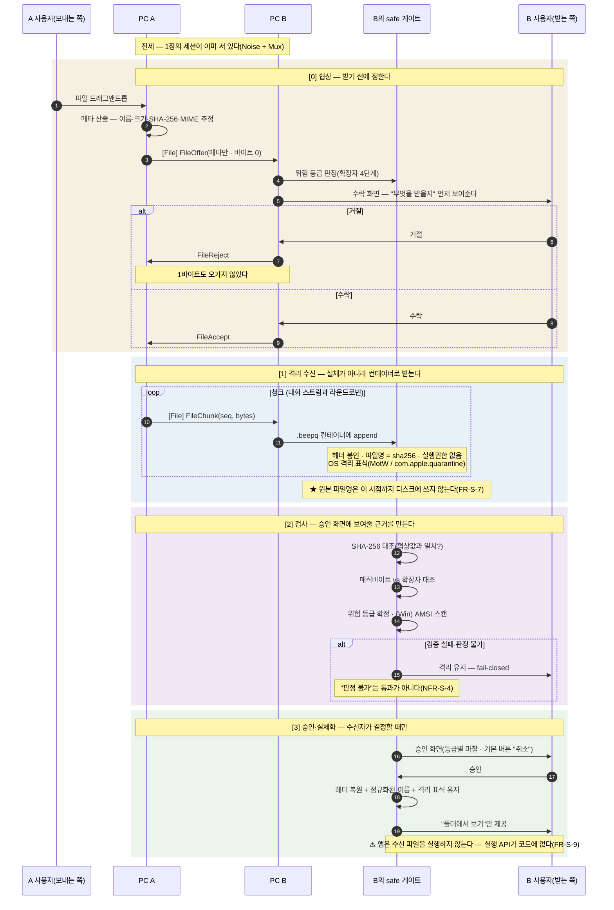
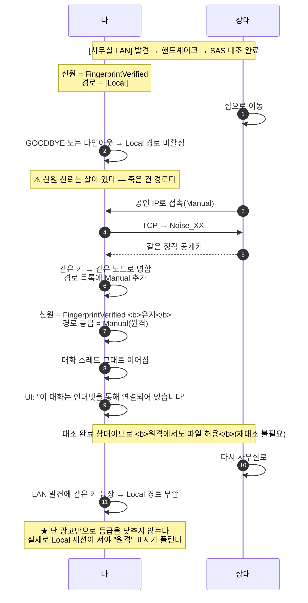

# 30 · 종단 동작 설명서 — 두 PC가 만나 대화하고 파일을 주고받기까지

> **이 문서 하나로 "무엇이 언제 어떻게 정해지고 실행되어 어떤 결과를 만드는가"를 순서대로 따라갈 수 있게** 쓴 문서다.
> 작성 2026-08-09 · **범례**: ✅ 구현·실증 · 🚧 일부 구현 · 📐 설계만(코드 없음)
> 근거: [08 ADR-0002](08-adr-0002-discovery-transport.md)(발견·세션·암호) · [09 ADR-0003](09-adr-0003-transport-abstraction.md)(경계) · [04](04-safe-transfer.md)·[11 ADR-0004](11-adr-0004-quarantine.md)(무해화) · [21](21-identity-spec.md)(신원) · [29](29-wire-security-audit.md)(와이어 점검)

---

## 0. 먼저 — 이 그림을 지배하는 원칙 세 개

이걸 모르면 아래 순서가 왜 그렇게 생겼는지 이해할 수 없다.

| # | 원칙 | 이 문서에서 어떻게 나타나나 |
|:--:|---|---|
| **P-A** | **발견은 주장, 세션은 증명** | 1단계에서 얻는 `PeerId`는 **믿을 수 없는 힌트**다. 3단계 핸드셰이크가 끝나야 신원이 확정된다 |
| **P-B** | **암호는 전송 "위"** | TCP는 바이트 관일 뿐이다. 암호 세션이 그 위에 앉고, 다중화는 **암호 세션 위**에 앉는다 |
| **P-C** | **봉투만 본다** | 각 계층은 자기 일에 필요한 것만 본다 — 링크는 길이, 다중화는 스트림 번호, 게이트는 메타데이터 |

**전체 스택** — 아래에서 위로 쌓인다.

```
┌─────────────────────────────────────────────┐
│ 대화·파일 (ChatMessage / FileOffer …)        │  ← 의미
├─────────────────────────────────────────────┤
│ MuxSession   [stream_id 1B][payload]        │  ← 봉투 = 스트림 번호뿐
├─────────────────────────────────────────────┤
│ NoiseSession  AEAD 암·복호                   │  ← 여기서부터 평문이 없다
├─────────────────────────────────────────────┤
│ TcpLink       [len u32 BE][payload] ≤64KB    │  ← 봉투 = 길이뿐
├─────────────────────────────────────────────┤
│ TCP / IP                                     │
└─────────────────────────────────────────────┘
        ※ 발견(UDP)은 이 스택 밖의 별도 평문 경로다
```

---

## 1. 전체 시퀀스 — 기동부터 대화까지 ✅ *실증됨*



---

## 2. 단계별 상세 — 무엇이 정해지고, 무엇이 실행되고, 무슨 결과가 남나

### ① 기동 — 신원 생성 ✅

| | 내용 |
|---|---|
| **정해지는 것** | **`PeerId` = X25519 정적 공개키 32B**. 최초 실행 시 OS CSPRNG로 생성해 파일에 저장하고, 이후 실행에서는 로드한다 |
| **실행** | 키쌍 생성 → 신원 파일 기록 → `instance` 16B 난수 생성(**프로세스마다 새로** — 재시작과 복제를 구별) |
| **결과** | 이 PC의 **영구 식별자**가 생긴다. 해시하지 않고 공개키 **그 자체**를 쓴다 |
| **왜** | 계정·서버 없이 유일성을 얻는 유일한 방법이 난수다([21 P-2](21-identity-spec.md)). 발급자가 없으니 조율도 없다 |
| ⚠️ | **개인키는 로컬에만**. 이 파일이 곧 신원이라 **복제하면 같은 `PeerId`가 둘이 된다**(R-12 → `instance`로 **탐지**) |

### ① 기동 — 존재 알림 ✅

| | 내용 |
|---|---|
| **정해지는 것** | 발견 패킷 내용 = `magic·ver·type·flags·pubkey·tcp_port·epoch·seq·instance·name`. **총 88B**(이름 길이에 따라 변동, ≤512B 강제) |
| **실행** | **S1(IPv6 멀티캐스트)·S2(IPv4 멀티캐스트)·S3(브로드캐스트)를 동시에** 발사. 순차로 기다리면 3초 예산을 못 지킨다 |
| **결과** | 같은 L2 도메인의 모두가 받는다 |
| 🔴 **주의** | **이 구간은 평문이고 인증도 없다.** 우리 앱이 없어도, 그룹 조인 없이 **포트만 열어도** 받힌다([29](29-wire-security-audit.md) 실측). 그래서 여기 **무엇을 싣느냐가 전부**다 — 현재 **표시 이름이 실명을 흘린다(R-19)** |

### ② 목록 — 주장 정리 ✅

| | 내용 |
|---|---|
| **실행** | `PeerTable`이 **같은 `pubkey`의 여러 경로를 하나로 병합**(FR-D-6 — 유선·무선 동시 연결이면 같은 노드가 두 번 보인다) · `CloneWatch`가 **같은 키·다른 `instance`** 동시 관측을 감시 |
| **결과** | 화면에 **1행 = 1노드**. 배지는 **`Unverified`** |
| **왜 Unverified** | 아직 아무것도 증명되지 않았다. **누구나 남의 `pubkey`를 복사해 뿌릴 수 있다**(P-A) |

### ③ 연결 — 바이트 관 ✅

| | 내용 |
|---|---|
| **실행** | 발견 패킷의 `tcp_port`로 TCP 연결 → `TcpLink` 생성 |
| **프레이밍** | **`[len u32 BE][payload]`**, 프레임 상한 **64KB**. TCP는 스트림이라 경계가 없으므로 **여기서 메시지 경계를 만든다** |
| **결과** | 순서·신뢰가 보장되는 **바이트 관** 하나 |
| ⚠️ **경계 규칙** | IP·포트(`Locator`)는 **`net` 크레이트 밖으로 나가지 않는다.** 상위는 `PeerId`만 안다([09](09-adr-0003-transport-abstraction.md) 규칙 1) |

### ④ 핸드셰이크 — ★ 신원 증명 ✅

| | 내용 |
|---|---|
| **프로토콜** | **`Noise_XX_25519_ChaChaPoly_BLAKE2s`** — 3-메시지. `snow`에 위임(암호를 직접 구현하지 않는다) |
| **왜 `XX`인가** | 사전 등록이 없어 **상대 키를 미리 모른다.** `IK` 같은 패턴은 상대 키를 알아야 해서 **첫 접촉에 쓸 수 없다** |
| **결과 1** | 상대의 정적 공개키가 **암호학적으로 인증**된다 — *"이 사람이 그 개인키를 갖고 있다"* |
| **결과 2** | 이후 모든 바이트가 **AEAD로 암·복호**된다. 이 지점부터 **와이어에 평문이 없다** |
| **결과 3** | `TrustStore.on_session()` → 처음 보는 키면 **TOFU 핀** → 배지 **`Pinned`** |
| ⚠️ **한계** | **최초 접촉에 이미 중간자가 있으면 공격자의 키를 핀한다**(R-1). 그걸 닫는 건 **SAS 60자리 육안 대조**뿐 — 대조하면 `FingerprintVerified` |
| ⚠️ | 핀은 현재 **메모리 전용**이라 재시작하면 사라진다(**R-17** → M2-5a) |

### ⑤ 다중화 — 한 세션을 나눠 쓴다 ✅

| | 내용 |
|---|---|
| **정해지는 것** | 스트림 3종 — **`Control`(제어: 수신확인·프로필·공유목록) / `Chat`(대화) / `File`(파일)** |
| **봉투** | **`[stream_id 1B][payload]`** — 다중화 계층이 보는 건 **번호 하나뿐**이다(P-C) |
| **왜 세션을 나누지 않고 스트림을 나누나** | 스트림마다 세션을 열면 **핸드셰이크·소켓이 배로 늘고**, 경로가 바뀔 때 상태가 갈라진다. *"세션 = 상대당 하나"* 를 지킨다 |
| **전방 호환** | **미지 스트림 번호는 조용히 버린다** — v2가 스트림을 추가해도 v1이 죽지 않는다 |
| **백프레셔** | `Chat`을 읽는 동안 도착한 `Control`은 큐에 쌓이고, 상한을 넘으면 **세션을 끊는다**(fail-closed). 무한 버퍼는 상대가 내 메모리를 키우는 공격면이다 |

### ⑥ 대화 — 실제 메시지 ✅

```
입력 "안녕하세요"
   │  ① SafeText 무해화 — RLO(U+202E)·제어문자·0폭 제거 (FR-S-13)
   ▼  ★ 타입이 강제한다: 통과 못 한 문자열은 스레드에 넣을 수 없다(컴파일 불가)
ChatMessage { sender_device: 내 PeerId, seq: n, body: Text }
   │  ② 봉투 인코딩 (최소 42B)
   ▼
[stream_id=Chat][봉투]        ← 다중화
   │  ③ AEAD 암호화
   ▼
[len u32][암호문]              ← 링크 프레이밍
   ▼ TCP
```

수신 측은 정확히 역순이고, 마지막에 **`DedupIndex`** 를 통과한다.

| 필드 | 왜 있나 |
|---|---|
| **`sender_device`** | 어느 **기기**가 보냈는지. v2 다중 기기에서 sender copy와 원본을 구분한다(V1-3) |
| **`seq`** | 기기별 **단조 증가**. 다중 경로로 같은 메시지가 두 번 와도 **중복 제거**의 근거(FR-M-9) |

> **결과**: 상대 화면에 메시지가 뜬다. **비동기 수신 펌프**가 세션을 액터 스레드에 두고, 도착분을 UI 이벤트로 올려 **실시간 반영**한다(M2-7 ✅).

### ⑦ 종료 — 떠난다고 알린다 🚧

| | 내용 |
|---|---|
| **실행** | `plat::shutdown` 포트가 `SIGINT`/`SIGTERM`을 받아 **플래그**를 세운다 → 블로킹 루프가 깨어난다 → **GOODBYE 발신** → 세션·소켓·워커 회수 |
| **결과** | 상대 목록에서 **즉시** 사라진다 |
| **왜 중요** | 이탈 판정은 **GOODBYE + 타임아웃 이중**이다(FR-D-8). GOODBYE가 없으면 상대는 **항상 타임아웃까지 기다린다** |
| **실측** | SIGTERM **0.09초** · 관찰 노드가 `kind=Goodbye` 수신 확인 |
| ⚠️ 잔여 | Windows 콘솔 핸들러 · zeroize(M2-5) |

---

## 3. 파일 송수신 — **왜 별도 스트림인가** 📐 *설계(M4)*

### 3-1. 두 가지를 갈라야 한다

| | **별도 "스트림"** ✅ | 별도 "세션" ❌ |
|---|---|---|
| 무엇 | 같은 암호 세션 안의 `File` 스트림 | 새 TCP + 새 핸드셰이크 |
| 왜 | **대용량 파일이 대화를 굶기지 않게** 분리 | 핸드셰이크·소켓 배증 · 신뢰 상태 분리 |
| 우리 선택 | **이것** — 라운드로빈 + 청크 상한 | 채택 안 함 |

> ★ **핵심**: 파일은 **같은 세션·같은 암호**를 탄다. 별도 평문 경로를 만들지 않는다(W-9). 분리되는 것은 **논리 스트림과 스케줄링**이지 보안 경계가 아니다.

### 3-2. 시퀀스 — 4단계 게이트



### 3-3. 단계별 — 무엇이 정해지고 무슨 결과가 남나

| 단계 | 정해지는 것 | 실행 | 결과 | 막는 위협 |
|---|---|---|---|---|
| **[0] 협상** | 파일명·크기·해시·위험 등급 | 메타만 교환 · 수신자 판단 | **수락 전 1바이트도 안 받는다** | 원치 않는 파일 강제 수신 |
| **[1] 격리** | `.beepq` 레이아웃 | 헤더 봉인 · **콘텐츠 주소 파일명**(`<sha256>.beepq`) · 실행권한 없음 · OS 격리 표식 | 디스크에 **실행 가능한 실체가 없다** | 수신 즉시 실행 · 로더가 해석 |
| **[2] 검사** | 무결성·정합성 | SHA-256 대조 · 매직 vs 확장자 · AMSI | **승인 화면에 보여줄 근거** | 위장 확장자 · 전송 중 변조 |
| **[3] 승인** | 사용자의 명시적 결정 | 등급별 마찰 · **기본 버튼 "취소"** | 실체화 + **격리 표식 유지** | 무심코 승인 · 2차 방어 무력화 |

### 3-4. 이 설계가 만들어내는 최종 결과

- **승인 전에는 어떤 방법으로도 실행되지 않는다**(성공 기준 S-6).
- 복원 후에도 **MotW / `com.apple.quarantine`이 남아** SmartScreen·Gatekeeper가 **2차로 검사**한다.
- **보낸 사람이 누구든 게이트는 똑같이 적용된다**(FR-S-17) — "아는 사람이니 통과"가 없다. [공유 폴더 pull](23-adr-0009-shared-folders.md)로 **내가 직접 고른 파일도** 같은 게이트를 탄다.
- 이미지는 한 겹 더 — **권한을 낮춘 별도 프로세스**(`imgdec`)에서 디코드하고 **재인코딩본만** 표시한다. 파서 취약점이 본체를 못 건드린다(R-5).

---

### 3-4b. 속도는 누가 정하나 — 자동 대역의 동작 (M4-11 · 08-16)

파일이 느리다면 대역 협상을 보라 — 속도는 소켓이 아니라 **세 값의 협상**이 정한다:

1. **수락 순간** 수신자가 자기 수신 상한을 공지한다. **Auto(기본) = 0 = "상한을
   주장하지 않는다"** — 자동의 뜻은 "발신자가 자기 관측의 절반으로 알아서
   양보한다"이다. 설정에서 명시 값을 고르면 그 값이 공지되고, 발신자는 **둘 중
   낮은 쪽**을 따른다(수신측 제약 — 사용자 확정 08-09).
2. **첫 2MiB는 전속(프로브)** — 여기서 실제 링크 능력이 관측된다. 프로브가
   끝나면 발신자는 **관측 peak의 절반**으로 속도를 잡는다(다른 앱의 대역을
   남긴다 — Auto의 존재 이유). 2MiB 이하 파일은 사실상 전속으로 끝난다.
3. 이후 토큰 버킷(Pacer)이 그 목표를 유지한다 — 진행 막대가 일정한 속도로
   차는 이유.

> 종전(v0.1.7까지)에는 관측 전의 하한(256KiB/s)이 공지·목표 양쪽에 박혀
> **localhost에서도 0.25MB/s로 고착**됐다 — 관측이 페이싱에 갇히는 되먹임.
> 상세와 교훈은 [06 §5-1](06-network-stack.md).

## 3-5. 상대가 자리를 옮기면 — 경로 전환 📐 *설계([19 §5-1](19-adr-0006-manual-endpoint.md) · DR-28)*

지금까지는 **한 자리에 머무는** 두 PC였다. 실제로는 사람이 사무실에서 집으로 간다.



| 질문 | 답 |
|---|---|
| 인증이 유지되나 | ✅ **유지된다** — 신뢰는 **키**에 붙는다 |
| 내부·외부 IP가 한 사람에게 붙나 | ✅ **경로 후보가 둘**이 된다 |
| **PC 2대로 인식하나** | ❌ **아니다. 1대다** — 병합 근거는 **암호학적 증거**이지 IP가 아니다 |
| 무엇이 바뀌나 | **경로 목록·경로 등급·UI 표시**뿐. 대화·기록·차단·신뢰는 그대로 |

> ★ **두 축을 갈라 기억한다** — **신원 신뢰는 키에**(이동해도 따라간다) · **경로 등급은 경로에**(통로가 바뀌면 바뀐다).
> **원칙**: ***신원이 바뀌면 시끄럽게 알리고, 경로가 바뀌면 조용히 표시만 바꾼다.***
> ⚠️ **경로는 늙는다**(R-20) — 옛 공인 IP는 재할당되므로 실패 상한·**다른 키 성립 시 즉시 무효화**·보존 상한이 필요하다.

---

## 4. 전 과정에서 "무엇이 새고 무엇이 안 새나"

| 구간 | 도청자가 보는 것 | 보지 못하는 것 |
|---|---|---|
| **발견(UDP · 평문)** | 존재 · **표시 이름** · **공개키 32B** · IP · TCP 포트 | 대화 · 파일 · 프로필 필드 |
| **핸드셰이크** | 연결 사실 · 패킷 크기 | 정적 키(암호화 교환) — ⚠️ **단 발견이 이미 평문으로 뿌렸다** |
| **대화·파일(AEAD)** | **길이 · 타이밍** · 연결 상대 | **내용 · 파일명 · 스트림 종류** |
| **경로 전환 시** | 연결 상대가 어느 망에 있는지(IP 변화) | 대화 연속성은 안 끊긴다 — 상대는 **같은 노드** |
| **디스크** | (설계) 암호화 세그먼트 | 본문·첨부·상대·시각·인덱스 |

🔴 **열린 문제**: **R-19**(이름이 실명 방송) · **R-18**(공개키 = 영구 재식별자) · **R-17**(핀 비영속). 점검 기준과 상시 관찰은 [29](29-wire-security-audit.md)·[TODO §9](TODO.md).

---

## 5. 구현 현황 — 이 문서의 어디까지가 진짜인가

| 단계 | 상태 | 근거 |
|---|:--:|---|
| ① 신원 생성·발견 발신 | ✅ **실증** | 로컬 2노드·Docker 교차 발견 |
| ② 목록·병합·복제 감시 | ✅ | `PeerTable`·`CloneWatch` |
| ③ TCP 링크 | ✅ | `TcpLink` 프레이밍 |
| ④ Noise 핸드셰이크·TOFU | ✅ **실증** | 배지 `Unverified`→`Pinned` 육안 확인 |
| ⑤ 다중화 | ✅ | `MuxSession` 3스트림·백프레셔 |
| ⑥ 대화 왕복 | ✅ **실증** | GUI ↔ 터미널 양방향·한글 |
| ⑦ 종료·GOODBYE | 🚧 | 0.09초 실측 · Windows 잔여 |
| **[0]~[3] 파일 게이트** | 📐 **설계만** | `.beepq` 코덱은 브랜치에만 · M4-2/3 미착수 |
| **경로 전환·2축 신뢰** | 📐 | DR-28 · M5-3c |
| 기록 저장(암호화) | 📐 | M2-5 · D-18 대기 |

> **요약**: **대화까지는 전 계층이 실물로 돌아간다.** 파일 전송은 설계가 확정돼 있고 구현은 M4다.
