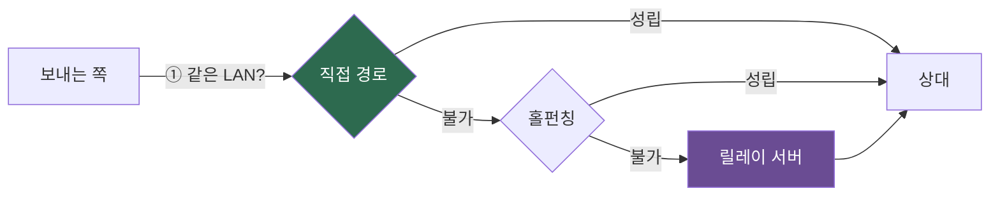
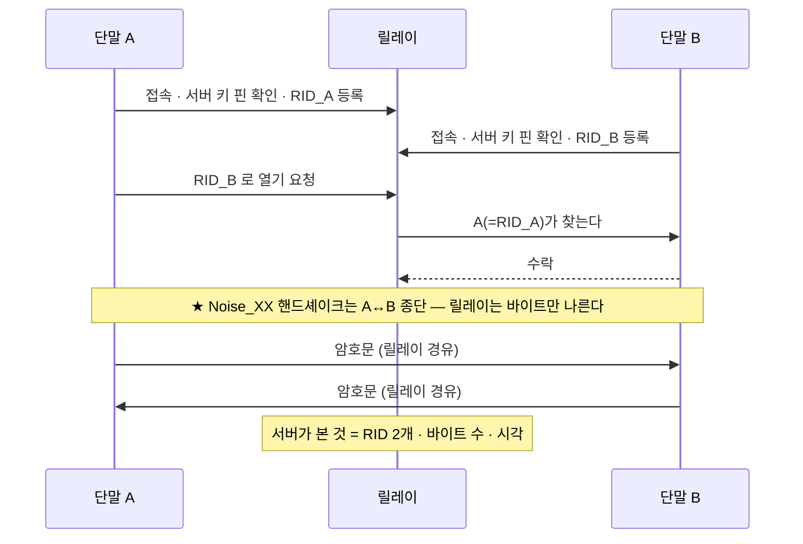
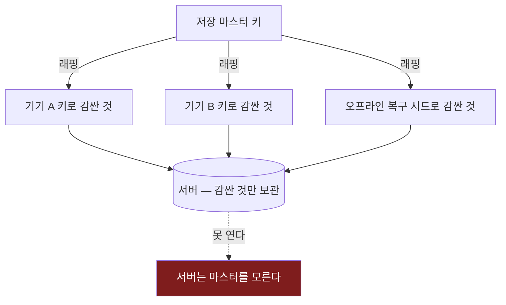
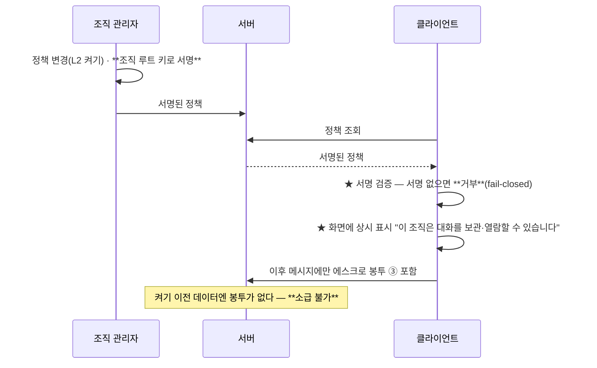
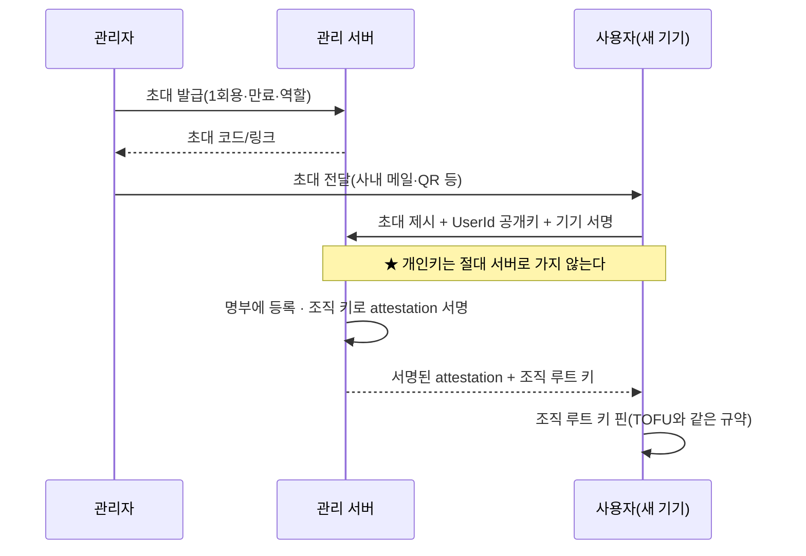
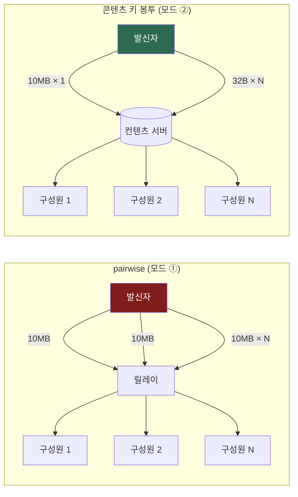
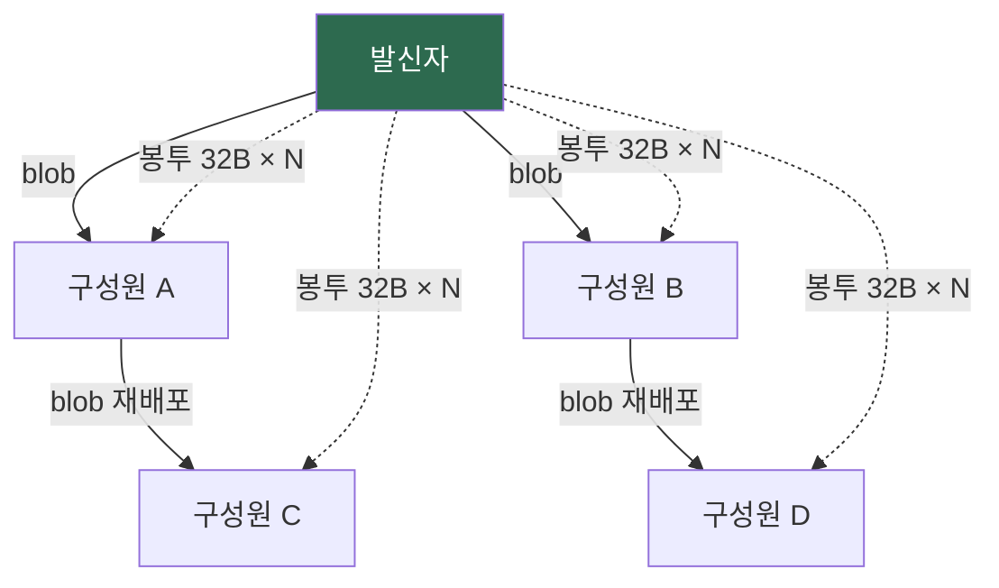
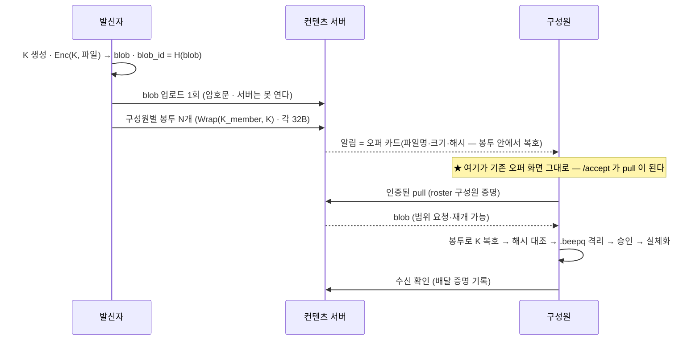
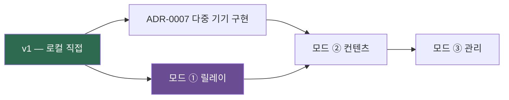

# 32 · ADR-0013 — `nexa-beepd` 서버 모드 (릴레이 / 컨텐츠 / 관리)

> **상태**: 📐 Proposed — 🔴 사용자 확정 대기(D-29)
> **범위**: **방향성만**. 구현 대상이 아니다(사용자 명시 08-13). 저장소도 별도(**DR-9** — `nexa-beepd`), 시점도 v1 이후.
> **이 문서가 하는 일**: 세 모드를 실체화하고, **기존 결정과 충돌하는 지점을 먼저 드러내** 그 처방까지 정한다.
> **보완(08-13)**: [§3-8](#3-8--갈림길--도착한-단말에서만-vs-다른-pc에서도)(A/B 갈림길) · [§3-9](#3-9-언제-누가-누구에게를-남긴다--가능하다-대가를-적는다)(메타데이터) · [§5-8~5-10](#5-8-파일-전송--모드별-경로-사용자-보완-08-13)(파일 전송 — 재배포·pull).
> 선행: [31 ADR-0012 공유 그룹 채팅](31-adr-0012-shared-group-chat.md)(**§5에서 결합**) · [09 ADR-0003 전송 추상화](09-adr-0003-transport-abstraction.md) · [19 §5-1 신뢰 2축](19-adr-0006-manual-endpoint.md) · [20 ADR-0007 다중 기기](20-adr-0007-multi-device-identity.md) · [17 ADR-0005 저장 암호화](17-adr-0005-history-at-rest.md) · [21 신원 규격](21-identity-spec.md)

---

## 0. 요약 — 세 모드는 기능 목록이 아니다

세 모드를 "릴레이 + 저장 + 관리"라는 **기능 누적**으로 보면 설계가 반드시 샌다.
정확한 정의는 이것이다:

> ### ★ 세 모드는 **"서버가 무엇을 아는가"** 의 세 단계다.

| 모드 | 서버가 아는 것 | 서버가 **여전히 모르는 것** |
|---|---|---|
| **① 릴레이** | 누가 누구에게 보내는지(**연결 사실**), 바이트 수, 시각 | 내용 · 파일 이름 · 대화 이력 |
| **② 컨텐츠** | ① + **암호문 덩어리를 보관한다는 사실**, 크기, 보관 기간 | 내용 · 파일 이름 · 검색어 (전부 암호문) |
| **③ 관리** | ② + **사람과 조직의 명부**(계정·소속·기기 목록) | 내용 (관리자도 못 본다 — [§4-5](#4-5-관리자가-볼-수-있는-것과-없는-것)) |

이 표가 이 문서의 척추다. 기능을 더할 때마다 물어야 할 질문은 "그래서 **서버의 봉투에 무엇이 추가되는가**"이고,
답이 "내용"이면 그 기능은 **설계가 틀린 것**이다(관통 원리 — [10 §0](10-decision-record.md)).

---

## 1. 먼저 못 박을 것 — 서버는 **선택**이고, 없어도 제품이다

**DR-1(제로 컨피그)이 정체성**이다. 서버가 생기는 순간 "서버 주소를 입력하는 메신저"로 미끄러지기
쉬우므로, 다음 넷을 **불변식(S-0~S-3)** 으로 박고 시작한다.

| # | 불변식 | 깨지면 |
|---|---|---|
| **S-0** | **서버를 몰라도 완전한 제품이다.** 3모드 전부 **옵트인 오버레이** | DR-1 붕괴 — "실행 = 참여"가 "가입 = 참여"가 된다 |
| **S-1** | **같은 LAN이면 언제나 직접 경로가 우선.** 릴레이는 폴백이지 기본이 아니다 | 사내망 트래픽이 전부 서버를 왕복한다(느리고, 서버가 단일 장애점) |
| **S-2** | **서버가 죽어도 LAN 대화는 그대로 돈다**(fail-open **to LAN**) | 서버 장애 = 전사 통신 마비. 제로 컨피그의 장점이 사라진다 |
| **S-3** | **서버는 평문에 접근할 수 없다**(fail-closed **on data**) — DR-7 | 릴레이·보관·관리 어느 모드든 E2E를 뚫으면 제품이 아니다 |

> ⚠️ **S-2와 S-3의 방향이 반대인 게 핵심이다.** 서버가 없으면 **연결은 계속되고**(fail-open),
> 서버가 있어도 **데이터는 안 열린다**(fail-closed). 이 비대칭을 흐리면 "서버 장애 시 평문 폴백" 같은
> 최악의 절충이 나온다.



**경로 선택은 언제나 이 순서다.** 릴레이는 **세 번째**다([§1](#1-먼저-못-박을-것--서버는-선택이고-없어도-제품이다)).

---

## 2. 모드 ① 릴레이 게이트웨이

### 2-1. 푸는 문제 하나

> **양쪽 모두 NAT 안**(집 공유기 ↔ 회사 공유기)일 때 서로 닿게 한다. **그것만** 한다.

부가 기능이 없다는 게 이 모드의 정의다. 저장하지 않고, 계정이 없고, 조직을 모른다.

### 2-2. 서버가 보는 봉투

```
[목적지 태그][길이][암호문]
      ↑          ↑       ↑
   라우팅용   흐름제어   서버는 못 연다
```

서버는 **목적지 태그**만 본다. 그런데 그 태그가 곧 `PeerId`면 문제가 생긴다 →

### 2-3. ⚠️ 구멍 — 릴레이는 **R-18(영구 재식별자)을 서버로 확대**한다

[29 W-?](29-wire-security-audit.md)의 **R-18**은 "고정 공개키 = 영구 재식별자"다.
릴레이에 `PeerId`를 그대로 등록하면 서버는 **누가 언제 어디서 접속했는지의 영구 로그**를 갖는다.
LAN에서는 관찰자가 같은 브로드캐스트 도메인에 있어야 하지만, **릴레이는 전 세계 접속을 한 점에 모은다.**
위협의 크기가 다르다.

**처방 — 회전 랑데부 ID(rotating rendezvous ID)**

| 항목 | 설계 |
|---|---|
| 서버에 등록하는 값 | `RID = KDF(UserId_pub, epoch, shared_salt)` — **에폭마다 바뀐다** |
| 상대가 나를 찾는 법 | 상대도 같은 `RID`를 계산할 수 있다(내 공개키를 이미 아는 사람만) |
| 서버가 아는 것 | 무의미한 바이트열 하나가 접속했다는 사실 |
| 서버가 **모르는** 것 | 그게 누구인지, 어제의 그 사람과 같은 사람인지 |

> ★ **"상대가 이미 내 키를 아는 사람만 나를 찾을 수 있다"가 요점이다.** 이건 제약이 아니라 **정확히 옳은
> 성질**이다 — 릴레이는 *새로운 만남*을 주선하지 않는다. 만남은 LAN에서 일어나고([DR-1](10-decision-record.md)),
> 릴레이는 **이미 아는 사이가 다른 망으로 흩어졌을 때**를 푼다.

이 성질이 **R-4(스팸) 방어도 같이 준다** — 모르는 사람은 애초에 내 `RID`를 계산할 수 없다.

### 2-4. 서버 사칭 방지 — 서버도 핀한다

클라이언트가 릴레이에 붙을 때 **서버 공개키를 TOFU로 핀**한다(사람에게 하는 것과 같은 규약).
서버 키가 바뀌면 **시끄럽게** 알린다(DR-28 — *신원이 바뀌면 시끄럽게*).

⚠️ 서버를 신뢰해도 **종단 세션은 서버를 통과할 뿐**이다. Noise 핸드셰이크는 **상대와 직접** 한다 —
서버는 바이트를 나를 뿐 세션의 당사자가 아니다. 이걸 흐리면 릴레이가 MITM이 된다.



### 2-5. 경로 등급은 `Relay` — 신원 신뢰는 건드리지 않는다

[19 §5-1](19-adr-0006-manual-endpoint.md)의 **2축**이 여기서 그대로 값을 한다.

- **신원 신뢰**는 키에 붙는다 → 릴레이로 와도 **그대로**(핀 유지, 다시 묻지 않는다)
- **경로 등급**은 통로에 붙는다 → `Local` → `Relay`로 **낮아진다**

정책은 두 축의 곱이다. 예: *미검증 신원 × Relay 경로* = 파일 수신 차단(§2-6).

### 2-6. 남용 방지 — 릴레이는 **증폭기**가 되기 쉽다

| 위협 | 처방 |
|---|---|
| 대역폭 무임승차 | 계정 없는 모드라 **RID 단위 토큰 버킷** + 세션당 상한 · 일 누적 쿼터 |
| 증폭 공격(작은 요청 → 큰 응답) | 릴레이는 **양방향 이미 성립한 세션만** 중계. 단발 요청 응답 없음 |
| 좀비 세션 | 유휴 타임아웃 · keepalive 미응답 시 절단 |
| 서버를 파일 창고로 악용 | 모드 ①은 **버퍼가 아니라 파이프** — 양쪽이 동시 접속일 때만 흐른다(저장 0) |
| 스캐닝(RID 추측) | RID는 KDF 출력 128비트 이상 · 실패 시도 레이트 리밋 |

> ★ **모드 ①이 저장하지 않는다는 게 보안 자산이다.** 저장이 없으면 유출될 것도, 영장을 받을 것도,
> 백업할 것도 없다. 이 단순함을 유지하는 게 모드 ①의 존재 이유다.

### 2-7. 서버 주소는 어떻게 아는가 (제로 컨피그와의 타협)

| 방법 | 성질 |
|---|---|
| **초대 링크·QR** | 조직/지인이 주는 값 — 사람이 주소를 타이핑하지 않는다(DR-1 정신 유지) |
| 설정에 직접 입력 | 고급 사용자용 폴백 |
| **LAN 발견으로 릴레이 광고** | 사내 릴레이가 스스로를 알린다 — **사내에서는 완전 제로 컨피그** ★ |
| DNS SRV | 조직 도메인 기반 자동 탐색(선택) |

> LAN 발견으로 릴레이를 알리는 ③이 이 제품답다. 회사에서 앱을 켜면 사내 릴레이가 보이고,
> 집에 가면 그 릴레이를 통해 회사 동료에게 닿는다 — **사용자는 아무것도 입력하지 않았다.**

---

## 3. 모드 ② 컨텐츠 서버

### 3-1. ★ 정면 충돌 세 개 — 여기가 이 설계의 진짜 난제다

| # | 충돌 | 무엇과 |
|---|---|---|
| **C-1** | 서버에 기록·파일을 **보관**한다 | **DR-7 E2E** · S-3 |
| **C-2** | **다른 PC에서 접속**해 쓴다 | **DR-18**(PC 1대 = 노드 1개) · **DR-20**(다중 기기는 v2) |
| **C-3** | 새 PC가 **과거 기록을 복호**해야 한다 | [20 §제약3](20-adr-0007-multi-device-identity.md)(팬아웃은 *지금부터*만) · [17 §3](17-adr-0005-history-at-rest.md) 키 관리 |

**세 개를 뭉뚱그리면 반드시 "서버가 키를 갖는" 설계로 미끄러진다.** 하나씩 끊는다.

### 3-2. C-1 해법 — 서버는 **암호문 세그먼트의 동기화 대상**일 뿐이다

[17 §4](17-adr-0005-history-at-rest.md)가 이미 **세그먼트 구조**를 정해 뒀다. 그걸 **그대로 올린다.**

```
로컬 저장(17 §4)          서버 보관
┌──────────────┐        ┌──────────────┐
│ 헤더(평문)    │  ───▶  │ 헤더(평문)    │  ← 서버가 보는 것: 세그먼트 ID·크기·시각
│ 본문(AEAD)    │        │ 본문(AEAD)    │  ← 서버가 못 여는 것
└──────────────┘        └──────────────┘
```

- **새로 만드는 포맷이 없다.** 서버는 blob 저장소이고, 클라이언트가 이미 쓰던 세그먼트를 올린다.
- 서버는 **파일 이름도 모른다**(이름은 본문 안).
- ⚠️ **헤더가 곧 서버의 봉투**다 — 헤더에 무엇을 넣을지가 이 모드의 유일한 프라이버시 결정이다.
  [17 §4](17-adr-0005-history-at-rest.md)의 "헤더만 본다"를 서버에서도 그대로 지킨다.

### 3-3. C-2 해법 — **다중 기기(ADR-0007)가 선행 조건**이다

> ★ **모드 ②는 다중 기기 없이 성립하지 않는다.** "다른 PC에서 접속"이 곧 `UserId` 1:M `PeerId`다.

이건 새 설계가 아니라 **[20 ADR-0007](20-adr-0007-multi-device-identity.md)의 실현**이다.
그래서 로드맵상 **모드 ② = ADR-0007 구현 이후**로 못 박는다. 순서를 뒤집으면 서버가
"기기 목록"을 대신 관리하게 되고, 그러면 **서버가 신원의 권위**가 된다 — DR-20 위반이다.

| 누가 기기 목록의 권위인가 | 결과 |
|---|---|
| ❌ 서버 | 서버가 기기를 몰래 추가하면 **도청자를 끼워 넣을 수 있다** |
| ✅ `UserId` 개인키(사용자) | 서버는 **서명된 목록을 보관·배포만** 한다. 위조 불가 |

### 3-4. C-3 해법 — 백업 키를 한 겹 더 감싼다 (V1-4가 여기서 값을 한다)

[20 V1-4](20-adr-0007-multi-device-identity.md)가 "저장 마스터 키를 기기 키에서 **직접 파생하지 말고
한 겹 래핑**"을 v1 제약으로 걸어 뒀다. **그 이유가 정확히 이것이다.**



- 새 PC 등록 = **마스터를 재암호화하는 게 아니라 래핑을 하나 더 만드는 것**. 전 기록 재암호화 불필요.
- 서버는 래핑된 덩어리들을 보관·배포만 한다. **어느 것도 열 수 없다.**
- 기기 폐기 = 그 기기의 래핑 삭제 + 마스터 회전(이후분) — [17](17-adr-0005-history-at-rest.md) 크립토 셰레딩과 같은 논리.

> ⚠️ **정직하게 적어 둘 한계** — 폐기 이전에 그 기기가 이미 내려받은 기록은 회수할 수 없다.
> 크립토 셰레딩은 *앞으로*를 끊지 *과거*를 지우지 못한다. UI에 그대로 말해야 한다.

### 3-5. 서버가 **할 수 없는 것**을 먼저 적는다

암호문만 갖는다는 건 **못 하는 게 생긴다**는 뜻이다. 이걸 안 적으면 나중에 "편의를 위해" E2E를 판다.

| 흔한 요구 | 왜 못 하나 | 대안 |
|---|---|---|
| 서버 측 전문 검색 | 본문이 암호문 | **클라이언트 검색** + [17 §5](17-adr-0005-history-at-rest.md) 블라인드 인덱스. ⚠️ 인덱스를 서버에 올리면 빈도 분석이 가능해지므로 **사용자별 솔트 + 서버 보관 여부는 옵트인** |
| 서버 측 썸네일 생성 | 이미지가 암호문 | 발신 클라이언트가 만들어 **같이 암호화**해 올린다 |
| 서버 측 바이러스 검사 | 파일이 암호문 | **무해화는 수신 단말에서**(§3-6) |
| 관리자 대화 열람 | 키가 없다 | §6-5 — 원한다면 **명시적 에스크로**(옵트인·사용자 고지) |
| 웹 브라우저 접속 | 키를 브라우저에 넣어야 한다 | v1 범위 밖. 넣는다면 **키가 서버로 가지 않는 설계**가 전제 |

### 3-6. ⚠️ 서버가 보관해도 **무해화 게이트는 수신 단말이 한다**

[04 T-7](04-safe-transfer.md): *"수신 파일은 보낸 사람이 누구든 믿지 않는다."*
**그 "누구든"에 서버도 포함된다.** 서버를 거쳐 왔다는 사실은 안전의 근거가 아니다.

→ 서버에서 내려받은 파일도 **`.beepq` 격리 → 검사 → 승인 → 실체화**(DR-13) 4단계를 그대로 탄다.
→ 서버가 "검사 완료" 표시를 붙여도 **클라이언트는 그것을 신뢰하지 않는다**(참고 정보일 뿐).

### 3-7. 보관 정책 — 무한 보관은 설계가 아니다

| 항목 | 설계 |
|---|---|
| TTL | 기본 보관 기간(조직/사용자 설정) · 만료 시 **암호문 삭제** |
| 쿼터 | 사용자별 용량 상한 · 초과 시 **오래된 것부터 만료 예고** |
| 삭제 요청 | 사용자가 지우면 서버 blob 삭제 **+ 래핑 키 폐기**(크립토 셰레딩 — 백업 사본까지 무력화) |
| 백업 | 서버 백업도 암호문 그대로 — **백업이 평문화 지점이 되면 안 된다** |
| 오프라인 큐 | 상대가 꺼져 있을 때 대기 — TTL 짧게(예: 7일) · 전달 후 즉시 삭제 |

### 3-8. ✅ 확정 — 컨텐츠 모드는 **동기 저장소(B)** 다 (사용자 확정 08-13)

앞선 보완에서 두 모델(A 저장형 중계 / B 동기 저장소)을 갈라 물었고, **사용자가 B로 확정**했다.
따라서 모드 ②의 약속은 이것 하나다:

> ### ★ **"어느 기기에서 접속해도 내 대화와 파일이 있다."**
> *"꺼져 있어도 도착한다"*(A)는 **B가 자연히 포함**한다 — 반대는 성립하지 않는다.

**확정에 따라오는 것 — 숨기지 않고 적는다**

| 따라오는 것 | 내용 |
|---|---|
| **선행 필수** | [ADR-0007 다중 기기](20-adr-0007-multi-device-identity.md) 구현. B는 `UserId` 1:M `PeerId` 없이는 말이 안 된다([§3-3](#3-3-c-2-해법--다중-기기adr-0007가-선행-조건이다)) |
| **키 계층 필수** | 저장 마스터 키 + 기기별 래핑([20 V1-4](20-adr-0007-multi-device-identity.md)) · **오프라인 복구 시드** |
| **복구 불가 지점** | 마스터를 잃으면 **서버도 못 열어 준다.** 그게 설계다 — 가입 시 고지(G-14) |
| **동기 상태 관리** | 기기마다 "어디까지 받았나"(커서)가 필요 — 아래 §3-8-2 |

#### 3-8-1. 암호 구조 — 봉투 두 겹, 본문은 한 번

```text
본문   Enc(K_content, 평문)                    ← 한 번만 암호화. 이게 blob (내용 주소 §5-9)
봉투 ①  Wrap(K_user_master, K_content)         ← ★ B의 본체 — 내 모든 기기가 연다
봉투 ②  Wrap(K_recipient_device, K_content)    ← 즉시 배달용(상대가 온라인일 때 빠른 경로)
봉투 ③  Wrap(K_escrow_org, K_content)          ← 조직 감사가 켜졌을 때만(§3-10 · 기본 없음)
```

- **`K_user_master`는 기기 키로 다시 감싸 서버에 둔다** — 서버는 어느 것도 못 연다.
- 새 기기 등록 = **마스터 래핑을 하나 더 만드는 것**. 본문·과거 blob은 손대지 않는다.
- 기기 폐기 = 그 래핑 삭제 + 이후분 마스터 회전([17](17-adr-0005-history-at-rest.md) 크립토 셰레딩).

> ★ **봉투가 여러 겹이어도 본문은 하나**라는 게 이 설계의 전부다. 그래서 같은 구조가
> **그룹 팬아웃**([§5-9](#5-9--그룹-파일-어떻게-보내는-게-가장-좋은가-순서대로))과 **A→B 이행**과 **서버 보관**을 함께 푼다.

#### 3-8-2. 기기 동기 — 커서와 충돌

| 항목 | 설계 |
|---|---|
| 진행 커서 | 기기별 `(스레드, 마지막 적용 seq)` — 서버에 **암호화해** 보관(서버는 진도도 모른다) |
| 순서 | [31 G-5](31-adr-0012-shared-group-chat.md) 그대로 — **발신자별 seq + 도착순 병합**(서버가 전역 순서를 정하지 않는다) |
| 중복 | `(group_uid \| peer, sender_device, sender_seq)`([§5-3](#5-3-이중-보관--발신자와-서버가-둘-다-갖는다) · P-10) |
| 읽음 상태 | 기기 간 동기 대상 — 단 **"읽음"은 상대에게 안 보낸다**([DR-25](10-decision-record.md) — 수신확인은 수동 버튼만) |
| 충돌 | 대화는 append-only라 충돌이 없다. **설정·프로필**만 last-writer-wins + 타임스탬프 |

> ⚠️ **서버가 전역 순서를 정하면 안 된다.** 편하지만 그 순간 서버가 대화의 권위가 되고,
> 서버 없는 LAN 모드와 순서가 갈린다(S-0 위반). 병합은 클라이언트가 한다.

### 3-9. 기록 등급 L0~L2 — **기본은 안전하게, 필요하면 전부**

사용자 요구(08-13): *"보안 관점에서 문제없는 수준으로 관리하되, **필요할 때 전체 내용을
기록·관리할 수 있는 데이터·기술 구조**로."*

정책 문장이 아니라 **구조**로 답한다. 기록을 **세 등급**으로 나누고, **등급은 나중에 올릴 수
있지만 소급은 안 되게** 만든다.

| 등급 | 서버가 갖는 것 | 내용 열람 | 켜는 주체 | 기본 |
|:--:|---|:--:|---|:--:|
| **L0 운영 최소** | 라우팅에 필요한 것만 · 즉시 폐기 · **집계만** 잔존 | ❌ | — | ✅ **기본** |
| **L1 배달 기록** | `언제·누가(가명)·누구에게·크기·blob_id` — 보존 기간 상한 | ❌ | 조직/사용자 설정 | |
| **L2 전체 보존** | L1 + blob 장기 보존 + **에스크로 봉투** | ✅ **가능** | 조직이 명시 · **상시 고지** | |

> ★ **핵심은 "L2가 가능하다"가 아니라 "L2가 몰래는 불가능하다"** 이다. 아래 구조가 그걸 보장한다.

#### 3-9-1. 데이터 구조 — 이벤트 원장(append-only 해시 체인)

```text
EventRecord {
  seq:       u64,          // 테넌트별 단조 증가 — 빠지면 즉시 드러난다
  ts:        u64,
  kind:      Sent | Delivered | Pulled | Uploaded | RosterChanged | EscrowRead | PolicyChanged,
  actor:     PseudoId,     // 가명 (실명 아님)
  target:    PseudoId | GroupUid,
  blob_id:   Option<[u8;32]>,   // 내용 주소 — 본문과의 연결 고리
  size:      u32,
  epoch:     u32,          // 보존 세그먼트 — 폐기 단위(§3-9-3)
  prev_hash: [u8;32],      // ★ 해시 체인 — 관리자도 조용히 지울 수 없다
}
```

| 필드 | 왜 이렇게 |
|---|---|
| **`PseudoId = HMAC(tenant_salt, UserId)`** | 테넌트 **안에서만** 안정. 테넌트 간 교차 상관 불가(G-8). 실명 연결은 **모드 ③ 명부에서만**, 별도 권한 |
| **`prev_hash` 체인** | 감사 로그의 무결성(G-10). *관리자가 자기 흔적을 지울 수 있으면 감사가 아니다* |
| **`blob_id`** | 기록과 본문을 잇는 유일한 끈. **이름·내용은 없다** |
| **`epoch`** | 보존 만료를 **키 폐기**로 처리하기 위한 단위(§3-9-3) |
| `EscrowRead`·`PolicyChanged` | ★ **감사의 감사** — 누가 언제 정책을 바꾸고 무엇을 열었는지가 같은 체인에 남는다 |

#### 3-9-2. 기술 구조 — 클라이언트가 봉투를 만든다 (서버는 켤 수 없다)

L2의 열람 능력은 **에스크로 봉투 ③**([§3-8-1](#3-8-1-암호-구조--봉투-두-겹-본문은-한-번))에서만 나온다. 그 봉투를 **누가 만드는가**가 이 설계의 급소다.



| 안전장치 | 내용 |
|---|---|
| **서버가 못 켠다** | 봉투를 만드는 건 클라이언트다. 서버가 요구해도 **조직 루트 키 서명이 없으면 거부** |
| **몰래 못 켠다** | 정책이 서명돼 있어 서버가 "고지 없음"으로 위조할 수 없다. 켜지면 **화면에 상시 표시** |
| **소급 불가** | 과거 blob엔 봉투 ③이 없다. **켜기 이전은 영원히 못 연다** |
| **혼자 못 연다** | 에스크로 개인키는 **M-of-N 분할**(예: 관리자 2/3) · **서버에 두지 않는다**(HSM·오프라인) |
| **연 것이 남는다** | 열람은 `EscrowRead` 이벤트로 해시 체인에 기록 — 지울 수 없다 |
| **끄면 즉시 중단** | 이후분에 봉투를 안 붙인다 |

> ⚠️ **서버가 털려도 L2 내용은 안 열린다** — 에스크로 개인키가 서버에 없기 때문이다.
> 이 성질이 "전체 기록이 가능한 서버"를 **위험한 자산이 아니게** 만든다.

#### 3-9-3. 보존과 삭제 — 지운다는 말을 신뢰할 수 있게

기록도 **에폭 단위로 암호화**해 둔다. 만료 = **그 에폭 키를 폐기**(크립토 셰레딩 — [17](17-adr-0005-history-at-rest.md) 기법 재사용).

| | 파일 삭제 | **키 폐기(채택)** |
|---|---|---|
| 백업 사본 | 남는다 | **함께 무력화** |
| 스냅샷·복제본 | 남는다 | **함께 무력화** |
| 검증 가능성 | 어렵다 | 키가 없다는 것으로 증명 |

| 항목 | 기본값(제안) |
|---|---|
| L1 배달 기록 보존 | **90일** — 조직 설정(상한도 제품이 정한다: 예 최대 3년) |
| L2 본문 보존 | 조직 설정 · **무기한 금지** |
| 집계 지표 | 개인 식별 불가 형태로만 무기한 허용 |
| 사용자 삭제 요청 | 해당 blob + 봉투 폐기 · **이벤트 원장은 남는다**(무결성) — 대신 원장에는 내용이 없다 |

#### 3-9-4. 열람 권한 — 등급별로 다른 문

| 권한 | 볼 수 있는 것 | 감사 기록 |
|---|---|---|
| 사용자 본인 | 내 이벤트 | — |
| 조직 관리자(기본) | **집계만**(건수·용량·활성 사용자) | — |
| 조직 관리자(조회 권한) | 개별 왕래(가명) | ✅ 남는다 |
| 조직 감사자(L2 · M-of-N) | **내용** | ✅ 남는다 |
| 서버 운영자 | 봉투 수준 지표만 — **테넌트 교차 조회 금지** | ✅ |

> ⚠️ **모드 ①과의 관계를 다시 못 박는다** — [§2-3](#2-3--구멍--릴레이는-r-18영구-재식별자을-서버로-확대한다)의 회전 RID는 이 기록을 **일부러 못 남기게** 만든 장치다.
> **모드 ①은 L0 고정**이고, L1 이상은 모드 ② 이상에서만 켜진다. 같은 서버가 둘을 겸하더라도
> 사용자에게는 **다른 약속**으로 보여야 한다(접속 시 현재 등급을 표시).

---

## 4. 모드 ③ 관리 서버

### 4-1. ★ 철학 충돌 — 익명·수평(TOFU) vs 권위·수직(조직)

이 제품의 신뢰는 **TOFU**다. 아무도 보증하지 않고, 처음 본 키를 기억하고, 사람이 SAS로 확인한다.
조직 관리는 정반대다 — **권위가 "이 사람은 우리 직원이다"라고 보증**한다.

**섞는 방법이 잘못되면 조직이 MITM을 할 수 있게 된다.** 그래서 규칙을 하나 박는다:

> ### ★ 조직 서명은 신원 신뢰의 **소스 하나**일 뿐, TOFU를 **대체하지 않는다.**

| | TOFU 핀 | 조직 서명(attestation) |
|---|---|---|
| 무엇을 말하나 | "이 키를 전에 봤다" | "이 키는 우리 조직의 홍길동이다" |
| 누가 보증 | 아무도(경험) | 조직 키 |
| 바뀌면 | **시끄럽게** 경고 | 명부 갱신(조용) |
| SAS를 대체하나 | — | **❌ 절대 아니다** |

**구체적 규칙**

- 조직 서명이 있어도 **핀은 그대로 잡는다.** 조직이 나중에 다른 키를 같은 이름으로 서명해도
  **키가 바뀌었다는 경고는 뜬다.** (조직이 몰래 사람을 바꿔치기 못 한다)
- 조직 서명은 **표시 등급을 올려 주지만**(예: `조직 확인됨` 배지) `FingerprintVerified`(SAS 대조)를
  **주지 않는다.** 최고 등급은 사람이 직접 확인했을 때만.
- 조직 서명이 **없어도** 대화는 된다(모드 ③에서 조직이 외부 차단을 켜지 않는 한 — §4-4).

### 4-2. 가입·등록 흐름



**핵심 성질**

- 서버는 **공개키만** 받는다. 개인키·시드는 절대 전송하지 않는다.
- 초대는 **1회용·만료**. 유출돼도 창이 좁다.
- 사용자는 **조직 루트 키를 핀**한다 — 서버가 바뀌어도 조직이 바뀌면 알아챈다.

### 4-3. 폐기(revocation) — **퇴사자 처리가 이 모드의 진짜 시험대**

| 필요 | 설계 |
|---|---|
| 즉시 차단 | 명부에서 제거 → **명부 버전 증가** · 서명된 새 명부 배포 |
| 롤백 방지 | 명부에 **단조 증가 버전 + 서명** — 옛 명부를 들이밀어도 클라이언트가 거부 |
| 오프라인 단말 | 명부 **만료 시간**을 둔다(예: 24h) — 갱신 못 하면 `조직 확인됨` 배지가 **자동으로 내려간다** |
| ⚠️ 못 하는 것 | **이미 전달된 메시지는 회수 못 한다.** 서버 보관분은 지울 수 있어도 상대 단말의 사본은 못 지운다 — UI에 명시 |

> ⚠️ **"차단"의 의미를 정직하게** — 명부에서 빼면 *조직 배지*가 사라지고 *조직 자원*(서버 보관·릴레이)
> 접근이 끊긴다. 그러나 **그 사람의 키 자체는 살아 있고, LAN에서 직접 대화는 여전히 된다**(S-0).
> 이걸 "완전 차단"으로 광고하면 거짓말이다.

### 4-4. 조직 정책 — 무엇을 강제할 수 있나

| 정책 | 가능? | 비고 |
|---|---|---|
| 조직 외부와 대화 차단 | ⚠️ 부분 | **조직 자원 경유만** 차단 가능. LAN 직접은 앱이 조직 관리 빌드일 때만(정직하게: 우회 가능) |
| 파일 전송 금지·확장자 제한 | ✅ | 클라이언트 정책 + 서버 거부 |
| 보관 기간 강제 | ✅ | 서버 TTL |
| 대화 내용 감사 | ❌ 기본 | §4-5 — 원하면 **명시적 에스크로**만 |
| 기기 수 제한 | ✅ | 명부의 기기 목록 상한 |

### 4-5. 관리자가 볼 수 있는 것과 없는 것

> ### ★ 기본값 — **관리자도 평문을 못 본다.**

감사·규제 요구가 실재한다는 것도 사실이다. 그래서 **금지가 아니라 옵트인 + 가시성**으로 푼다:

| 원칙 | 내용 |
|---|---|
| **명시적 에스크로만** | 조직이 감사를 켜면, 클라이언트가 **에스크로 공개키로도 한 겹 더 래핑**해서 올린다(§3-4 구조 재사용 — 새 메커니즘 불필요) |
| **침묵 금지** | 에스크로가 켜진 조직에서는 **모든 대화 화면에 상시 표시**한다. "이 조직은 대화를 보관·열람할 수 있습니다" |
| **소급 불가** | 켜기 이전 기록에는 에스크로 래핑이 없다 — **과거는 못 연다** |
| **끄면 즉시 중단** | 이후분에 래핑을 붙이지 않는다 |

> 이 설계의 요점은 **"몰래"가 불가능하다**는 것이다. 에스크로를 켜는 순간 사용자가 본다.
> 조직이 감시하고 싶다면 **밝히고** 해야 한다.

### 4-6. 공용 관리 서버(SosomLab) vs 사설 조직 — 멀티테넌시

| 축 | 공용(SosomLab 운영) | 사설(조직 자체 운영) |
|---|---|---|
| 대상 | SosomLab signup 사용자 · 소규모 팀 | 자체 서버를 두는 조직 |
| 테넌트 격리 | **조직별 루트 키 · 저장소 네임스페이스 분리** | 서버 자체가 하나의 테넌트 |
| 운영자가 보는 것 | 봉투만(§0 표) — **테넌트 간 교차 조회 금지** | 조직이 스스로 책임 |
| 신뢰 | 사용자는 **SosomLab 루트 키**를 핀 | 사용자는 **그 조직 루트 키**를 핀 |

⚠️ **공용 서버는 신뢰의 집중점**이다. 그래서:
- 운영자도 평문을 못 본다(§4-5와 동일 — 에스크로는 각 조직이 켜는 것이지 운영자 권한이 아니다)
- **투명성 로그**(발급한 attestation의 append-only 공개 로그)를 두면 "몰래 서명한 가짜 계정"을 탐지할 수 있다
  → 이건 v2 이상 항목이지만 **자리를 지금 비워 둔다**

---

## 5. 그룹과의 결합 — [ADR-0012](31-adr-0012-shared-group-chat.md)가 서버를 만나면

> 다른 세션이 [31 ADR-0012](31-adr-0012-shared-group-chat.md)(공유 그룹 채팅)를 진행 중이다.
> 그룹은 **서버와 가장 많이 얽히는 기능**이라 따로 절을 둔다. 그룹 설계의 v1.5 비목표는
> *"서버·릴레이 없음"* 인데, **그 비목표가 정확히 이 문서의 시작점**이다 — 서버가 생기면
> 그룹의 한계 여러 개가 동시에 풀리고, 동시에 **새 위험 하나가 생긴다**.

### 5-1. ★ 구조적 문제 — pairwise 팬아웃 × 릴레이 = **N배 업링크**

[31 G-3](31-adr-0012-shared-group-chat.md)은 그룹 암호화를 **1:1 Noise 세션 위 팬아웃**(pairwise)으로
정했다. LAN에서는 옳다 — 기가비트 위에서 N=30은 무시할 수 있다. **릴레이에서는 다르다.**

| 상황 | 발신자 업링크 |
|---|---|
| LAN · 30명 · 10MB 파일 | 300MB (기가비트 · 수 초) |
| **릴레이 · 30명 · 10MB 파일** | **300MB (가정용 업로드 20Mbps · 약 2분)** |
| 릴레이 · 30명 · 텍스트 | 무시 가능 |

> ⚠️ **파일에서 터진다.** 텍스트는 문제가 없고, 파일 팬아웃이 가정용 회선에서 못 쓸 수준이 된다.
> "릴레이를 붙였더니 그룹 파일 전송이 죽었다"가 **설계 단계에서 예측 가능한 결함**이다.

**처방 — 모드별로 다르게 푼다.** 하나의 답을 강요하지 않는다:

| 모드 | 처방 | 성질 |
|---|---|---|
| **① 릴레이** | pairwise 유지 + **릴레이 경로일 때 그룹 파일 크기·인원 상한**을 UI가 경고 | 서버에 저장이 없으니 이 방법뿐. 정직하게 한계를 노출 |
| **② 컨텐츠** | ★ **1회 업로드 + N개 키 봉투** — 본문은 **임의 콘텐츠 키**로 한 번 암호화해 올리고, 그 키만 구성원별로 감싼다(N×32B) | 업링크 O(1). **E2E 그대로**(서버는 콘텐츠 키를 모른다) |
| **③ 관리** | ②와 동일 + 조직 쿼터 | — |



> ★ **이게 모드 ②의 가장 강한 존재 이유다.** "다른 PC에서 이어 쓰기"보다 **그룹 파일 전송을
> 실용적으로 만드는 것**이 먼저 체감된다. 그런데 이 구조를 쓰려면 **본문을 콘텐츠 키로 한 번
> 암호화하는 형태**여야 하고, 그건 pairwise 팬아웃과 **와이어가 다르다** →
> [§8 P-9](#8-v1이-지금-지켜야-할-것--선행-제약)에 선행 제약으로 건다.

### 5-2. 서버가 풀어 주는 그룹의 한계 4개

[31](31-adr-0012-shared-group-chat.md)이 v1.5 한계로 정직하게 적어 둔 것들이, 서버가 생기면 풀린다.
**단, 풀리는 방식이 "서버가 권위를 갖는 것"이면 안 된다** — 각 항목의 오른쪽 열이 그 경계다.

| # | 그룹의 v1.5 한계 | 서버가 푸는 방식 | ⚠️ 넘으면 안 되는 선 |
|:--:|---|---|---|
| **GS-1** | **소유자 오프라인 = 멤버십 변경 대기**([31 §4](31-adr-0012-shared-group-chat.md)) | 서버가 **서명된 roster를 보관·배포**. 소유자가 서명해 두면 오프라인이어도 신규 구성원이 받는다 | 서버는 **roster를 만들지 못한다.** 소유자 서명 없는 roster는 클라이언트가 거부(fail-closed) |
| **GS-2** | **재동기 = 발신자 보관**([31 §4](31-adr-0012-shared-group-chat.md) — 발신자가 꺼져 있으면 그 메시지는 늦게 온다) | 서버가 **암호문을 대신 보관** — 발신자가 꺼져도 도착 | 서버 보관은 **발신자 보관을 대체하지 않고 겹친다**(§5-3 중복 제거) |
| **GS-3** | **참가 전 이력 없음**([31 §1 비목표](31-adr-0012-shared-group-chat.md)) | 서버에 이력이 있으면 신규 참가자에게 열어 줄 수 있다 | ★ **열어 줄지는 서버가 아니라 사람이 정한다** — §5-5 |
| **GS-4** | **소유자 키 분실 = 그룹 고아**([31 §5](31-adr-0012-shared-group-chat.md)) | 모드 ③에서 **조직이 소유권 이양**을 중재 | 조직이 임의로 소유자를 바꾸면 **그룹 탈취**다 → 이양은 **구성원 다수 동의 + 전원 고지**를 요구 |

### 5-3. 이중 보관 — **발신자와 서버가 둘 다 갖는다**

[31](31-adr-0012-shared-group-chat.md)의 재동기는 *"보관의 주체는 송신자"*(사용자 확정 08-13)다.
서버 보관이 생겨도 **그 결정을 뒤집지 않는다** — 서버는 **추가 사본**이지 대체가 아니다(S-0·S-2).

| 상황 | 어디서 오나 |
|---|---|
| 발신자 온라인 · 서버 없음 | 발신자 push (기존 그대로) |
| 발신자 오프라인 · 서버 있음 | **서버에서 받음** |
| 둘 다 있음 | 먼저 도착한 것 채택 — **중복 제거 키 = `(group_uid, sender_device, sender_seq)`** |

> ★ 중복 제거 키가 이미 있다는 게 중요하다. [31 G-5](31-adr-0012-shared-group-chat.md)의
> *발신자별 seq* 와 [20 V1-3](20-adr-0007-multi-device-identity.md)의 `sender_device`가
> **그대로 서버 경로의 중복 제거에 쓰인다.** 새 식별자를 만들 필요가 없다.
> ⚠️ 단 오늘(08-13) 겪은 `DedupIndex` 함정 — **세션 경계에서 seq가 재시작**하면 서버 사본이
> 조용히 폐기된다. `reset_device`와 같은 규칙을 서버 경로에도 적용해야 한다.

### 5-4. ⚠️ 새로 생기는 위험 — 서버는 **그룹 그래프**를 본다

내용을 못 봐도, **누가 누구와 같은 방에 있는지**는 트래픽 모양으로 드러난다.

```
발신자 RID_A 가 같은 순간 RID_1..RID_30 으로 같은 크기를 보냈다
  → 이 30명은 한 그룹이다   (내용은 몰라도 그래프는 안다)
```

사회 그래프는 내용 못지않게 민감하다(조직도·인간관계가 드러난다). [§2-3](#2-3--구멍--릴레이는-r-18영구-재식별자을-서버로-확대한다)의
RID 회전만으로는 **한 에폭 안의 동시성**을 못 가린다.

**처방 (비용 순)**

| 처방 | 효과 | 비용 |
|---|---|---|
| **그룹 RID**(방마다 별도 랑데부 ID) | 개인 RID와 그룹 활동을 분리 | 낮음 — 권장 |
| 모드 ②의 **1회 업로드**(§5-1) | 팬아웃 폭발 자체가 사라져 동시성 신호가 약해진다 | 없음(어차피 함) |
| 전송 시각 지터·패딩 | 상관관계 약화 | 지연 증가 |
| 커버 트래픽 | 강함 | 대역폭·배터리 — **v1 범위 밖** |

> **정직하게** — 릴레이를 쓰는 이상 그래프 은닉은 **완전할 수 없다.** 문서와 UI에 그대로 적는다
> ("릴레이 경유 시 서버는 누가 함께 대화하는지 추정할 수 있습니다"). 숨기지 않는 게 이 제품의 방식이다.

### 5-5. 참가 전 이력 — **서버가 아니라 사람이 연다**

GS-3은 편리하지만 **프라이버시 결정**이다. 신규 참가자가 과거를 보게 할지는 서버가 정할 일이 아니다.

| 결정 지점 | 설계 |
|---|---|
| 누가 정하나 | **그룹 소유자**가 roster에 정책 필드로 서명한다(`history_on_join: None \| LastN \| All`) |
| 어떻게 열리나 | 기존 구성원들이 **콘텐츠 키를 신규 참가자에게 다시 감싸 준다**(§5-1 구조 재사용) — 서버는 여전히 못 연다 |
| 기본값 | **`None`**(안 보임) — 열지 말지는 명시적으로 켜는 것 |
| 고지 | 방에 시스템 라인: "새 구성원에게 최근 N개가 공개됩니다" |

> ★ 여기서도 **서버는 키를 만지지 못한다.** 이력 공개는 *구성원들이 키를 다시 감싸는 행위*이지
> *서버가 권한을 여는 행위*가 아니다. 이 구분이 무너지면 서버가 그룹의 게이트키퍼가 된다.

### 5-6. 모드 ③에서의 그룹 — 조직 그룹

| 기능 | 설계 | ⚠️ |
|---|---|---|
| 조직이 그룹을 **미리 만들어 배포**(부서 채널) | 조직 키로 서명한 roster — [31 G-1](31-adr-0012-shared-group-chat.md)의 소유자 자리에 **조직**이 들어간다 | 문법이 같아 재사용 가능 |
| 자동 편입 | ❌ — [31 G-4](31-adr-0012-shared-group-chat.md) **초대 수락제는 조직에서도 유지** | 무단 편입은 조직 권한으로도 금지. *배포는 초대이지 편입이 아니다* |
| 퇴사자 그룹 제외 | 명부 폐기(§4-3)와 연동해 roster 자동 갱신 | 이미 받은 메시지는 회수 못 함(정직하게) |
| 조직 그룹 목록 | 서버가 **내가 초대받은 방 목록**만 준다 | 조직 전체 그룹 디렉터리는 **그래프 노출** — 옵트인 |

### 5-7. 그룹 × 서버 — 결합 지점 요약

| 그룹 요소([31](31-adr-0012-shared-group-chat.md)) | 서버 모드에서 달라지는 것 |
|---|---|
| `GroupUid`(G-2) | 그대로 — 서버도 이 값으로만 라우팅(내용 무관) |
| roster 서명(G-1) | 서버가 **보관·배포**. 권위는 여전히 소유자 키 |
| pairwise 팬아웃(G-3) | ★ 모드 ②에서 **콘텐츠 키 + N 봉투**로 전환(§5-1) |
| 초대 수락제(G-4) | 오프라인 초대를 서버 큐가 전달. **수락제 자체는 불변** |
| 발신자별 seq(G-5) | 서버 사본의 **중복 제거 키**로 재사용(§5-3) |
| 소유자만 편집(G-6) | GS-1로 오프라인 제약 해소 · GS-4로 이양 경로 |
| `StreamId::Group`(G-7) | 릴레이는 스트림 번호도 안 본다(암호문 안) — **봉투 원리 유지** |

### 5-8. 파일 전송 — 모드별 경로 (사용자 보완 08-13)

사용자 정리: **1:1은 기존 절차 그대로**(오퍼→수락→전송), **1:그룹은 발신자 PC에서 직접 다중 송신**,
**컨텐츠 서버 이상이면 업로드→링크→능동 다운로드**. 이 방향이 맞다. 아래는 그 위의 보완이다.

| 모드 | 1:1 | 1:그룹 |
|---|---|---|
| **① 릴레이 / 서버 없음** | 기존 그대로(오퍼→`/accept`→전송) | 구성원별 1:1 세션 팬아웃 — **+ §5-9 재배포** |
| **② 컨텐츠 이상** | 상대 온라인이면 직접, 오프라인이면 서버 경유 | **업로드 1회 → 봉투 N개 → 능동 pull**(§5-10) |

★ **1:1은 손대지 않는다.** 이미 [M4-9 종단 ack](TODO.md)까지 도는 경로이고, 서버가 생겨도
**상대가 온라인이면 직접이 언제나 빠르다**(S-1). 서버는 *상대가 꺼져 있을 때만* 끼어든다.

### 5-9. ★ 그룹 파일, 어떻게 보내는 게 가장 좋은가 (순서대로)

사용자 질문: *"각 구성원과 1:1 세션을 열어 다중 송신 — 더 좋은 기법이 있나?"*
**있다.** 결론부터: **파일을 한 번만 암호화하고, 열쇠만 사람 수만큼 나눠 준다.**
왜 그게 나은지 단계로 본다.

#### 1단계 — 지금 방식이 왜 비싼가

구성원마다 **1:1 세션**을 연다. 세션마다 **암호 키가 다르다.** 그래서 같은 파일이라도
**구성원마다 다른 바이트**가 된다 → 발신자가 **N번 암호화하고 N번 올린다.**

```
30명 · 10MB  →  발신자 업로드 300MB
```

LAN이면 몇 초라 괜찮다. **릴레이·인터넷이면 가정용 업로드로 2분**이고, 그동안 다른 일도 못 한다.

#### 2단계 — 바꾸는 것은 딱 하나

파일을 **그 파일 전용 임의 키 `K`** 로 **한 번만** 암호화한다.

```
blob = Enc(K, 파일)        ← 딱 한 번. 10MB 하나.
```

#### 3단계 — 그러면 모두에게 갈 바이트가 같아진다

전에는 30명분이 전부 다른 바이트였는데, 이제 **모두가 받을 것이 `blob` 하나로 같다.**

#### 4단계 — 열쇠는 작으니 사람 수만큼 나눠 준다

`K`는 **32바이트**다. 구성원별로 각자의 키로 감싼다.

```
봉투_i = Wrap(구성원 i 의 키, K)      ← 32B 남짓 × N
30명이면 봉투 전부 합쳐 1KB 안팎
```

| | 큰 것 | 작은 것 |
|---|---|---|
| 전 | 10MB × 30 = **300MB** | — |
| 후 | 10MB × **1** | 32B × 30 ≈ **1KB** |

#### 5단계 — 바이트가 같아지니 **남이 대신 전해줄 수 있다**

여기가 진짜 이득이다. 모두가 받을 것이 같은 `blob`이므로,
**이미 받은 구성원이 아직 못 받은 구성원에게 그대로 넘겨줄 수 있다.**



발신자 업로드가 **O(N) → O(log N)** 으로 준다. 30명이면 300MB가 **수십 MB** 수준이 된다.

#### 6단계 — 이게 왜 안전한가 (세 문장)

1. **넘어가는 것은 암호문뿐이다.** 열쇠 `K`는 그 안에 없다.
2. **열쇠는 발신자만 나눠 준다.** 재배포하는 사람은 봉투를 만들지 못한다.
3. **구성원은 어차피 그 파일을 볼 자격이 있다.** 구성원끼리 암호문이 오가도 **새로 새는 것이 없다.**
   비구성원이 `blob`을 주워도 `K`가 없어 **쓸모없는 바이트**다.

#### 7단계 — 서버가 생기면? **서버는 "열쇠 없는 구성원 하나"다**

구조를 안 바꾼다. 서버에 `blob`을 **한 번** 올려 두면, 그게 항상 켜져 있는 재배포자 역할을 한다.

| | 서버 없음 | 서버 있음 |
|---|---|---|
| blob | 구성원끼리 재배포 | **서버에 1회 업로드** |
| 봉투 | 발신자 → 구성원 N | 동일 |
| 오프라인 구성원 | 나중에 발신자·구성원이 켜져야 받는다 | **아무 때나 받는다** |

> ★ **하나의 구조가 셋을 덮는다** — 서버 없음(재배포) · 서버 있음(업로드) · 나중의 다중 기기.
> 그래서 [§8 P-9](#8-v1이-지금-지켜야-할-것--선행-제약)(콘텐츠 키 봉투 수용 포맷)를 **지금** 잡아야 한다.

#### 8단계 — 구멍 막는 규칙 5개

| 규칙 | 이유 |
|---|---|
| `blob_id = H(암호문)` **내용 주소** | 변조 즉시 탐지 · 중복 제거 · 조각 재개의 기준 (P-12) |
| 재배포는 **같은 roster 구성원 사이만** | 자격은 roster가 정한다(fail-closed) |
| **봉투는 발신자만** 만든다 | 재배포자가 열쇠를 나눠 주면 자격 판정이 흩어진다 |
| 받은 쪽도 **무해화 게이트 통과** | [04 T-7](04-safe-transfer.md) — *보낸 사람이 누구든 믿지 않는다*. **구성원도 포함** |
| 재배포는 **옵트인 · 상한** | 남의 회선을 쓰는 일이라 사용자가 끌 수 있어야 한다 |

#### 9단계 — 정직한 한계

- **재배포는 동시 접속자가 있어야 이득이다.** 다들 다른 시간에 접속하는 조직에서는 효과가 없다 → 그때 답은 서버([§5-10](#5-10--컨텐츠-서버의-파일--업로드-1회--봉투-n개--능동-pull)).
- **LAN 멀티캐스트는 검토 후 미채택** — 신뢰성 재전송·혼잡 제어를 직접 만들어야 하고([06](06-network-stack.md) L3 제약), 이득은 *같은 LAN·동시 접속*에만 있다. 비용 대비 얇다.
- 첫 수신자 한 명까지는 어차피 발신자가 올려야 한다. **O(1)이 되지는 않는다.**

### 5-10. ★ 컨텐츠 서버의 파일 — **업로드 1회 → 봉투 N개 → 능동 pull**

사용자 제안 그대로가 맞다. 다듬을 곳은 **"링크"의 성질**과 **기존 게이트와의 접합**이다.



**설계 요점 6개**

| # | 요점 | 근거 |
|:--:|---|---|
| **F-1** | **"링크"는 bearer URL이 아니라 `blob_id` + 인증 pull** | URL만 있으면 전달·유출로 암호문이 샌다. 열지는 못해도 **크기·존재·DoS**가 샌다 |
| **F-2** | **pull = 기존 `/accept`** — 새 UX를 만들지 않는다 | 오퍼 카드([31](31-adr-0012-shared-group-chat.md) 파일 오퍼 문법)가 그대로 알림이 된다. **DR-13 4단계 게이트가 자연스럽게 유지**된다 |
| **F-3** | **능동 pull이 기본**(자동 다운로드 아님) | 10MB를 원치 않는 사람에게 밀지 않는다. 무해화 게이트의 "승인 후 실체화"와 같은 정신 |
| **F-4** | `blob_id = H(암호문)` **내용 주소** | 서버 변조 탐지 · 중복 제거 · **범위 요청 재개** |
| **F-5** | **하이브리드** — LAN에 있는 구성원은 직접, 원격만 서버 | S-1. 사내 트래픽을 서버로 왕복시키지 않는다 |
| **F-6** | **서버가 죽으면 §5-9 P2P로 폴백** | S-2. 서버는 최적화이지 의존이 아니다 |

**보관·삭제**

| 항목 | 설계 |
|---|---|
| TTL | blob은 **전원 수신 완료 또는 만료** 시 삭제(둘 중 먼저) |
| 쿼터 | **발신자 기준 × 수신자 수**로 센다(G-23) — 한 사람이 대용량을 N명에게 밀지 못하게 |
| 발신자 삭제 | blob + 봉투 삭제 → **아직 안 받은 사람은 못 받는다.** 이미 받은 사본은 회수 불가(명시) |
| 전달 상태 | 서버가 `N/M 수신 완료`를 발신자에게 — **FR-G-4를 서버가 정확히 채운다**(P2P보다 정확) |

> ★ **부수 효과** — pull 모델은 [FR-G-4 개별 전달 상태](05-requirements.md)를 **거저 준다.**
> P2P 팬아웃에서는 "보냈다"까지만 알 수 있는데, 서버는 **누가 실제로 받아 갔는지**를 안다.
> (그 대가가 §3-9의 메타데이터다 — 공짜가 아니다.)

**⚠️ 서버가 여전히 못 하는 것** — 바이러스 검사·썸네일·미리보기. 암호문이라 그렇다([§3-5](#3-5-서버가-할-수-없는-것을-먼저-적는다)).
**무해화는 끝까지 수신 단말의 일**이다.

---

---

## 6. 모드 사이 — 승격·강등·이주

| 전환 | 무슨 일이 일어나나 |
|---|---|
| ① → ② | 보관이 켜진다. **과거 대화는 안 올라간다**(소급 없음). 사용자에게 "지금부터 보관" 고지 |
| ② → ① | 보관 중단. 기존 blob은 **TTL 만료 또는 즉시 삭제**(사용자 선택) |
| ② → ③ | 계정·명부가 생긴다. 기존 사용자는 **초대로 편입** — 자동 편입 금지(사람의 동의) |
| ③ → ② | 명부 폐기. **배지가 사라질 뿐 대화·키는 그대로**(신원은 키에 붙는다 — DR-28) |
| 조직 탈퇴 | 내 기록의 **내 사본은 내 것**. 서버 사본은 조직 정책에 따름 — **탈퇴 전 내보내기 제공 필수** |
| 서버 이전 | 조직 루트 키를 유지하면 사용자 재핀 불필요. 키까지 바꾸면 **전원 재확인**(시끄럽게) |

---

## 7. 구멍 점검 — 흔히 빠뜨리는 것

설계 리뷰용 체크리스트다. **각 항목에 "이 모드에서 어떻게 되나"를 답할 수 없으면 그 설계는 아직 구멍이 있다.**

| # | 항목 | 지금 답 |
|:--:|---|---|
| G-1 | **서버 다운** | S-2 — LAN 직접으로 계속. UI는 "릴레이 끊김"만 표시하고 대화는 산다 |
| G-2 | **부분 장애**(보관만 죽음) | 대화는 되고 동기화만 지연 — **기능별 독립 강등** |
| G-3 | **시계 어긋남** | 토큰 만료·명부 만료가 시계에 의존 → **단조 시계 + 허용 오차** 명시. 재생 공격 방어는 세션 논스가 담당 |
| G-4 | **버전 비호환** | [M1-13](TODO.md)의 교훈 — **조용한 비호환 금지**. "서버 버전 불일치" 명시 |
| G-5 | **백업/복구** | 서버 백업은 암호문 그대로. **복구 훈련 절차**가 없으면 백업은 없는 것과 같다 |
| G-6 | **로그에 무엇이 남나** | 봉투만(RID·크기·시각). **평문·파일명·IP 장기 보존 금지** · 보존 기간 명시 |
| G-7 | **DoS** | 접속 레이트 리밋 · 미인증 연결 상한 · 큰 프레임 거부(기존 `MAX_FRAME` 규약 재사용) |
| G-8 | **멀티테넌시 누수** | 저장소 네임스페이스 + 조회 경로에 테넌트 강제. **교차 조회 테스트를 CI에** |
| G-9 | **관리자 부트스트랩** | 최초 관리자 생성 절차 · **break-glass 계정은 오프라인 봉인 + 사용 시 감사 기록** |
| G-10 | **감사 로그 무결성** | 관리자가 자기 흔적을 지울 수 있으면 감사가 아니다 → **append-only + 해시 체인** |
| G-11 | **법적 보존/삭제 요구** | 크립토 셰레딩으로 "삭제"를 정의(§3-7). 관할·데이터 위치 정책 명시 |
| G-12 | **스팸/남용(R-4)** | 릴레이는 §2-3의 RID로 대부분 차단. 관리 모드는 명부가 원천 차단 |
| G-13 | **요금/쿼터 초과** | 초과 시 **차단이 아니라 강등**(보관 중단·릴레이는 유지) — 통신이 끊기는 건 최후 |
| G-14 | **키 분실** | 오프라인 복구 시드가 유일한 답. **서버는 복구해 줄 수 없다**(그게 설계다) — 가입 시 고지 |
| G-15 | **서버 강제 업데이트** | 클라이언트가 서버 지시로 코드를 받지 않는다. **서버는 데이터만 준다** |
| G-16 | **IPv6·이중 스택** | 릴레이 접속 경로 양쪽 지원 · 주소군 실패 시 폴백 |
| G-17 | **모바일/절전** | 오프라인 큐 TTL과 재접속 백오프 — 지금 GUI의 재연결 백오프 규약 재사용 |
| G-18 | **관측성** | 봉투 수준 지표만(연결 수·바이트·오류율). **내용 기반 지표 금지** |
| G-19 | **그룹 그래프 노출** | §5-4 — 그룹 RID + 모드 ② 1회 업로드로 완화. **완전 은닉 불가는 명시** |
| G-20 | **그룹 파일 N배 업링크** | §5-1 — 모드 ①은 상한 경고, 모드 ②는 콘텐츠 키 봉투 |
| G-21 | **roster 위조·롤백** | 소유자 서명 + 단조 version([31 §3](31-adr-0012-shared-group-chat.md)). 서버는 **보관만** — 서명 없는 roster 거부 |
| G-22 | **그룹 소유자 부재** | GS-1(서버 배포)로 완화 · GS-4(조직 중재 이양)는 **다수 동의 + 전원 고지** |
| G-23 | **대규모 그룹 DoS** | 한 발신자가 큰 파일을 N명에게 → 쿼터는 **발신자 기준 × 수신자 수**로 센다 |
| G-24 | **메타데이터 무한 보존** | §3-9 — 보존 기간 상한 필수. 무기한은 설계가 아니다 |
| G-25 | **bearer 링크 유출** | §5-10 F-1 — 링크가 곧 접근권이면 안 된다. `blob_id` + 인증 pull |
| G-26 | **재배포 남용** | §5-9 — roster 구성원 사이만·옵트인·상한. 비구성원에게 암호문이 가도 무해하지만 대역폭은 샌다 |
| G-27 | **부분 수신 상태의 blob** | 전원 수신 전 발신자 삭제 → 못 받은 사람은 영영 못 받는다. **UI에 명시** |
| G-28 | **A↔B 모델 혼동** | §3-8 — "서버에 보관"이 *어디서든 이어쓰기*인지 *꺼져 있어도 도착*인지를 **제품 문구가 구분**해야 한다 |

---

## 8. v1이 **지금** 지켜야 할 것 — 선행 제약

> ★ 이 절이 이 문서에서 **당장 쓸모 있는 유일한 부분**이다. 서버는 나중이지만, **지금 깨뜨리면 나중에
> 못 얹는 것들**이 있다. [09 ADR-0003](09-adr-0003-transport-abstraction.md)이 릴레이를 위해 한 일을,
> 모드 ②·③까지 넓혀 다시 적는다.

| # | 제약 | 안 지키면 |
|---|---|---|
| **P-1** | 대화·기록·차단의 키는 **`UserId`**(V1-1 — 이미 반영) | 서버 동기화 시 기기별로 쪼개진 기록을 병합해야 한다 |
| **P-2** | 저장 마스터 키는 **한 겹 래핑**(V1-4 — 이미 반영) | 새 기기 추가 때 **전 기록 재암호화** |
| **P-3** | 발신 경로는 **수신자 = `PeerId` 집합**(V1-2 — 이미 반영) | 릴레이·팬아웃을 두 벌 만들게 된다 |
| **P-4** | 저장 세그먼트 헤더에 **평문 식별 정보를 넣지 않는다**([17 §4](17-adr-0005-history-at-rest.md)) | 그 헤더가 그대로 **서버의 봉투**가 된다 — 나중에 못 뺀다 |
| **P-5** | 경로 등급을 **광고가 아니라 성립한 세션이 정한다**(DR-28) | 릴레이가 자기 등급을 주장하게 된다 |
| **P-6** | 무해화 게이트는 **수신 단말**에 둔다(DR-13 · T-7) | 서버 검사에 의존하는 순간 서버가 신뢰 경계가 된다 |
| **P-7** | 어떤 계층도 **평문을 로그에 쓰지 않는다** | 서버 로그가 유출 지점이 된다 |
| **P-8** | **`Bye`·상태 제어를 세션 안에** 둔다(M2-4b) | 릴레이가 상태를 해석하게 되면 봉투를 넘어선다 |
| **P-9** | ★ **그룹 본문을 "콘텐츠 키로 1회 암호화 + 수신자별 키 봉투"로 담을 수 있는 형태**로 둔다([§5-1](#5-1--구조적-문제--pairwise-팬아웃--릴레이--n배-업링크)) — v1.5는 pairwise로 보내더라도 **메시지 포맷이 이 형태를 수용**해야 한다 | 나중에 바꾸면 **와이어 포맷 변경**이다. 그룹 파일이 릴레이에서 N배 업링크로 못 쓰게 된다 |
| **P-10** | 그룹 중복 제거 키를 **`(group_uid, sender_device, sender_seq)`** 로 고정([§5-3](#5-3-이중-보관--발신자와-서버가-둘-다-갖는다)) · **세션 경계 seq 재시작**을 `reset_device`와 같은 규칙으로 처리 | 서버 사본과 발신자 사본이 겹칠 때 조용히 폐기된다(08-13 `DedupIndex` 함정의 재판) |
| **P-12** | 파일 전송 봉투에 **`blob_id = H(암호문)`(내용 주소) 자리**를 둔다([§5-9](#5-9--그룹-팬아웃을-더-잘하는-법--구성원-재배포swarm)) | 나중에 넣으면 재개·중복 제거·재배포·서버 업로드가 **전부 포맷 변경**이 된다. 지금은 필드 하나다 |
| **P-13** | 파일 오퍼/수락 UX를 **"어디서 받는지와 무관"** 하게 둔다([§5-10 F-2](#5-10--컨텐츠-서버의-파일--업로드-1회--봉투-n개--능동-pull)) — 직접·재배포·서버 pull이 같은 카드 | 경로마다 다른 화면을 만들면 무해화 게이트가 경로별로 갈라진다(DR-13 붕괴 위험) |
| **P-11** | roster에 **정책 필드 자리**(`history_on_join` 등)를 서명 대상에 포함([§5-5](#5-5-참가-전-이력--서버가-아니라-사람이-연다)) | 나중에 추가하면 **서명 포맷 변경 = 전 roster 재서명** |

**P-1~P-3은 이미 v1에 들어가 있다.** P-4~P-8은 앞으로 M2-5b·M4·M2-4b를 만들 때 지켜야 한다.

---

## 9. 로드맵상 자리



| 단계 | 선행 조건 | 근거 |
|---|---|---|
| 모드 ① | v1 출시 · [09](09-adr-0003-transport-abstraction.md) 경계 유지 | 저장·계정이 없어 **독립적으로 만들 수 있다** |
| 모드 ② | **ADR-0007 다중 기기 구현** + [17](17-adr-0005-history-at-rest.md) 저장 확정(M2-5b) | §3-3 — 순서를 뒤집으면 서버가 신원 권위가 된다 |
| 모드 ③ | 모드 ② + 조직 명부·폐기 설계 | 관리는 보관 위에 얹힌다 |

**그룹과의 순서** — [ADR-0012](31-adr-0012-shared-group-chat.md) G1~G4는 **서버 없이 먼저 간다**(v1.5).
서버는 그 위에 얹혀 한계를 푼다(§5-2). 다만 **[§8 P-9·P-10·P-11](#8-v1이-지금-지켜야-할-것--선행-제약)은
G1~G4를 만들 때 함께 지켜야 한다** — 나중에 넣으면 와이어·서명 포맷 변경이다.

> ⚠️ **모드 ①만 v1 직후에 가능**하고, ②·③은 클라이언트 쪽 선행 작업이 끝나야 한다.
> "서버부터 만들자"가 안 되는 이유가 이것이다.

---

## 10. 🔴 확정이 필요한 것 (D-29 하위)

| # | 질문 | 왜 지금 답이 필요한가 |
|---|---|---|
| **Q-32-1** | RID 회전 주기(에폭)를 얼마로 하나 | 짧으면 프라이버시↑ 재접속 비용↑. 상대가 계산 가능해야 하므로 **시계 동기 허용 오차**와 묶인다 |
| **Q-32-2** | 블라인드 인덱스를 **서버에 올리나** | 올리면 서버 검색이 가능해지지만 빈도 분석 노출 — §3-5 |
| **Q-32-3** | 모드 ③에서 **조직 외부 대화 차단**을 어디까지 강제하나 | §4-4 — 완전 차단은 불가능하다는 걸 제품이 인정할 것인가 |
| **Q-32-4** | 에스크로를 **제품이 지원할 것인가** | §4-5. 지원 안 하면 규제 조직이 못 쓰고, 지원하면 "감시 가능한 메신저"가 된다 — **제품 정체성 결정** |
| **Q-32-5** | 공용 서버(SosomLab)의 **운영 책임 범위** | 가용성·보존·법적 대응. 무료/유료 경계 |
| **Q-32-6** | 서버 발견을 **LAN 광고**로 할 것인가(§2-7 ③) | 제로 컨피그를 서버까지 확장하는 대신, 사내망 관찰자가 릴레이 존재를 안다 |
| **Q-32-7** | ★ **P-9(콘텐츠 키 봉투 수용 포맷)을 v1.5 그룹 와이어에 지금 넣을 것인가** | 넣으면 [ADR-0012 G3](31-adr-0012-shared-group-chat.md)가 조금 커진다. 안 넣으면 **나중에 그룹 와이어를 바꿔야** 한다 — 이 문서에서 **가장 시급한 결정** |
| **Q-32-8** | 참가 전 이력 기본값(§5-5) — `None` 고정인가, 소유자 선택인가 | 프라이버시 기본값. 조직 요구와 충돌할 수 있다 |
| **Q-32-9** | 그룹 소유권 이양(GS-4)에 **조직 중재를 허용**할 것인가 | 허용하면 편의↑, 조직의 그룹 탈취 경로가 생긴다 |
| **Q-32-10** | ★ **모드 ②는 A(도착한 단말만)인가 B(다른 PC에서도)인가**([§3-8](#3-8--갈림길--도착한-단말에서만-vs-다른-pc에서도)) | 사용자 보완에 **두 모델이 섞여 있다.** A면 ADR-0007 없이 지금 만들 수 있고, B면 선행이 붙는다. **제품 문구가 달라진다** |
| **Q-32-11** | 송수신 기록(누가·누구에게·언제) **보존 기간 기본값**([§3-9](#3-9-언제-누가-누구에게를-남긴다--가능하다-대가를-적는다)) | 무기한은 없다. 90일? 조직 설정 허용 범위는? |
| **Q-32-12** | **구성원 재배포(swarm)를 v1.5 그룹에 넣을 것인가**([§5-9](#5-9--그룹-팬아웃을-더-잘하는-법--구성원-재배포swarm)) | 서버 없이 N배 업링크를 크게 줄인다. 다만 P-12(내용 주소)가 선행 |

---

> **다음 단계**: 🔴 **D-29 사용자 확정** → 확정되면 ① [10 결정 기록](10-decision-record.md)에 DR 추가
> ② [02 로드맵](02-roadmap.md)에 모드 ①~③ 자리 ③ [05 요구사항](05-requirements.md)에 FR-SV-* 신설
> ④ §7 P-4~P-8을 [TODO](TODO.md)의 해당 슬라이스(M2-5b·M4·M2-4b)에 **제약으로 부착**.
>
> **이 문서는 구현 지시가 아니다** — `nexa-beepd`는 별도 저장소(DR-9)이고 v1 이후다.
