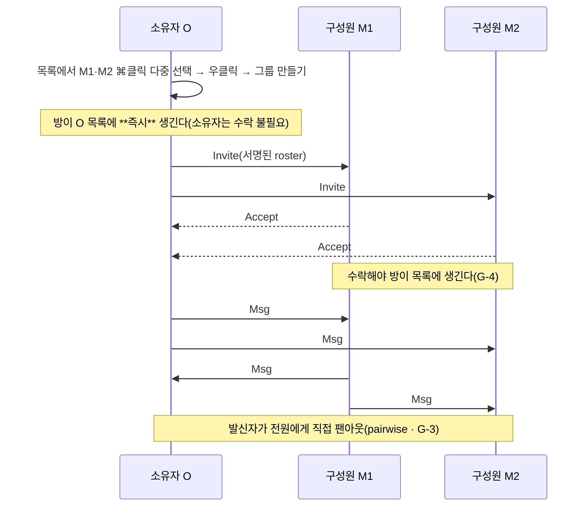

# 33 · 공유 그룹 채팅 — 다자 실기 테스트 안내서

> **목적** — [31 ADR-0012](31-adr-0012-shared-group-chat.md) 공유 그룹 채팅을 **사람이 직접 돌려 확인**한다.
> 그룹은 **3명 이상**이어야 의미가 드러난다(2명이면 1:1과 구분이 안 된다) — 그래서 한 PC에서
> **신원 3개**를 띄우는 준비 절차부터 담는다.
> 일반 실행·시나리오는 [26 실행·수동 테스트](26-run-and-manual-test.md), 빌드 SSOT는 [18](18-build-and-test.md).

**읽는 순서** — [§1 빌드](#1-전처리--빌드-os별--docker) → [§2 신원 3개](#2-전처리--한-pc에서-신원-3개-띄우기) → [§3 시나리오](#3-시나리오--순서대로) → [§4 체크리스트](#4-확인-체크리스트) → 막히면 [§5](#5-자주-막히는-곳).

---

## 1. 전처리 — 빌드 (OS별 · Docker)

⚠️ **어느 OS든 `nbeep-imgdec`를 함께 빌드한다.** 빠뜨려도 오류가 안 나고 **이미지·아바타만 조용히
죽는다**([26 §1-3](26-run-and-manual-test.md)). 그룹 방은 발신자 아바타를 쓰므로 특히 눈에 띈다.

### 1-1. macOS

```bash
cargo build --release -p nexa-beep -p nbeep-imgdec
#   → target/release/{nexa-beep, nbeep-imgdec}
```

Apple Silicon에서 Intel 바이너리가 필요하면 `--target x86_64-apple-darwin`(반대도 동일).

### 1-2. Windows (PowerShell)

```powershell
cargo build --release -p nexa-beep -p nbeep-imgdec
#   → target\release\{nexa-beep.exe, nbeep-imgdec.exe}
```

- 콘솔 없이 띄우려면 `Start-Process .\target\release\nexa-beep.exe`.
- 첫 실행에서 **방화벽 허용 창**이 뜬다 — **허용해야 발견이 된다**(사설/도메인 네트워크 체크).
- 한글 IME 관련 확인 항목은 [TODO WIME-*](TODO.md)를 함께 본다.

### 1-3. Linux (호스트)

```bash
cargo build --release -p nexa-beep -p nbeep-imgdec
```

데스크톱 세션(X11/Wayland)이 있어야 창이 뜬다. 없으면 **안내 후 종료**된다(`exit 3` — [26 §6](26-run-and-manual-test.md)).

### 1-4. Docker — Linux 바이너리 (상주 빌더 권장)

컨테이너는 **터미널 단말**(`--chat-live`)로만 참여한다. GUI는 헤드리스라 못 띄운다.

```bash
# ① 1회 준비
docker run -d --name beep-builder -v "$PWD":/src -w /src -e CARGO_TARGET_DIR=/target \
  rust:1-slim sleep infinity
docker exec beep-builder bash -c \
  'apt-get update -qq && apt-get install -y -qq pkg-config >/dev/null; rustup show >/dev/null'

# ② 매회 — 빌드와 반출을 한 줄로(따로 두면 복사를 잊는다)
docker exec beep-builder bash -c \
  'cargo build --release -p nexa-beep -p nbeep-imgdec \
   && mkdir -p /src/.docker-target/release \
   && cp /target/release/nexa-beep /target/release/nbeep-imgdec /src/.docker-target/release/'
```

상세·실측 수치는 [26 §1-2](26-run-and-manual-test.md).

### 1-5. 크로스 컴파일 (배포본 확인용)

릴리스가 만드는 5타깃 — `x86_64/aarch64-pc-windows-msvc` · `x86_64/aarch64-apple-darwin` ·
`x86_64-unknown-linux-gnu`. 컴파일만 확인하려면:

```bash
cargo check --target x86_64-pc-windows-msvc -p nexa-beep
```

---

## 2. 전처리 — 한 PC에서 **신원 3개** 띄우기

원리와 상세는 [26 §3-4](26-run-and-manual-test.md). 요지는 **`data_dir()`가 `실행파일 옆/data`를
먼저 본다**(포터블 규칙 DR-4)는 것 — 폴더를 나누면 신원·핀·그룹·설정이 통째로 갈린다.

```bash
cd <저장소 루트>

# ① 기본 신원 — 저장소 빌드 그대로(데이터는 target/release/data)
./target/release/nexa-beep --window --live &

# ② ③ 추가 신원 2개 — 같은 exe, 폴더만 분리
S=/tmp/beep-multi; rm -rf $S; mkdir -p $S/A $S/B
for d in A B; do cp target/release/nexa-beep target/release/nbeep-imgdec $S/$d/; done
( cd $S/A && ./nexa-beep --window --live ) &
( cd $S/B && ./nexa-beep --window --live ) &
```

**확인** — 창 3개가 뜨고, **각 창의 목록에 나머지 2명**이 보인다.

```bash
./target/release/nexa-beep --discover-probe 8 | grep -oE "peer=[0-9a-f]+ .*name=[^ ]*" | sort -u
```

**실측(2026-08-13)** — 셋 다 관측:

```
peer=02c6519b name=kiros33            ← 기본(프로필 이름 설정됨)
peer=78878a84 name=beep-78878a84      ← A
peer=d2cf5814 name=beep-d2cf5814      ← B
```

> ⚠️ **CLI 모드는 신원이 매번 바뀐다** — `--chat-live`·`--discover-probe`는 임시 신원이라
> **그룹 구성원으로 쓰면 재시작 때마다 남이 된다.** 그룹 테스트의 3인은 **전부 GUI**여야 한다.
> (Docker 컨테이너를 4번째로 붙일 수는 있으나, 재기동하면 roster에서 유령이 된다.)

**정리** — `pkill -f nexa-beep && rm -rf /tmp/beep-multi`
⚠️ 기본 신원을 초기화하려면 `target/release/data/`를 지운다(핀·그룹·설정도 함께 사라진다).

---

## 3. 시나리오 — 순서대로

세 창을 각각 **소유자 O**(기본) · **구성원 M1**(A) · **구성원 M2**(B)로 부른다.



### T-1. 그룹 만들기 (O)

1. 목록에서 **M1·M2를 `⌘/Ctrl+클릭`** 으로 다중 선택(좌측 강조 막대)
2. **우클릭 → 그룹 만들기(2명)** → 이름 입력
3. **확인** — O의 목록 상단 **그룹 섹션**에 방이 즉시 생긴다

> ★ **소유자는 수락하지 않는다.** 만든 사람은 바로 `Owner`로 들어간다.

### T-2. 초대 수락 (M1·M2)

각 창에 **초대 카드**가 뜬다:

```
그룹 대화 초대
─────────────────────────────────────────────
kiros33 님이 '개발팀' 그룹(구성원 3명)에 초대했습니다.
수락하면 방이 목록에 생기고 구성원과 함께 대화합니다.
              [ 수락 ]   [ 거절 ]
```

**확인** — 보낸 사람·그룹 이름·구성원 수가 **모두 보이는가**(판단에 필요한 정보).
수락하면 그 창 목록에도 방이 생긴다. **거절하면 안 생긴다.**

### T-3. 한 방에서 대화

- 세 창에서 번갈아 보낸다.
- **확인** — 상대 메시지에 **발신자 아바타·이름 라벨**, 내 메시지는 우측.
- **확인** — M1이 보낸 것이 **O와 M2 양쪽에** 뜬다(팬아웃).

### T-4. 오프라인 구성원 (재동기)

1. **M2 창을 닫는다**
2. O가 방에 2~3개 보낸다 → O 쪽에 **미전달 표시**
3. **M2를 다시 띄운다**(같은 폴더 = 같은 신원)
4. **확인** — 발신자가 밀어 준 메시지가 도착한다(보관 주체 = 송신자 · [31 §4](31-adr-0012-shared-group-chat.md))
   상한은 설정 `group.resync_keep`(기본 200)

### T-5. 구성원 관리 (O)

- 헤더의 **"구성원 N"** 클릭 → 관리 모달(체크박스 + 검색)
- **확인** — 소유자는 편집 가능, **비소유자는 열람 + 탈퇴만**
- 제외해 보고 → 제외된 창에서 **방이 닫힘 표시**가 되는지

### T-6. 구성원 초대 (기본 허용)

`group.member_invite`가 켜져 있으면 **구성원도 초대를 요청**할 수 있다.

- M1이 누군가를 초대 요청 → **소유자가 명부에 반영**해야 실제 초대가 나간다
- ⚠️ **알려진 표기 한계** — 초대 카드에는 *소유자* 이름이 뜬다(실제 초대 발신자가 소유자라서).
  "M1의 요청으로" 라는 정보는 지금 와이어에 없다

### T-7. 파일 전송 (그룹)

- 방에서 파일을 보낸다 → **구성원마다 1:1 세션으로 팬아웃**(현재 방식)
- **확인** — 각 수신 창에서 **무해화 게이트**를 거치는가(`.beepq` 격리 → 승인 → 실체화)
- ⚠️ **크기 주의** — 지금은 **N배 업로드**다(30명·10MB = 300MB). 개선안은
  [32 §5-9](32-adr-0013-server-modes.md) — 아직 미구현

### T-8. 소유자 부재

- **O 창을 닫는다** → M1·M2는 **대화는 계속**되지만 **멤버십 변경은 대기**
- **확인** — 관리 버튼 비활성 + "소유자 접속 시 반영" 안내

---

## 4. 확인 체크리스트

| # | 항목 | 근거 | ☐ |
|:--:|---|---|:--:|
| C-1 | 소유자는 수락 없이 방이 생긴다 | G-1 | ☐ |
| C-2 | 초대 카드에 **보낸 사람·그룹명·인원**이 보인다 | 판단 가능성 | ☐ |
| C-3 | 수락해야 방이 생긴다 · 거절하면 안 생긴다 | G-4 | ☐ |
| C-4 | 셋이 **한 방**에서 대화(발신자 라벨·아바타) | 목표 | ☐ |
| C-5 | 미연결 구성원에게 **이어 전달** | FR-G-4 | ☐ |
| C-6 | 재접속 시 **재동기**(발신자 보관) | [31 §4](31-adr-0012-shared-group-chat.md) | ☐ |
| C-7 | 구성원 관리 — 소유자만 편집 | G-6 | ☐ |
| C-8 | 제외된 구성원에게 **방 닫힘** 표시 | G-6 | ☐ |
| C-9 | 그룹 파일이 **무해화 게이트**를 거친다 | DR-13 | ☐ |
| C-10 | 소유자 부재 시 **대화는 되고 관리만 대기** | [31 §4](31-adr-0012-shared-group-chat.md) | ☐ |
| C-11 | 재시작해도 방·구성원이 남는다 | `groups.seg` v2 | ☐ |
| C-12 | 발견 패킷에 **그룹 정보가 없다** | [31 §5](31-adr-0012-shared-group-chat.md) 봉투 원리 | ☐ |

> C-12는 육안이 아니라 프로브로 본다:
> `./target/release/nexa-beep --discover-probe 8` — 출력에 **그룹 이름이 나오면 설계 위반**이다.

---

## 5. 자주 막히는 곳

| 증상 | 원인 | 조치 |
|---|---|---|
| 창은 떴는데 **서로 안 보인다** | `--live` 누락(InMemory 데모) | 무인자 또는 `--window --live` |
| 폴더를 나눴는데 **같은 신원** | `data/`까지 복사했다 | 바이너리만 복사(`data/`는 첫 실행이 만든다) |
| 재시작하니 **남이 됐다** | CLI 모드로 참여했다(임시 신원) | 그룹 3인은 **전부 GUI** |
| 초대 카드가 **안 뜬다** | 상대와 세션이 없다 | 먼저 1:1 대화를 한 번 연다(자동 연결 후 이어 전달되지만 확인이 빠르다) |
| 아바타가 **이니셜만** | `nbeep-imgdec` 부재 | 같이 빌드 + 같은 폴더에 복사(§1) |
| 컨테이너에서 **창이 안 뜬다** | 헤드리스 | 정상 — 컨테이너는 `--chat-live`로만([26 §4](26-run-and-manual-test.md)) |
| 두 번째 창이 **포트 47200을 못 잡음** | 첫 창이 점유 | 정상 — 임의 포트로 폴백하고 발견이 실제 포트를 나른다 |

---

> **미구현·설계 대기** — G4 잔여(구성원 관리 모달 확장·재동기 확장) · 그룹 파일의 콘텐츠 키 봉투
> ([32 §5-9](32-adr-0013-server-modes.md) P-9) · 소유권 이양(v2). 진행 상태는 [TODO M5-1g](TODO.md).
