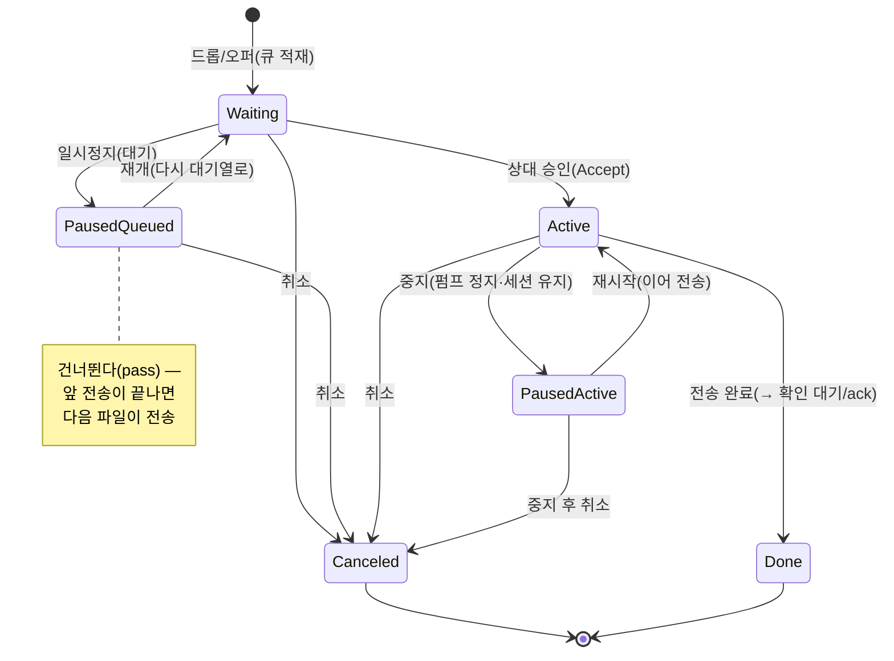

# 37 — 전송 동기·재개 설계 (M4-10) ✅

> **상태: ✅ Accepted — D-31 사용자 확정(2026-08-18 · "승인 + 즉시 착수").**
> §4 결정지는 문서의 제안·권고안 그대로 채택: ① 보존 72h·총 1GiB(초과 시
> 오래된 것부터) ② 부분 해시 = **ⓐ 스트리밍 해시 중간 상태**(권고안) ③ 그룹
> 팬아웃 재개는 **보류**(M4-10d 제외 — 1:1 완주 후 재검토). 구현 = M4-10a~c. 관련: [04 안전 전송](04-safe-transfer.md) · [21 전송 파이프라인 M4](21-transfer-pipeline.md) ·
> [31 그룹 팬아웃](31-adr-0012-shared-group-chat.md).

## 1. 문제 — "끊기면 처음부터"

현행 파일 전송(M4)은 **세션이 살아 있는 동안만** 유효하다. 청크 스트림이 중간에
끊기면(네트워크 이동·앱 종료·상대 이탈) 수신측 부분 데이터는 버려지고, 재시도는
**0바이트부터** 다시 시작한다. 작은 파일에선 문제가 아니지만:

- 대용량(수백 MB)에서 무선 이동 한 번이 전송 전체를 무효화한다.
- 그룹 파일 팬아웃(M5-1)은 N배 업링크라 중단 비용도 N배다.
- 자동 재연결 백오프(08-13ⓑ)가 세션은 되살리는데 **전송은 못 되살린다** —
  사용자 눈에는 "다시 보내라"로 보인다.

## 2. 원리 — 재개의 근거도 암호학적 증거

CLAUDE.md 관통 원리 그대로: **이어붙임의 근거는 바이트 수가 아니라 해시다.**
"몇 바이트 받았다"는 상대의 주장이고, 주장은 검증 전까지 재개 근거가 아니다.

- Offer에는 이미 전체 `sha`(32B)가 실린다 — 재개 협상의 **동일성 앵커**로 재사용.
- 수신측은 부분 데이터의 **수신 완료 오프셋**과 **부분 해시 상태**(스트리밍 해시의
  중간 상태 또는 세그먼트 해시 목록)를 함께 보존해야 "그 지점까지는 이 파일이
  맞다"를 증명할 수 있다.

## 3. 설계 골격

### 3-1. 수신측 — `.beepq.part` 부분 격리물

- 중단 시 수신 버퍼를 `data/quarantine/{xfer}.beepq.part`로 보존:
  헤더(원 Offer 메타: 이름·크기·전체 sha·발신 PeerId) ‖ 수신 완료 바이트.
- **부분물은 격리함에 보이지 않는다**(미완성은 존재만 — 봉투 원리). 완성 시에만
  기존 `.beepq` 경로로 승격 → 무해화 게이트는 **변경 없음**(재개는 게이트 앞
  단계의 일이다 — [04](04-safe-transfer.md) 불변).
- 부분물 수명: 기본 72h 지나면 자동 폐기(고아 파일 누적 방지 · §4 결정지).

### 3-2. 와이어 — Offer 확장 3필드(하위 호환)

| 필드 | 방향 | 의미 |
| --- | --- | --- |
| `resume_offset` | Accept에 추가 | "이 오프셋부터 보내라"(0 = 처음부터 — 구버전 동작) |
| `prefix_sha` | Accept에 추가 | 보존 부분의 해시 — 발신측이 자기 파일 앞부분과 대조 |
| (없음) | Offer | **Offer는 불변** — 같은 `sha` + 같은 크기의 Offer 재수신 = 재개 후보 판정은 수신측 로컬 |

- 발신측: Accept의 `resume_offset > 0`이면 자기 원본의 같은 구간 해시를 계산해
  `prefix_sha` 일치할 때만 그 지점부터 송신. **불일치 = 처음부터**(fail-closed —
  조용히 이어붙여 손상 파일을 만들지 않는다).
- 구버전 발신자는 미지 필드를 무시하고 0부터 보낸다 — 수신측은 중복 프리픽스를
  버리면 된다(전방 호환).

### 3-3. 재개 트리거 — 자동은 세션 복원까지만

- 자동 재연결(기존 백오프)이 세션을 되살리면, 수신측은 보유한 `.beepq.part`와
  일치하는 **새 Offer가 도착했을 때만** 재개를 제안한다(수신 UI에 "이어받기 N% |
  처음부터" 2택). **발신측이 능동으로 재-Offer한다**(13 §12-1 자동 반복 점검:
  재-Offer는 세션 성립 시 1회 · 중복 가드 = XferId).
- 사용자 수동 취소는 부분물도 함께 폐기한다(취소 = 의사 표시 — 재개 제안 금지).

### 3-4. "동기"의 범위 — v1은 재개만

M4-10의 "동기(sync)"를 **폴더 동기화로 확장하지 않는다**. 그건 별개 제품 축이고
(FR에 없음), 여기서의 동기는 "**중단 전송의 상태 동기**"로 한정한다.

## 4. 결정지 (✅ D-31 확정 08-18 — 아래 제안·권고안 그대로 채택 · 3은 보류)

1. 부분물 보존 기한(제안: 72h) · 보존 상한(제안: 총 1GiB · 초과 시 오래된 것부터).
2. 부분 해시 방식 — ⓐ 스트리밍 해시 중간 상태 저장(작음·구현 단순 · blake3/sha256
   중간 상태 직렬화) vs ⓑ 4MiB 세그먼트 해시 목록(재개 지점 유연 · 목록 크기 증가).
   **권고 = ⓐ**(재개 지점은 어차피 "받은 만큼"뿐이다).
3. 그룹 팬아웃 재개 — v1.5 범위 포함 여부(구성원별 오프셋이 달라 상태가 N개).

## 5. 슬라이스 (구현 시)

1. **M4-10a** 수신 부분물 보존·복원(`.beepq.part` — 와이어 불변·로컬만) + 수명 정리.
2. **M4-10b** Accept 확장 2필드 + 발신 prefix 검증·중간 송신(회귀: 불일치 = 0부터).
3. **M4-10c** 재-Offer 1회 + 수신 2택 UI("이어받기 N%").
4. **M4-10d** (D-31-3 승인 시) 그룹 팬아웃 재개.

## 6. 발신 전송 제어 상태 전이 (M4-2d · ✅ 구현 08-19)

발신 배치 패널([`Role::Sending`] · 개수·총량·스크롤 목록·파일별 트랜스포트
아이콘)의 **한 파일**이 갖는 상태와, 사용자·프로토콜이 일으키는 전이다(사용자
확정 08-19). 배치는 **한 파일씩 순차 오퍼**라, 한 순간 실제 승인/전송 대상은
하나뿐이고 나머지는 큐에서 대기한다.

- **상단 아이콘 = 배치 전체**(전체 취소·전체 일시정지/재개).
- **행 아이콘 = 그 파일만**(취소·일시정지·재개).
- **일시정지 아이콘**은 상태에 따라 뜻이 갈린다:
  - *대기(Waiting) 파일 일시정지* = 큐에서 **건너뛴다**(pass) → 앞 전송이 끝나면
    정지 안 된 **다음 파일**이 전송된다. 재개하면 다시 전송 대상이 된다.
  - *전송 중(Active) 파일 일시정지* = 세션을 **유지한 채** 청크 펌프만 멈춘다
    (P2 · 와이어 무통지 — 수신측은 다음 청크를 기다린다). 재시작하면 이어서
    보낸다(재협상 없음).

**구현 매핑** — 큐 정지 = `send_paused` 집합 + `pump_send_queue`가 정지 파일을
pass하고 순서 보존해 되돌린다. 활성 정지/재개 = `SessionCmd::PauseXfer/ResumeXfer`
→ 액터 `paused_xid` pump gate(세션 유지 · 와이어 무변경). 파일별 취소 =
`cancel_one_send`(대기는 큐 제거, 현재 파일은 Cancel 통지 후 다음으로) · 전체 취소 =
`cancel_send`(큐·배치 비움·창 닫기). 창은 **배치가 끝날 때만** 닫힌다
(`refresh_send_batch` — `XferAccepted`에서 닫지 않는다). 아이콘 자산 = [10 §4].
'중지'는 여기서 **취소(STOP/CANCEL 아이콘)** 로 매핑한다(테이프 정지처럼 그 전송을
끝낸다) — "멈췄다 잇기"는 일시정지(PAUSE)/재개(PLAY)다.
