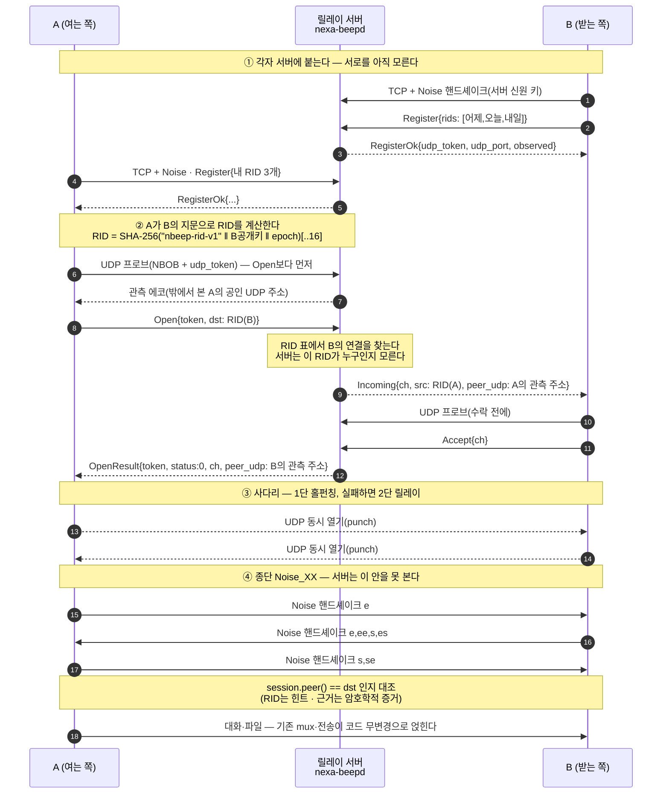
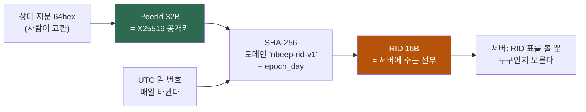
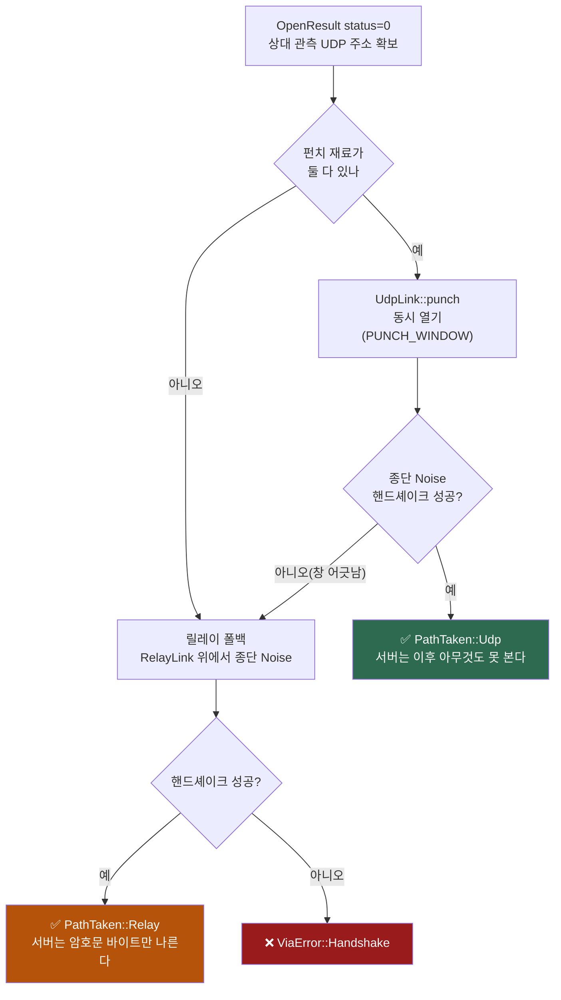

# 42. 지문(64hex)으로 만나는 법 — 릴레이 랑데부 종단 설명서

> **성격**: 구현 기반 설명서(코드가 원본 — [`nbeep-relay`](../crates/nbeep-relay/src/lib.rs) ·
> [`nexa-beepd`](../crates/nexa-beepd/src/lib.rs)). **왜 이렇게 설계했는가**는
> [32 ADR-0013](32-adr-0013-server-modes.md), **LAN 직접 경로**의 같은 설명은
> [30 종단 동작 설명서](30-end-to-end-walkthrough.md), **서버를 세우고 운영하는 법**은
> [41 beepd 설치·운영 가이드](41-beepd-ops-guide.md)다.
> 이 문서는 그 사이 — **"서로의 64자리 지문만 알 때, 인터넷 너머에서 어떻게 만나는가"** — 를
> 프로토콜 한 줄씩 따라간다.

**읽는 순서** — [§1 한 장](#1-한-장으로-보는-전체-흐름) → [§2 식별자 셋](#2-식별자-셋--무엇이-무엇을-가리키나)
→ [§3 RID](#3-rid-유도--서버에-키-원본을-주지-않는다) → [§4~§7 절차](#4-1단계-서버-접속과-등록) →
[§9 서버가 보는 것](#9-서버가-보는-것과-못-보는-것) → [§12 직접 해 보기](#12-직접-해-보기--cli-절차)

---

## 1. 한 장으로 보는 전체 흐름

A가 B의 지문 64hex를 알고 있다. 둘 다 NAT 뒤에 있고 서로의 IP는 모른다.



**한 문장 요약** — *지문은 상대의 공개키이고, 공개키를 아는 사람만 그날의 RID를 계산할 수
있으며, 서버는 그 RID로 연결 두 개를 이어 줄 뿐 누구인지도 무엇을 보내는지도 모른다.*

---

## 2. 식별자 셋 — 무엇이 무엇을 가리키나

| 이름 | 크기·형태 | 누가 아는가 | 수명 | 코드 |
|---|---|---|---|---|
| **`PeerId`(지문 64hex)** | X25519 **정적 공개키 32B** = hex 64자 | 사람이 교환한다(대면·전화·사내 위키) | 기기 신원 = 영구 | [`peer_hex`/`parse_peer_hex`](../crates/nbeep-relay/src/lib.rs) |
| **RID**(랑데부 ID) | 16B(SHA-256 앞 16바이트) | **서버**가 본다 — 원본 키는 못 본다 | **UTC 하루**(회전) | [`rid_for`](../crates/nbeep-relay/src/lib.rs) |
| **채널 번호 `ch`** | u32 | 서버·양쪽 클라이언트 | 그 채널 동안 | `C2s::Open`→`OpenResult.ch` |
| **서버 신원 키** | 서버의 Noise 정적 공개키(64hex) | 접속하는 모두(TOFU 핀) | 서버 수명 | `server.pin` |

### 2-1. 왜 8자리 짧은 지문이 아니라 **64자리 전체**인가

UI 곳곳에 보이는 `beep-3f2a91c8` 같은 8자리는 **표시용 축약**이다([21 §3-1](21-identity-spec.md)).
릴레이 랑데부는 그걸로는 성립하지 않는다 — **RID를 계산하려면 공개키 32바이트 원본이 필요**한데
축약본에서는 키를 복원할 수 없기 때문이다. 그래서 교환 단위가 64hex다.

```rust
// parse_peer_hex — 64자가 아니거나 hex가 아니면 즉시 None (fail-closed)
if s.len() != 64 || !s.bytes().all(|b| b.is_ascii_hexdigit()) { return None; }
```

---

## 3. RID 유도 — 서버에 키 원본을 주지 않는다

```
RID = SHA-256( "nbeep-rid-v1" ‖ PeerId(32B) ‖ epoch_day(u64 big-endian) )[0..16]
epoch_day = UNIX초 / 86400   (UTC 일 번호)
```



이 한 줄 유도가 세 가지를 동시에 산다.

1. **서버는 사용자 명부를 만들 수 없다** — 받는 것이 해시라 역산이 불가능하고, 날마다 바뀐다.
   [32 §2-3](32-adr-0013-server-modes.md)이 지목한 **R-18(고정 공개키 = 영구 재식별자)의
   서버 확대**를 여기서 끊는다.
2. ★ **릴레이는 새로운 만남을 주선하지 않는다** — RID를 계산하려면 **상대 공개키를 이미
   알아야** 한다. 서버에 붙었다는 이유로 모르는 사람이 나를 찾아낼 수 없다(제로 컨피그
   LAN 발견과 정반대의 성질 — 인터넷 너머는 위협 모델이 다르다 · DR-19).
3. **도메인 분리 문자열**(`nbeep-rid-v1`)이 다른 용도의 해시와 값이 겹치지 않게 한다.

### 3-1. 왜 하루치가 아니라 **셋**을 등록하나

시계가 어긋난 두 기기가 서로 다른 "오늘"을 계산하면 영영 못 만난다. 그래서 등록은
**어제·오늘·내일 세 개**([`rids_around`])이고, 여는 쪽은 **오늘 → 어제 → 내일** 순으로
시도한다([`connect_via`]).

```rust
let rids = [ rid_for(dst, day), rid_for(dst, day - 1), rid_for(dst, day + 1) ];
for rid in rids {
    match client.open(rid, timeout) {
        Err(1) => continue,   // 이 에폭 RID는 미등록 — 다음 에폭
        ...
    }
}
```

연결당 등록 상한은 `MAX_RIDS = 8`(에폭 3 + 여유)이다. 상한이 없으면 한 연결이 RID 표를
무한히 채워 다른 사용자를 밀어낼 수 있다.

---

## 4. 1단계: 서버 접속과 등록

```
TCP 연결(기본 47300) → Noise_XX 핸드셰이크(상대 = 서버) → [핀 검증] → Register → RegisterOk
```

- **서버와도 Noise를 한다.** 제어 채널 자체가 암호화되고, 그 과정에서 **서버의 정적 공개키가
  확정**된다. 이 값이 사용자가 핀하는 "서버의 정체"다([32 §2-4](32-adr-0013-server-modes.md)).
- **서버 핀은 TOFU**다. 첫 접속이면 `server.pin`에 `v1 <주소> <64hex>` 한 줄로 저장하고,
  다음부터는 대조한다. 불일치는 **조용히 재핀하지 않고** `RelayError::PinMismatch`로 시끄럽게
  실패한다(DR-28 — *신원이 바뀌면 시끄럽게*).

```rust
if let Some(exp) = expected_server {
    if exp != server_peer { return Err(RelayError::PinMismatch { expected: exp, got: server_peer }); }
}
```

- `RegisterOk`가 돌려주는 것:

| 필드 | 뜻 | 어디 쓰나 |
|---|---|---|
| `udp_token` | 관측 프로브에 실을 토큰 | UDP 프로브 ↔ 이 연결을 잇는 고리 |
| `udp_port` | 서버의 UDP 관측 포트 | 프로브 목적지(TCP와 **같은 번호**) |
| `observed` | 서버가 밖에서 본 **내 공인 TCP 주소** | 진단·표시 |

> ⚠️ **핸드셰이크·등록 왕복에 10초 상한**이 걸려 있다(`set_recv_timeout`). 침묵하는 서버가
> 클라이언트 연결을 영구 점유하지 못하게 하는 방어다.

---

## 5. 2단계: 랑데부 — 서버가 두 연결을 잇는다

### 5-1. 여는 쪽

```
[UDP 프로브] → Open{token, dst=RID(B)} → OpenResult{token, status, ch, peer_udp}
```

★ **프로브가 `Open`보다 먼저다.** 서버는 상대에게 보내는 `Incoming`에 **내 관측 UDP
엔드포인트**를 실어야 하는데, 프로브를 안 했으면 실을 것이 없어 홀펀칭 재료가 사라진다.
코드 주석이 그 순서를 규약으로 못 박는다:

```rust
// 프로브가 Open보다 **먼저** — 서버가 내 관측 엔드포인트를 상대의 Incoming에 싣는다.
let sock = if punch { fresh_probed_sock(client).ok() } else { None };
```

`OpenResult.status` 해석:

| status | 뜻 | 클라이언트 동작 |
|:--:|---|---|
| **0** | 성립 — `ch`와 상대 관측 주소 동봉 | 사다리로 진행 |
| **1** | 그 RID로 등록된 연결이 없다 | **다음 에폭 RID로 재시도**(§3-1) |
| **2** | 상한·거절(채널 상한 등) | `ViaError::Limit` — 중단 |
| 255 | 세션 죽음·시간 초과(클라이언트 내부 코드) | `ViaError::Dead` |

### 5-2. 받는 쪽

```
Incoming{ch, src, peer_udp} → [UDP 프로브] → Accept{ch}
```

★ **여기서도 프로브가 `Accept`보다 먼저다.** 여는 쪽의 펀치는 `OpenResult`(= 내 `Accept` 이후)를
받고 시작하므로, 이 순서를 지켜야 **내 관측 주소가 반드시 상대에게 실려 간다.**

★ **`Accept` 전에는 서버가 단 1바이트도 중계하지 않는다.** 양방향 성립을 요구하는 이 규칙이
릴레이가 **증폭기**로 악용되는 것을 막는다([32 §2-6](32-adr-0013-server-modes.md)).

---

## 6. 3단계: 경로 사다리 — 홀펀칭 → 릴레이



- **1단이 성공했다는 기준은 "UDP가 뚫렸다"가 아니라 "종단 핸드셰이크까지 됐다"** 이다.
  펀치 소켓이 열려도 상대가 그 창을 놓쳤으면 조용히 2단으로 내려간다.
- 펀치 소켓은 **시도마다 새로 만든다**(`fresh_probed_sock`). NAT 매핑은
  (로컬 포트, 목적지) 쌍에 붙으므로 오래된 소켓의 관측값은 신뢰할 수 없고, 소켓을 공유하면
  `recv` 경합이 생긴다.

### 6-1. 받는 쪽은 **첫 프레임이 온 링크**로 단을 고른다

받는 쪽은 여는 쪽이 어느 단을 골랐는지 미리 알 수 없다. 그래서 UDP 링크와 릴레이 링크를
**동시에 폴링**하다가 **먼저 프레임이 도착한 쪽**을 채택한다. 그때 이미 읽어 버린 첫 프레임은
`PrefixedLink`가 되돌려주어 핸드셰이크에 그대로 쓰인다.

```rust
impl<L: Link> Link for PrefixedLink<L> {
    fn recv(&mut self) -> Result<Vec<u8>, LinkError> {
        if let Some(f) = self.first.take() { return Ok(f); }   // 먼저 뽑아 둔 프레임을 되살린다
        self.inner.recv()
    }
}
```

*읽어 버린 프레임을 버리지 않는 것* — 이 작은 래퍼가 "단 선택"과 "핸드셰이크 무결성"을 동시에 만족시킨다.

---

## 7. 4단계: 종단 Noise — 릴레이는 MITM이 아니다

사다리가 고른 링크 위에서 **A와 B가 직접** Noise_XX 핸드셰이크를 한다. 서버는 이 트래픽을
**나르기만** 한다 — 자기 전송 계층(서버와의 Noise)을 벗겨도 안에는 **A↔B의 암호문**이 남는다.

```
[ 서버와의 Noise ]  ← 서버가 열 수 있다(제어 메시지: RID·ch·바이트 수)
   └ C2s::Data { ch, fin, bytes }
        └ [ A↔B 종단 Noise ]  ← 서버가 열 수 없다(대화·파일·프로필 전부)
```

서버가 중간자가 되려면 **A와 B의 정적 키를 위조**해야 하는데, 그 키는 사람이 교환한 64hex
지문 그 자체다. 그래서 마지막에 이 대조가 들어간다:

```rust
fn finish_via(session, taken, path, dst) -> Result<ViaSession, ViaError> {
    if session.peer() != *dst {
        return Err(ViaError::WrongPeer); // RID 충돌·오지정 — 인증된 키가 근거다
    }
    ...
}
```

★ **RID는 힌트고, 근거는 언제나 암호학적 증거다.** 서버가 엉뚱한 연결을 이어 줬거나 RID가
충돌해도, 핸드셰이크가 확정한 키가 내가 지정한 지문과 다르면 **세션을 버린다**. 이것이
"이름·IP·주장은 신원이 아니다"라는 프로젝트 원칙([21](21-identity-spec.md))의 릴레이판이다.

### 7-1. 경로 등급은 따로 매긴다

성립한 세션에는 두 가지 표가 붙는다.

| 표 | 값 | 정하는 근거 | 쓰임 |
|---|---|---|---|
| `PathTaken` | `Udp` / `Relay` | 사다리 어느 단을 탔나 | 표시·계측 |
| [`PathClass`](../crates/nbeep-core/src/path.rs) | `Local`/`Remote`/… | **성립한 세션의 실소켓 주소** | **정책**(FR-S-24 원격 파일 차단 등) |

```rust
let path = class_of_link(&relay, nbeep_core::PathClass::Remote); // 서버 미상 = Remote(fail-closed)
```

주소를 못 읽으면 **Remote로 떨어뜨린다** — 모르면 느슨한 쪽이 아니라 **엄한 쪽**으로 간다.
그래서 릴레이로 붙은 상대는 지문 대조 전까지 파일을 주고받지 못한다(DR-28 경로 2축).

---

## 8. 데이터 평면 — `RelayLink`는 그냥 `Link`다

```rust
pub struct RelayLink { ... }
impl Link for RelayLink { ... }
```

이 한 줄이 이 설계의 핵심 절약이다. **대화·파일 전송·프로필·그룹이 전부 `Link` 위에 얹혀
있으므로**([09 ADR-0003](09-adr-0003-transport-abstraction.md) · DR-21), 릴레이를 붙이는 데
위층 코드가 **한 줄도 바뀌지 않는다.** TCP든, 홀펀칭 UDP든, 릴레이 채널이든 같은 계약이다.

- 링크 프레임이 `RELAY_CHUNK`(32 KiB)를 넘으면 `RelayLink`가 **투명하게 분할**하고,
  `fin` 플래그로 마지막 조각을 표시해 상대가 다시 조립한다. 위층은 65535바이트 프레임을
  그대로 주고받는 것처럼 보인다.
- 서버 입장에서 `Data`는 **열 수 없는 바이트 뭉치**다 — 세는 것은 길이뿐이다.

---

## 9. 서버가 보는 것과 못 보는 것

| 서버가 **보는 것**(봉투) | 서버가 **못 보는 것**(내용) |
|---|---|
| 회전 RID(16B — 오늘치) | 그 RID가 **누구**인지(공개키 원본) |
| 채널 번호·개설/종료 시각 | 대화 본문·파일·파일명·프로필 |
| 조각 **바이트 수** | 조각 내용(A↔B 종단 암호문) |
| 연결의 공인 IP·포트(관측) | 상대의 이름·소속·연락처 |
| 공개 목록을 **켠** 사용자의 공개키(§10-1) | 켜지 않은 사용자의 존재 |

**그리고 아무것도 저장하지 않는다.** 모드 ①은 버퍼가 아니라 **파이프**다 — 양쪽이 동시에
붙어 있을 때만 흐르고, 로그조차 봉투만 남긴다(`--verbose`여도 conn#·RID 앞 4바이트·ch#·바이트 수).

### 9-1. 옵트인 roster — 있으면 편하고, 기본은 꺼져 있다

`C2s::Announce{listed}`를 켠 연결만 서버가 목록에 싣고, 그 목록을 `S2c::PeerUp/PeerDown`으로
배포한다. 여기 실리는 것은 **공개키뿐**이다 — 이름·프로필은 성립 후 종단으로 나른다
(DR-22 "브로드캐스트에 프로필을 싣지 않는다"의 릴레이판). 서버는 **켠 연결만 메모리에**
들고 있고 저장하지 않는다.

---

## 10. 남용 방지 — 무료 파이프는 반드시 악용된다

| 방어 | 값 | 무엇을 막나 |
|---|---|---|
| **Accept 후에만 중계** | — | **증폭 공격**(한 명이 보낸 것을 서버가 남에게 퍼뜨리는 구조 자체를 없앤다) |
| 연결당 릴레이 예산 | `DEFAULT_RATE_BPS` = **1 MiB/s**(`--rate`로 조정 · 0=무제한) | 대역 독점 |
| 송신 큐 상한 | `QUEUE_CAP` **8 MiB** 초과 = **연결 절단** | 느린 소비자가 서버 메모리를 먹는 것(무한 버퍼·쓰기 교착 둘 다 회피) |
| 연결당 채널 상한 | `MAX_CHANNELS_PER_CONN` **64** | 채널 폭주 |
| 등록 RID 상한 | `MAX_RIDS` **8** | RID 표 점거 |
| 핸드셰이크·미등록 유휴 | **10초** | 붙기만 하고 침묵하는 연결 |

---

## 11. 실패 모드와 진단

| 증상 | 원인 | 확인·처방 |
|---|---|---|
| `ViaError::NotFound` | 세 에폭 RID 모두 미등록 = **상대가 그 서버에 안 붙어 있다** | 상대 단말이 `--server`로 붙었는지 · 같은 서버 주소인지 |
| `RelayError::PinMismatch` | 서버 키가 바뀌었다(재설치·키 분실) **또는 사칭** | [41 §6](41-beepd-ops-guide.md)의 키 관리 — 정당한 교체면 `server.pin`의 옛 줄을 지우고 재핀 |
| `ViaError::WrongPeer` | 인증된 키 ≠ 내가 지정한 지문 | 지문 오타·RID 충돌. **그대로 실패하는 게 정상**이다 |
| `ViaError::Limit` | `status=2` — 채널·연결 상한 | 서버 부하 · `--rate`/상한 확인 |
| 항상 `PathTaken::Relay`만 나온다 | 홀펀칭 실패(양쪽 Symmetric NAT·UDP 차단) | 정상 폴백이다. 서버 **UDP 포트가 열려 있는지** 먼저 본다([41 §5](41-beepd-ops-guide.md) — UDP를 빼먹으면 관측이 조용히 죽는다) |
| 붙었는데 파일이 안 간다 | `PathClass::Remote` + 지문 미대조 | **정상 정책**(FR-S-24) — `/fingerprint` → 다른 채널 대조 → `/verify` |

---

## 12. 직접 해 보기 — CLI 절차

```bash
# B(받는 쪽) — 서버에 등록하고 대기. 시작할 때 "내 지문" 64hex를 찍는다.
nexa-beep --chat-live 비 --server relay.example.com:47300
#   [서버] … 등록 완료 — 서버가 본 내 주소 … · 상대는 `--chat-connect-via <내 지문> --server …` 로 나를 찾는다

# A(여는 쪽) — B의 지문으로 랑데부
nexa-beep --chat-connect-via <B의_64hex> --server relay.example.com:47300
```

- 지문은 `nexa-beep --whoami`의 `full =` 줄에서도 확인할 수 있다.
- GUI는 설정 › 서버에서 `managed` 모드 + 주소를 넣으면 자동 접속하고, 상대 지정은
  `⌘/Ctrl+K` 모달에 **64hex**를 넣는다.
- 서버를 직접 세우려면 [41](41-beepd-ops-guide.md), 검증 시나리오는
  [26 §3-7](26-run-and-manual-test.md).

---

## 13. 설계 원칙과의 대조

| 원칙 | 이 경로에서 지켜진 방식 |
|---|---|
| **봉투만 본다**([10 §0](10-decision-record.md)) | 서버 = RID·ch·바이트·시각. 내용은 종단 Noise 안 |
| **DR-7 E2E 필수** | 릴레이든 홀펀칭이든 **종단 핸드셰이크는 상대와 직접** |
| **DR-21 이음새 뒤** | `RelayLink: Link` — 위층 무변경 |
| **DR-28 경로 2축** | 신원 신뢰는 키에(지문 대조) · 경로 등급은 실소켓이 정한다 |
| **DR-1 제로 컨피그** | 서버는 **선택**이다 — LAN에서는 지금도 서버 없이 동작한다 |
| **R-18 완화** | 회전 RID로 서버 확대를 끊는다(원본 키 미제공) |

> 관련: [32 ADR-0013](32-adr-0013-server-modes.md)(왜) · [41](41-beepd-ops-guide.md)(운영) ·
> [30](30-end-to-end-walkthrough.md)(LAN 경로) · [09](09-adr-0003-transport-abstraction.md)(Link 계약) ·
> [19](19-adr-0006-manual-endpoint.md)(원격 신뢰 등급) · [40](40-known-limitations.md)(못 막는 것)
