# 45 · 사용자 매뉴얼 — 화면과 함께 보는 Nexa Beep (v0.2.15 · 2026-09-07)

> **SSOT** = 이 문서. 위키 [User-Guide](https://github.com/SosomLab/nexa-beep/wiki/User-Guide)는 이 문서의 **거울**(같은 커밋에서 같이 고친다). 캡처 원본 = [`docs/img/manual/`](img/manual/).

> **누구를 위한 문서인가** — Nexa Beep을 **쓰는 사람**을 위한 안내다. 설계·결정은 다른 문서(10·30·40)가 맡고, 여기는
> **화면 캡처와 함께 "어디를 눌러 무엇이 되는가"** 만 적는다. 캡처는 **v0.2.14 + main(09-05)** 기준(7-1 사용자 절은 v0.2.15 · 글로만) · macOS · 한국어 UI ·
> 신원 두 개(**Alice** = 라이트·별도 창 / **Bob** = 다크·단일 창)로 같은 PC에서 찍었다. 표기 `⌘/Ctrl` = macOS는 ⌘, Windows·Linux는 Ctrl.
> **최근 개선·수정 기능 위주**로 구성했다(각 절 머리의 🆕 = v0.2.13~0.2.15에 실린 것).

---

## 1. 시작하기 — 실행이 곧 참여

설치본을 열거나 포터블 `nexa-beep`을 더블클릭하면 **바로 목록 화면**이 뜬다. 서버 주소·계정·상대 등록은 없다.
같은 로컬 네트워크(LAN)에서 실행 중인 상대가 **자동으로 목록에 나타나고**, 고르면 즉시 암호화 대화가 시작된다.

| 라이트(시스템 추종 기본) | 다크 |
|---|---|
| 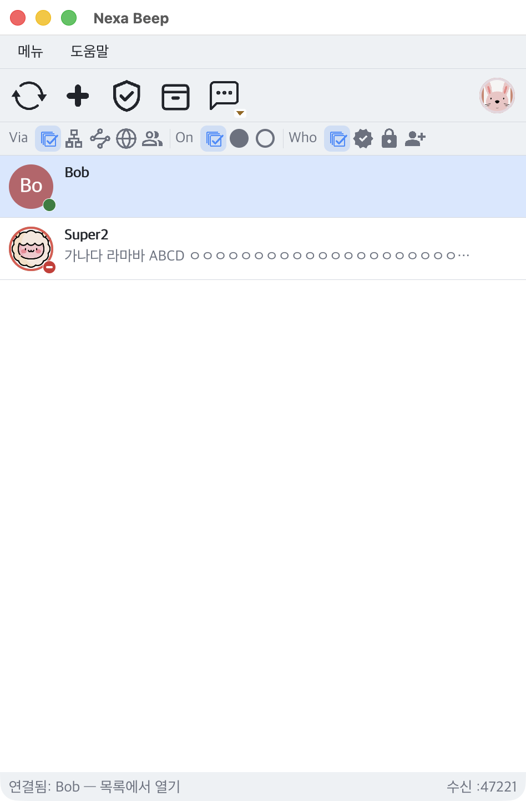 | 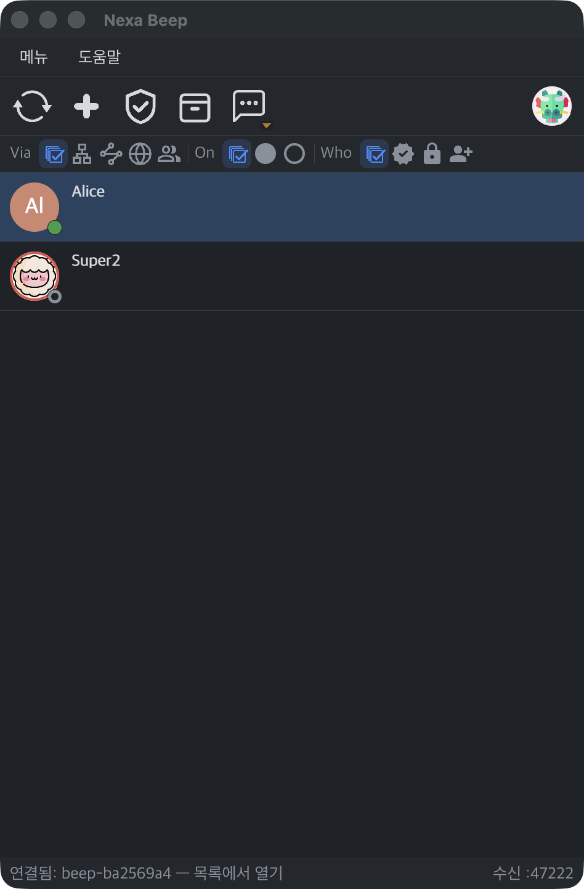 |

**화면 읽는 법**

| 자리 | 뜻 |
|---|---|
| 툴바 왼쪽 5개 | **재발견**(목록 새로 고침) · **주소로 추가**(⌘/Ctrl+K — 다른 망의 상대를 IP/DDNS로) · **격리함**(받은 파일 보관·승인) · **보관함**(격리 해제된 파일) · **대화함**(열린 대화 목록·공지) |
| 툴바 오른쪽 | **연결 아이콘**(서버 연결 상태 — Managed일 때) · **내 아바타** = 클릭하면 **내 프로필** |
| 필터 바 `Via` `On` `Who` | 경로(전체·LAN·서버·인터넷·그룹) · 접속(전체·온라인·오프라인) · 신뢰(전체·대조 완료·핀·처음 본 상대) 칩 — **AND**로 겹친다 |
| 행의 점 | 🟢 온라인 · ⚪ 오프라인 · 🔴− 방금 끊김 · 오른섽 ✔ 배지 = **핀(TOFU)** · 파란 실 배지 = **대조 완료** |
| 상태바 | 마지막 사건 한 줄 + `수신 :포트`(이 실행의 세션 포트) |

> 🆕 **테마는 OS를 따라간다**(v0.2.11~) — 설정 › 모양 › 테마 = 시스템/라이트/다크. 창 장식(제목 표시줄)까지 같이 바뀐다.
> 🆕 **오프라인이어도 행이 남는다**(v0.2.15 예정 · 09-03 수정) — 대화 이력·핀·수동 주소가 있는 상대는 상대가 꺼져도 목록에서 사라지지 않는다([§5](#5-목록-관리--오프라인-행우클릭-메뉴프로필)).

## 2. 대화

목록에서 상대를 **더블클릭**하거나 **Enter**를 누르면 대화가 열린다. 첫 대화면 세션을 먼저 맺는다(1초 안쪽 · 상태바 `대화 열림`).
대화 창은 **두 가지 모드** 중 하나다 — 설정 › 대화 › **대화 창 모드**(다음 대화부터 적용).

| 상대별 **별도 창**(Alice) | **단일 창** — 목록 자리에서 열리고 Esc로 목록 복귀(Bob · 다크) |
|---|---|
| 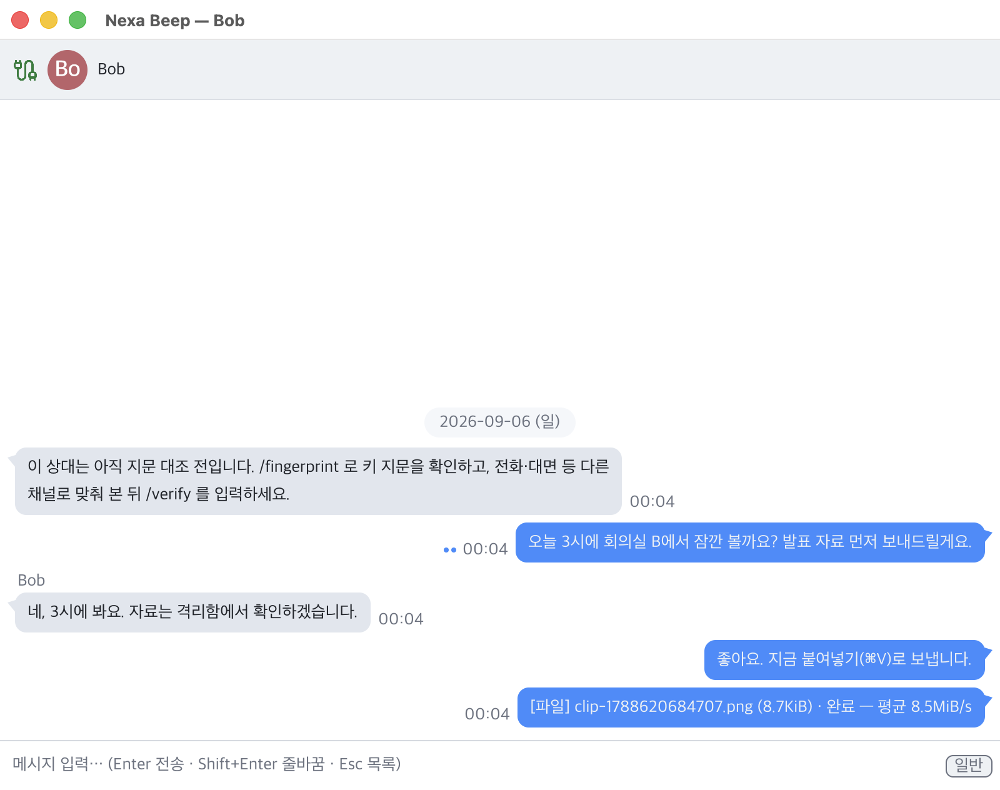 | 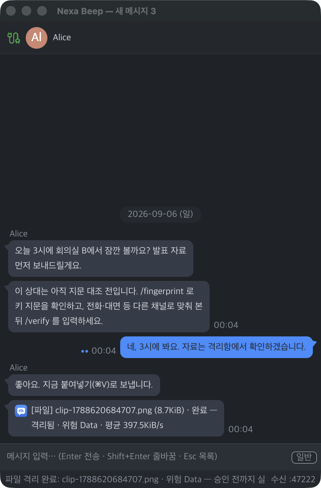 |

- **Enter = 전송 · Shift+Enter = 줄바꿈 · Esc = 목록**. 오른쪽 아래 `일반` = 이 메시지의 등급(일반/알림/긴급 — 누르면 바꾼다 · 상대의 알림 세기는 **상대가** 정한다).
- 내 말풍선 왼쪽 **파란 점 2개** = 상대가 받았고 읽었다(수신·읽음 확인 — 설정 › 대화에서 보내기 여부 선택 · "읽음" 강제는 없다).
- 첫 대화에는 회색 안내가 붙는다 — *"이 상대는 아직 지문 대조 전입니다"*. 진짜 그 사람인지 확인하려면 `/fingerprint` → 전화·대면 등 **다른 채널로 숫자를 맞춘 뒤** → `/verify`([§5-3](#5-3-프로필-카드--키-지문-대조)). 대화 자체는 대조 없이도 **항상 암호화**된다.
- **`/`로 시작하면 명령**(상대에게 나가지 않는다): `/help` `/fingerprint` `/verify` `/trust` `/notice`(이 메시지 알림 등급) `/urgent` `/close`. `/`로 시작하는 문장을 보내려면 `//`.
- 상대가 꺼져 있어도 보낼 수 있다 — **오프라인 큐**(200건 · 재시작 유지)에 들어가 상대가 나타나면 전달된다(내 PC가 켜져 있을 때).

## 3. 파일·이미지 보내기

세 가지 방법이 전부 같은 길을 탄다 — ① 대화 창에 **끌어다 놓기** ② 클립보드 이미지를 **⌘/Ctrl+V** ③ CLI `/send`.

> 🆕 **⌘/Ctrl+V = 이미지 전송**(v0.2.14 — 3-OS 자체 구현). 스크린샷을 찍고 대화 창에서 붙여넣으면 **PNG 파일로 전송**된다.
> Windows·macOS·Linux 어디서도 외부 도구가 필요 없다(Linux는 Wayland/X11 프로토콜을 직접 쓴다 — 종전 `wl-paste`/`xclip` 의존 폐지).

**받는 쪽에는 승인 창이 뜬다** — 보낸 사람·경로 배지·파일 수·이름·크기를 보고 **승인/취소**한다.

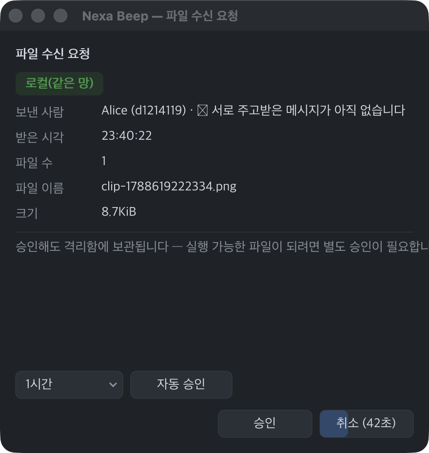

| 표시 | 뜻 |
|---|---|
| `로컬(같은 망)` 배지 | 이 요청이 들어온 **경로 등급**(로컬 / 서버 경유 / 인터넷). 인터넷 경유는 지문 대조 전엔 파일이 막힌다 |
| *"서로 주고받은 메시지가 아직 없습니다"* | **아직 왕래가 없는 상대**의 파일은 자동 승인 설정이어도 **수동 승인으로 강등**된다 — 처음 보는 상대가 파일부터 던지는 것을 막는 규칙 |
| `1시간 ▾` + `자동 승인` | 이 상대를 **기간 한정 자동 승인**으로(설정 › 파일 › 승인 정책이 기본값) |
| `취소 (42초)` | 응답이 없으면 **시간 초과로 자동 취소**(기본 60초 · 설정 › 파일) |
| 안내 문구 | 승인해도 **격리함에 보관**된다 — 실행 가능한 파일로 만들려면 격리함에서 한 번 더 승인 |

- 보낸 쪽 말풍선은 `승인 대기 → 진행률(⏸ ▶ ✕) → 완료 — 평균 속도`로 바뀐다. 받는 쪽은 `완료 — 격리됨 · 위험 Data`처럼 **검사 등급**이 붙는다.
- 요청 한 번에 파일 **최대 5개**(설정) · 10GB급도 메모리에 올리지 않고 흐른다 · **끊겨도 이어받기**(같은 파일을 다시 보내면 받은 데까지 건너뛴다).
- 받은 파일은 **격리함**(툴바 방패)에 `.beepq` 봉인으로 있다. 이미지는 격리된 채로 **미리보기**만 볼 수 있고, 승인하면 보관함으로 나온다(macOS quarantine · Windows MotW 표식 유지 — 복원 뒤에도 OS가 "인터넷에서 온 파일"로 안다).

## 4. 그룹 대화

목록에서 상대를 **여러 명 선택**(⌘/Ctrl+클릭) → 우클릭 → **그룹 만들기**. 방이 하나 생기고 구성원 전원에게 초대가 간다(수락제).
그룹 행을 열면 **한 방에서 대화**하고, 파일도 방 단위로 보낸다(구성원별 승인 · 합산 배너 · 미왕래 구성원은 자동 승인이 아니라 수동).

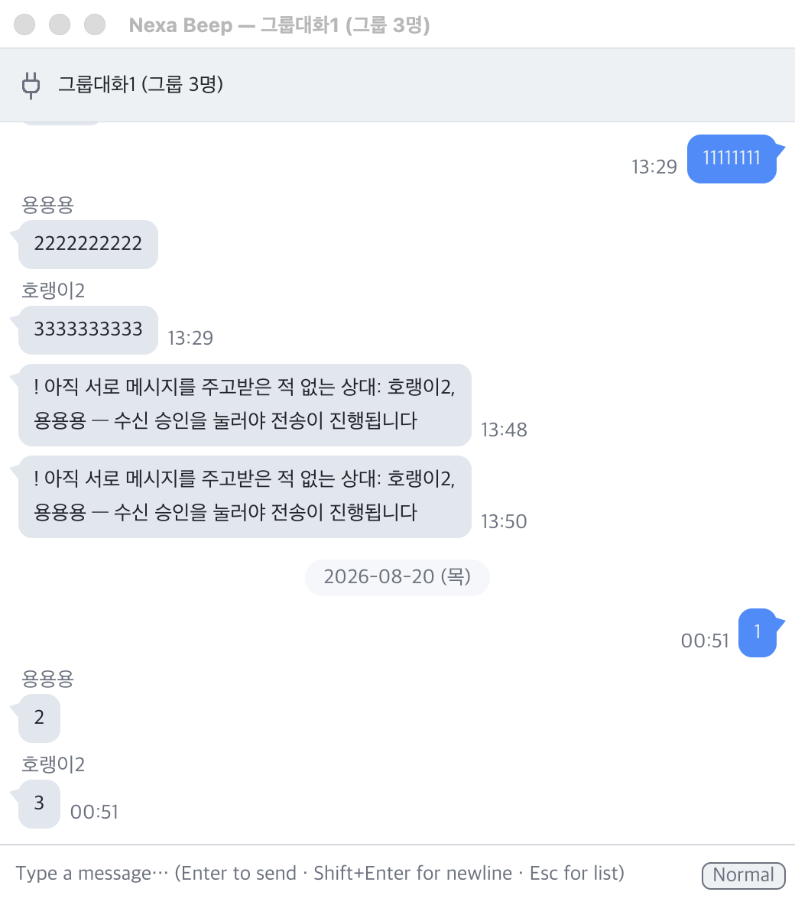

- 그룹 말풍선에는 **보낸 사람 이름**이 붙는다. 그룹 기록도 1:1과 같이 암호화 영속된다.
- 초대·구성원 편집(추가·제외·비소유자의 추천)은 그룹 행 우클릭 → 구성원.

## 5. 목록 관리 — 오프라인 행·우클릭 메뉴·프로필

### 5-1. 🆕 상대가 꺼져도 행이 남는다 (v0.2.15)

대화 이력·핀·수동 주소 중 하나라도 있는 상대는 **오프라인이어도 목록에 남는다**(🔴− = 방금 끊김 · ⚪ = 오프라인).
09-03에 "상대가 종료하면 행이 사라졌다가 재시작하면 돌아오는" 결함을 고쳤다 — 이제 세 경로(발견 만료·goodbye·세션 종료)가 같은 판정을 쓴다.

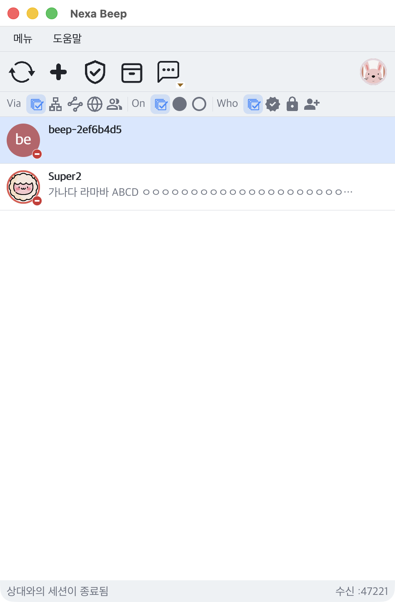

> ℹ️ 상대가 이름을 **공개하지 않았거나 아직 프로필을 받기 전**이면 오프라인 행은 `beep-지문8자리`로 보인다(이름은 상대가 켜 둘 때 세션으로만 온다 — 방송에 실명이 실리지 않는 설계).

### 5-2. 우클릭 메뉴

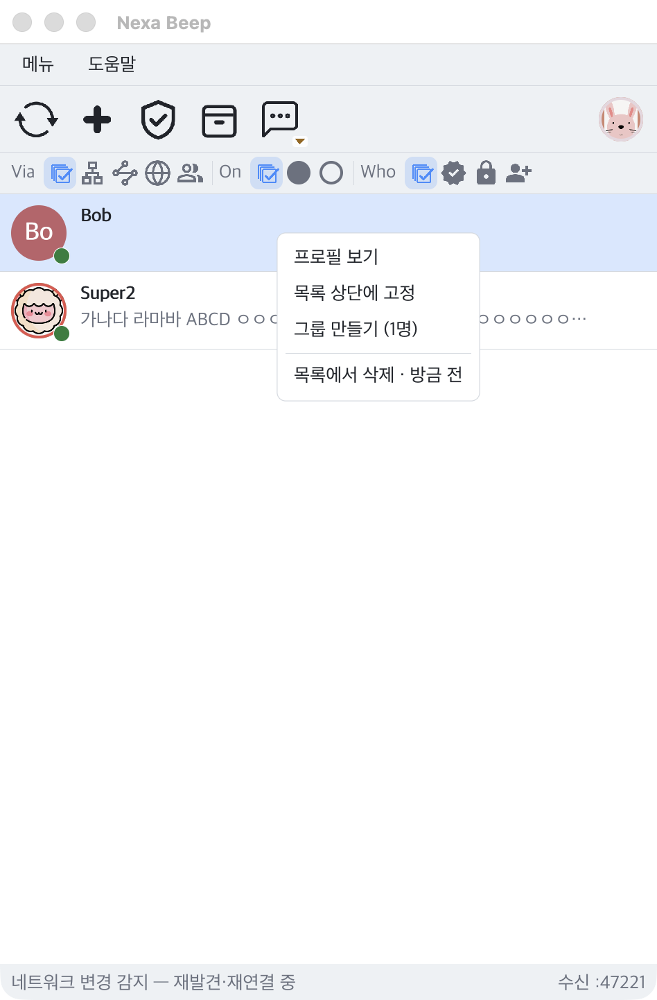

| 항목 | 동작 |
|---|---|
| 프로필 보기 | 상대 카드(§5-3) |
| 목록 상단에 고정 | 핀 고정(정렬 무관 최상단 · 재시작 유지) |
| 그룹 만들기 (N명) | 선택한 상대로 방 생성(§4) |
| 목록에서 삭제 · 방금 전 | 이 상대를 잊는다(핀·이력·수동 주소 삭제 — **대화 기록의 데이터 키가 폐기**되어 복구 불가) |

### 5-3. 프로필 카드 · 키 지문 대조

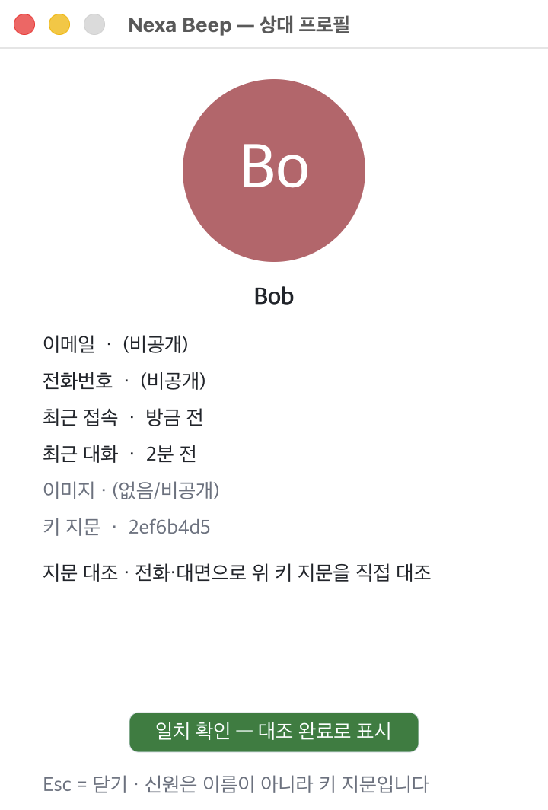

- 이메일·전화 등은 **상대가 공개한 항목만** 보인다(설정 › 프로필의 토글 — 기본 전부 비공개).
- **키 지문**이 곧 신원이다. 이름·IP는 근거가 아니다. 전화·대면으로 지문을 맞췄으면 **`일치 확인 — 대조 완료로 표시`**(또는 대화에서 `/verify`) → 목록 배지가 파란 실 배지로 바뀐다.
- 대조 완료 상대는 알림이 전면 알림으로 올라가고(미검증은 소리 없음), 인터넷 경유 파일 차단도 풀린다.

## 6. 트레이·메뉴바 상주

앱은 **트레이(Windows·Linux)/메뉴바(macOS)** 에 내 아바타 아이콘으로 상주한다. 아이콘 클릭·메뉴의 **열기**로 창을 다시 부르고, **종료**는 여기서만 한다.

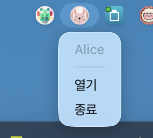

| 설정(고급) | 동작 |
|---|---|
| **닫기 버튼 = 트레이로** | 켜면 X를 눌러도 종료되지 않고 트레이로 내려간다(기본 끔) |
| 🆕 **트레이에 있는 동안 작업표시줄/Dock에서 숨김**(v0.2.15 예정 · 기본 켬) | 트레이로 내려가면 작업표시줄/Dock에서 사라진다(macOS는 Dock 아이콘까지) · 끄면 최소화로 남는다 |
| **시스템 시작 시 자동 실행**(기본 켬) | OS 로그인 시 함께 뜬다 — 관리자 권한 없이 사용자 수준 등록 · 🆕 설치본·포터블·개발 빌드가 **각자 자리**를 갖는다(v0.2.13 — 한쪽을 끄면 다른 쪽이 꺼지던 줄다리기 해소) |

> Linux(GNOME Wayland)는 트레이 "열기"가 셸 토큰으로 진짜 포커스를 얻는다(v0.2.12). 확장(appindicator)이 없는 데스크톱은 [40 알려진 한계](40-known-limitations.md) §6.

## 7. 설정

**⌘/Ctrl+,** 또는 툴바 아바타 › 설정. 왼쪽 트리 + 위 검색(단어를 여러 개 넣으면 AND) · **바꾸는 즉시 적용**되고 조용해진 1초 뒤 저장된다.

| 프로필 | 모양 |
|---|---|
| 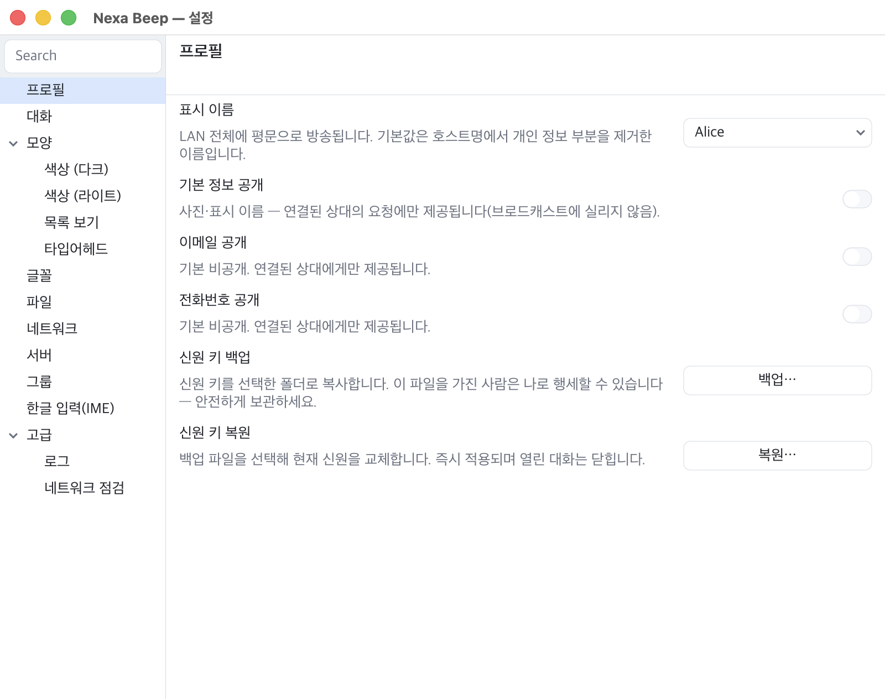 | 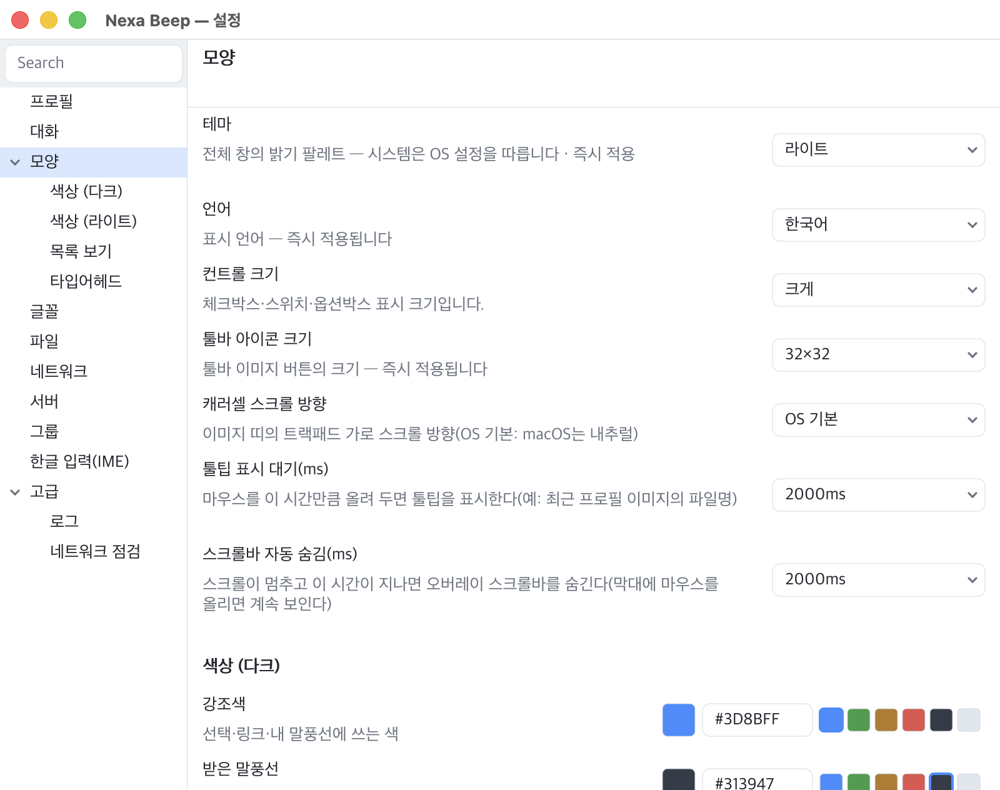 |

- **프로필** — 표시 이름(기본 = 호스트명에서 개인 정보 제거) · 이름/사진/이메일/전화 **공개 토글**(연결된 상대의 요청에만 · 방송에 안 실림) · **신원 키 백업/복원**(`identity.key` = 신원. 기기 교체·포맷 전에 반드시 백업 — 없으면 상대에게 다른 사람으로 보인다).
- **모양** — 🆕 테마 **시스템/라이트/다크** · 언어(한국어·English·中文·日本語 · 즉시) · 컨트롤 크기 · 툴바 아이콘 크기 · 색상 팔레트(다크/라이트 각각 강조색·말풍선·배경·글자).

| 대화 | 서버 |
|---|---|
| 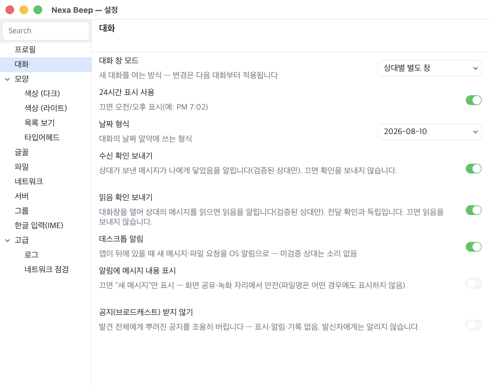 | 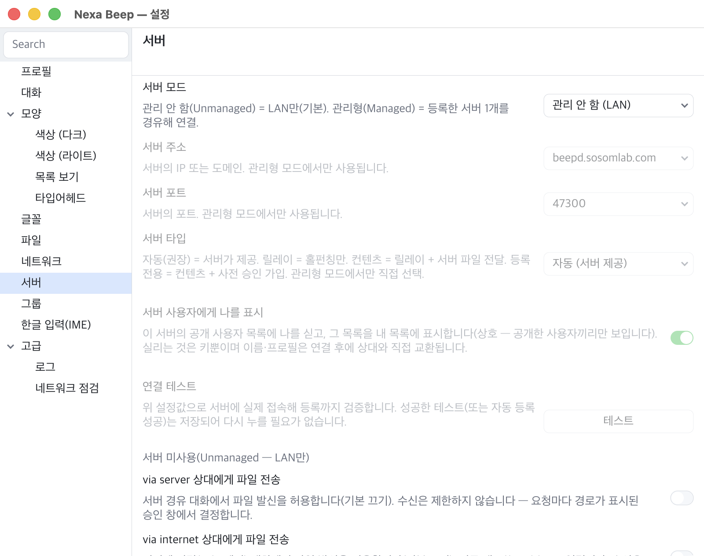 |

- **대화** — 대화 창 모드(별도/단일) · 24시간·날짜 형식 · **수신 확인·읽음 확인 보내기** · 데스크톱 알림(미검증 상대 = 소리 없음) · 알림에 내용 표시 · **공지(브로드캐스트) 받지 않기**.
- **서버** — 기본 **관리 안 함(LAN만)**. 다른 망의 상대와 쓰려면 **관리형(Managed)** + 서버 주소(기본 공식 서버 `beepd.sosomlab.com`) → **테스트** 1회로 서버 키를 핀. `서버 사용자에게 나를 표시`를 켜면 같은 서버의 공개 사용자끼리 목록에 서로 보인다. 서버는 봉투만 보고 **아무것도 저장하지 않는다**(→ [42 릴레이 랑데부 설명서](42-relay-rendezvous-walkthrough.md)).

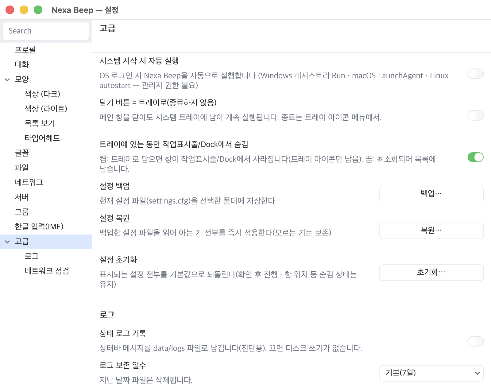

- **고급** — 자동 실행 · 닫기 = 트레이 · 🆕 작업표시줄/Dock 숨김 · 설정 **백업/복원/초기화** · 상태 로그(기본 끔) · 네트워크 점검(netmon — 횟수·바이트만).
- **파일** — 승인 정책(수동/자동/차단 · 자동 승인 기본 기간) · 요청당 파일 수 · 수신 상한 · 송수신 속도 · 응답 시간 초과 · 정지 방치 자동 취소.

### 7-1. 🆕 다중 기기 신원 — 내 PC들을 한 사용자로 (v0.2.15)

설정 › **사용자**. 내 PC가 둘 이상일 때 켠다(기본 꺼짐 = 단독 노드).

1. **다중 기기 신원** 스위치를 켜면 **핸들**(짧은 공개 이름)과 **페어링 암호**가 기본값으로 채워지고 바로 인증된다. 다른 PC에도 **같은 핸들·같은 암호**를 넣으면 끝이다.
2. 페어링 암호는 내 기기끼리만 아는 비밀이다. 서버로 가지 않고 이 PC에 봉인 저장된다. 생성 아이콘(🔄)은 **한 번 누르면 빨강으로 바뀌고 5초 안에 한 번 더** 눌러야 새 암호로 바뀐다. 눈 아이콘은 가림 토글.
3. 같은 값의 PC끼리는 **승인·지문 대조 없이** 서로를 "내 기기"로 인식한다. 목록 행에는 **보라색 인증 배지**, 프로필 카드에는 "내 기기 — 같은 사용자 키로 인증됨"이 뜬다. 파일도 승인 없이 받는다(격리·검사는 그대로).
4. 같은 LAN이면 서버 없이 되고, 다른 망이면 **설정 › 서버**를 관리형으로 켜 둔 상태에서 만난다(서버는 만남 지점만 — 내용·키는 보지 않는다). 처음 만나면 두 PC의 사용자 ID가 **먼저 만든 쪽으로 자동으로 합쳐진다**(30초 안팎).
5. **기기를 잃어버렸을 때** — "사용자 키 교체" 버튼(빨강 → 5초 안 재클릭). 이 PC만 남기고 다른 기기는 전부 폐기되니, 이어서 **페어링 암호를 바꾸고** 아직 가진 기기마다 새 암호를 넣어 다시 결합한다. 상대에게는 옛 ID가 새 ID로 자동으로 이어진다.

- 핸들은 라벨일 뿐 신원이 아니다 — 같은 핸들을 **다른 사용자 키**가 쓰면 목록에 ⚠ 표식이 붙는다(프로필 카드에서 ID로 구분).
- 값을 바꾸면 인증이 풀리고 다시 인증할 때까지 이 기능이 멈춘다. 암호를 바꿔도 사용자 ID는 그대로다.

## 8. 데이터와 보안 — 알아 둘 것

| 항목 | 내용 |
|---|---|
| 데이터 자리 | 포터블 = 실행 파일 옆 `data/` · 설치본 = 사용자 폴더(`~/.config/nexa-beep` · `~/Library/Application Support/nexa-beep` · `%APPDATA%`). **`nexa-beep --whoami`** 가 지문·이름·실행 경로·데이터 경로를 보여 준다 |
| 신원 | `identity.key` 하나. 지우면 **다른 사람**이 된다(핀·격리물도 못 연다) — 설정 › 프로필에서 백업. 🆕 다중 기기 신원을 켜면 `user.key`(사용자 키 · 봉인)가 추가되고 형제 PC끼리 자동 복제된다 |
| 저장 | 대화 기록·핀·그룹·프로필·격리 파일 **전부 봉인(암호화)** · 대화 삭제 = 데이터 키 폐기(복구 불가) · 🆕 비밀 파일은 **소유자만 읽고 쓸 수 있게**(0600 · v0.2.15 — 기동 시 예전 파일도 정리) |
| 기록 이동 | 기기를 옮기면 **기록은 따라가지 않는다**(v1 한계). 신원 키만 옮기면 상대에게 같은 사람으로 보인다 |
| 수신 파일 | 누가 보냈든 **실행하지 않는다**. 격리 → 검사(Windows는 AMSI 실물) → 승인 → 실체화, 그 뒤에도 OS 격리 표식 유지 |
| 보조 실행 파일 | 같은 폴더의 **`nbeep-imgdec`를 지우지 말 것** — 이미지를 권한 낮춘 별도 프로세스에서 디코드한다. 없으면 사진 대신 이니셜 아바타 |

## 9. 문제 해결

| 증상 | 확인 |
|---|---|
| 상대가 목록에 없다 | 같은 LAN인가(게스트 Wi-Fi·VLAN은 멀티캐스트를 막는다) → 툴바 **재발견** → 필터 바 `On` 칩이 온라인만 보고 있지 않은가 → 그래도 없으면 **⌘/Ctrl+K로 IP 직접 추가**(같은 망) 또는 **서버 Managed**(다른 망) |
| 내가 상대에게 안 보인다 | 방화벽이 UDP 47100(발견)·TCP 47200(세션)을 막는지 · 상태바 `수신 :포트` 확인 · 두 인스턴스가 한 PC에서 같은 포트를 물지 않았는지(`--port`) |
| 붙여넣기(⌘/Ctrl+V)가 안 된다 | v0.2.14부터 외부 도구 없이 동작한다. 그래도 안 되면 클립보드에 **이미지**가 있는지(텍스트는 글로 붙는다) · Linux X11/KDE는 실기 중 |
| 파일이 `승인 대기`에서 멈춘다 | 상대 화면의 승인 창을 기다리는 중 — 60초 지나면 자동 취소 · **아직 왕래가 없는 상대**는 자동 승인이어도 수동으로 강등된다(메시지를 한 번 주고받으면 풀린다) |
| 재시작하니 상대가 나를 모른다 | `identity.key`가 바뀌었다(임시 폴더에 두었거나 지웠다) — `--whoami`의 지문이 전과 같은지 · 백업 복원 |
| 트레이에서 "열기"를 눌러도 창이 안 뜬다(Linux) | GNOME은 appindicator 확장 필요 · [40 §6](40-known-limitations.md) |

## 10. 부록 — 이 캡처를 다시 찍는 법(앱 페이지·릴리스 노트용)

같은 PC에서 신원 두 개를 띄우고 **창 ID로** 찍었다(겹친 창에 영향받지 않는다). 절차는 [26 §3-4](26-run-and-manual-test.md)의 다신원 원리와 같다.

```bash
# ① 신원 폴더 2개(실행 파일 옆 data/ = 그 인스턴스의 신원·설정)
for id in E F; do mkdir -p /tmp/cap/id$id/data && cp target/release/{nexa-beep,nbeep-imgdec} /tmp/cap/id$id/; done
printf '_schema=1\nchat.window_mode=separate\nprofile.display_name=Alice\nui.language=ko\nui.theme=light\nxfer.approval=auto\napp.autostart=off\n' > /tmp/cap/idE/data/settings.cfg
printf '_schema=1\nchat.window_mode=single\nprofile.display_name=Bob\nui.language=ko\nui.theme=dark\nxfer.approval=auto\napp.autostart=off\n'   > /tmp/cap/idF/data/settings.cfg
(cd /tmp/cap/idE && ./nexa-beep --window --live --port 47221 &) ; (cd /tmp/cap/idF && ./nexa-beep --window --live --port 47222 &)
# ② macOS: 창 ID 목록(CGWindowList) → screencapture -l <id>  · 조작은 cliclick(클릭) + 클립보드 붙여넣기(IME 우회) + System Events의 Return
screencapture -x -o -l <windowID> out.png
```

- 텍스트는 `pbcopy` → ⌘V로 넣는다(합성 키 입력은 한글 IME를 타 깨진다). Return은 `osascript -e 'tell application "System Events" to keystroke return'`.
- 파일 전송을 자동으로 완주시키려면 **양쪽이 메시지를 한 번씩 주고받은 뒤**(미왕래 강등 규칙) `xfer.approval=auto`여야 한다.
- 캡처 대상 프로세스를 먼저 `frontmost`로 올린 뒤 클릭해야 키 입력이 그 창으로 간다(다른 인스턴스가 키를 먹는다).
