# 48 · ADR-0015 결정 사항 상세 — 추가 조사 · 설계 변경 · 기능/성능/보안 영향 · 흐름도

> **작성 2026-09-06** · 대상 = [46 ADR-0015](46-adr-0015-userid-handle-passphrase.md) + [47 검토 보고서](47-adr-0015-review-userid-continuity.md) · 브랜치 `feat/userid-handle`
> **사용자 요청**: *"추가 결정이 필요한 사항을 상세히 조사(혹은 물어보고) · 결정대로 개발했을 때 설계 변경 상세 · 기능·성능 영향 · 보안 영향 · Mermaid로 흐름·순서·개념."*
> **읽는 법**: §0 표 → §2 개념도 → §3 흐름도(시퀀스 8) → §4 결정별 상세 → §5 성능 · §6 보안 종합. 전부 **47의 3층 구조** 를 전제로 쓴다. 🔴 표시 항목은 **09-06 사용자 답변으로 전부 권고안 확정**(§8 · 46 §9).

---

## 0. 결정 9문항 — 권고 · 근거 · 영향 등급

| # | 질문 | 권고 | 한 줄 근거 | 기능 | 성능 | 보안 |
|:--:|---|---|---|:--:|:--:|:--:|
| D-32-1 | 형제 기기 소속 증명 | **XXpsk3 + UserKey 서명 목록** | PSK = 형제 사이 증명, 서명 = 제3자 검증. 둘이 다른 일을 한다(§4-1) | 대 | 소 | **대** |
| D-32-2 | (47로 대체) | — | — | | | |
| 🔴 D-32-3 | 제약 해제 범위 | **사람 판정 전부 해제 · 파일 판정 유지** | DR-13은 발신자 무관(§4-3) | 대 | — | 중 |
| 🔴 D-32-4 | 동기화 1차 범위 | **sender copy + 따라잡기 200줄** | copy만이면 "꺼졌던 기기"가 비어 남는다(§4-4) | 대 | 중 | 소 |
| 🔴 D-32-5 | 컨텐츠 모드 착수 | **S0~S4 실기 후 별도 결정** | 서버 저장·쿼터·배포가 동반(§4-5) | 대 | 대 | 대 |
| 🔴 D-32-6 | 패스프레이즈 저장 | **`profile.sec` 봉인** | 평문이면 폴더 복사 = 전 기기 탈취(§4-6) | — | — | 중 |
| 🔴 D-32-7 | 강도 정책 | **표시+경고 · 자동 추천 12자** | 온라인 추측만 가능하므로 강제는 과하다(§4-7) | 소 | — | 중 |
| D-32-8 | UserId 원천 | **무작위 UserKey(전 기기 복제 · 봉인)** | 암호 변경 ≠ 신원 변경(47) | 대 | 소 | **대** |
| D-32-9 | 폐기 경쟁 | **정직한 충돌 표시** | 자동 승자 = 공격자 승리(47 §3-3) | 중 | — | **대** |

---

## 1. 추가 조사 결과 (사실 · 09-06)

| # | 조사 | 결과 | 설계 반영 |
|:--:|---|---|---|
| F-1 | `snow 0.9.6` PSK API | `Builder::psk(location, key)` (`builder.rs:105`) · `Token::Psk(n)` 처리 `handshakestate.rs:259` · **psk 패턴이면 `e` 토큰 뒤 `MixKey(e.pub)`** (`:243, :369` `is_psk()`) | 의존 신규 0 · `initiate_psk/accept_psk` 두 함수로 끝 |
| F-2 | **인바운드에서 XX / XXpsk3를 어떻게 가르나** | F-1의 MixKey(e) 때문에 **XXpsk3의 1번 메시지 payload는 e.pub에서 파생된 키로 AEAD 봉인**된다(비밀 없이 누구나 열 수 있지만 **인증 태그**가 붙는다). 응답자가 XXpsk3 상태로 1번을 파싱해 태그가 맞고 payload가 마커 `NBPSK1`이면 psk 경로, 태그 실패면 XX로 재파싱. **DH 없이 해시 1회 + AEAD 1회** — 추가 왕복 0 | §3-2 시퀀스 · **실측 항목 T-1** |
| F-3 | 서명 의존 | `curve25519-dalek 4.1.3`이 이미 트리에 있다(snow). **`ed25519-dalek 2.x`는 같은 4.x를 쓴다** → 트리 증가 = 크레이트 1개. 3.0은 `curve25519-dalek 5`라 **중복 트리** — 2.x로 핀 | DR-5 산출물 +약 50~80KB(추정 · 실측 T-2) |
| F-4 | 발견 패킷 꼬리 확장 | `wire.rs:138` `bytes.len() != FIXED + name_len` → **길이 엄격** · 꼬리 확장 불가 · 미지 `WIRE_VER`는 `None`으로 조용히 폐기 | LAN 힌트는 **별도 패킷**(`kind = UserHint` · 새 ver) — 구버전은 폐기, 신버전만 읽음. 힌트는 **최적화**이고 없어도 §3-4 폴백으로 동작 |
| F-5 | 힌트 없이 형제를 만났을 때 | XX 세션 → `UserHello`에서 같은 UserId **주장** → 증명이 없으므로 **XXpsk3로 재세션**(1회 추가 핸드셰이크) → 성립 시 형제 확정 | 릴레이 첫 만남(RID_pair)은 힌트 자체 · LAN은 힌트 패킷 또는 폴백 |
| F-6 | 폐기 경쟁 완화 시간 | 후계 증명서는 **세션 성립 시 즉시** 제시(UserHello에 동봉) · 상대가 오프라인이면 다음 접촉 | 시간 우위는 "먼저 접촉한 쪽" — 정당 사용자는 기기 대부분과 이미 세션이 있어 유리 |

---

## 2. 개념도

### 2-1. 3층 신원과 키 파생

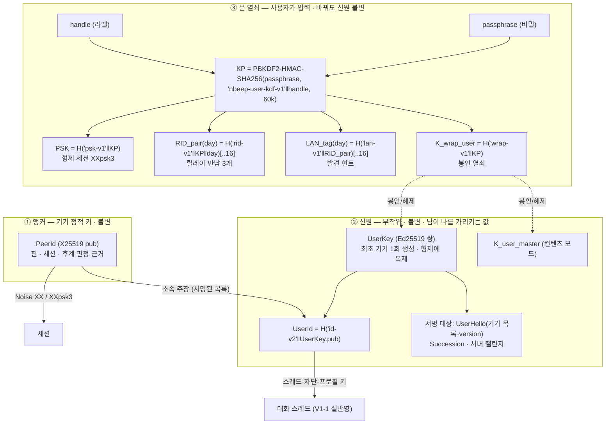

### 2-2. 신뢰의 출처 — 누가 무엇을 증명하나

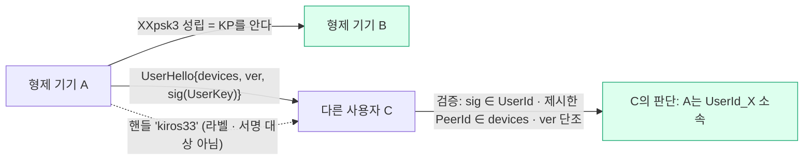

---

## 3. 흐름도 (시퀀스)

### 3-1. 부트스트랩 — 첫 기기와 두 번째 기기

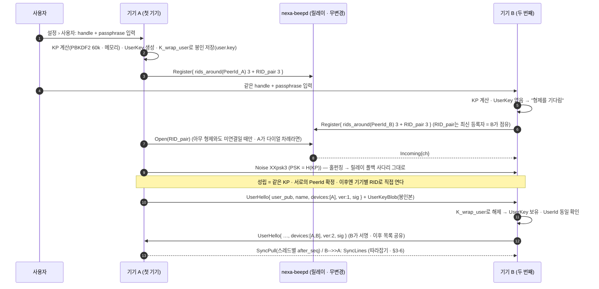

### 3-2. 인바운드 패턴 판별 — XX인지 XXpsk3인지 (추가 왕복 0)

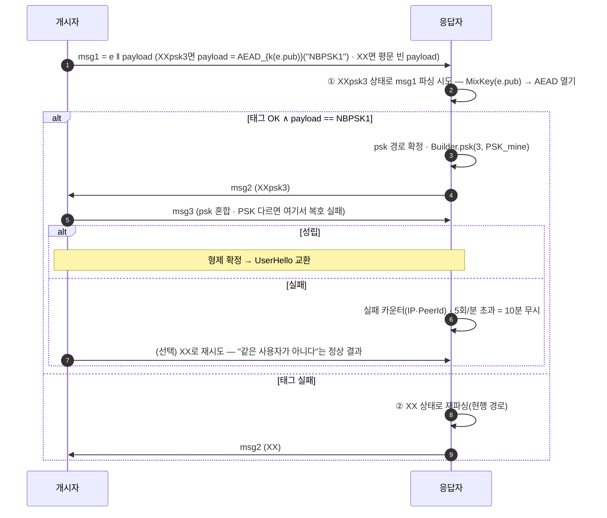

> ★ 실측 항목 T-1: snow에서 msg1 파싱 실패 후 **새 HandshakeState로 같은 바이트를 재파싱**하는 것은 상태가 독립이라 문제없다(각 Builder가 새 상태). 비용 = 해시 2회 + AEAD 1회.

### 3-3. 다른 사용자와의 세션 — 서명된 기기 목록으로 스레드 접기

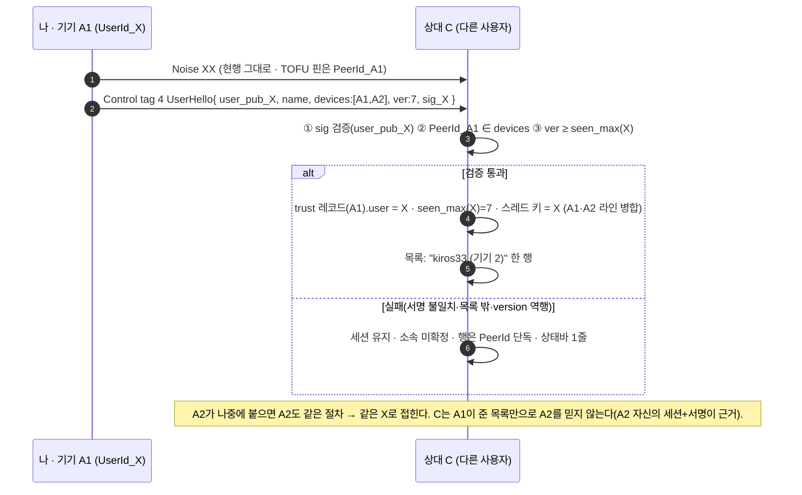

### 3-4. 힌트 없이 만난 형제 — 폴백(XX → 주장 → XXpsk3 재세션)

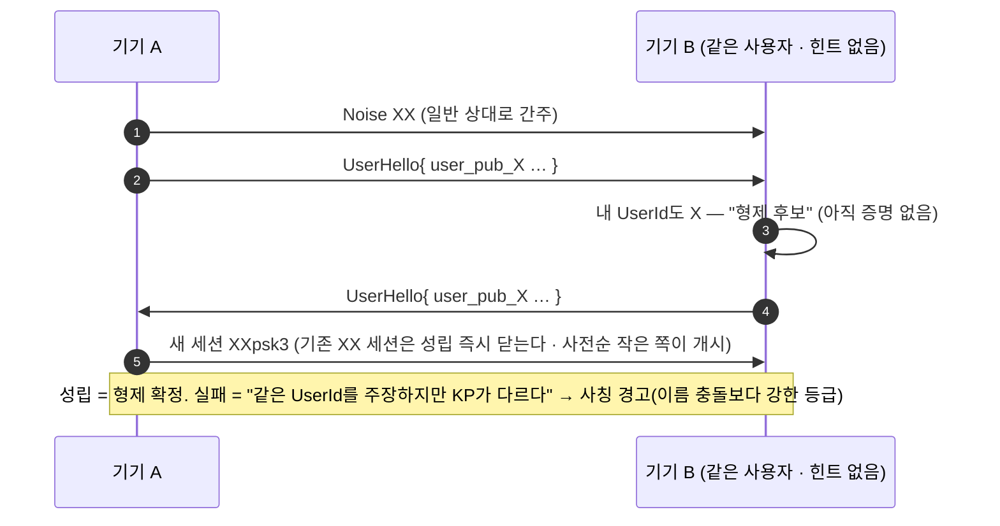

### 3-5. 메시지 발신 — sender copy와 확인 응답

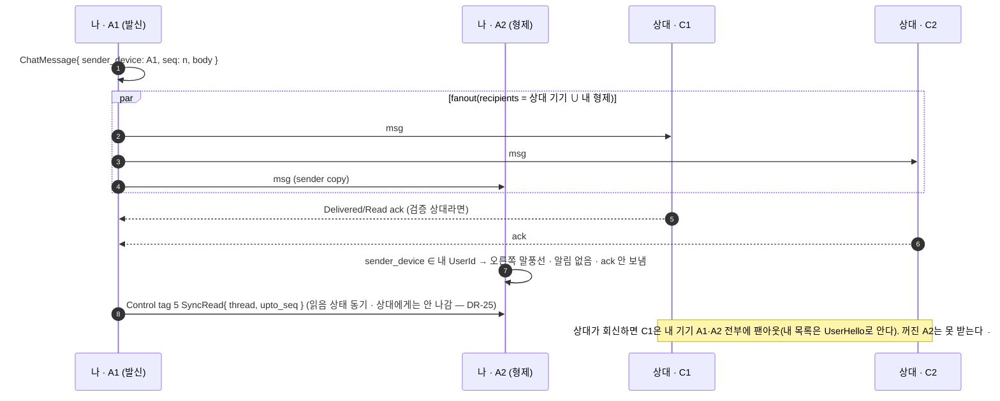

### 3-6. 따라잡기 — 꺼졌던 기기가 돌아왔을 때

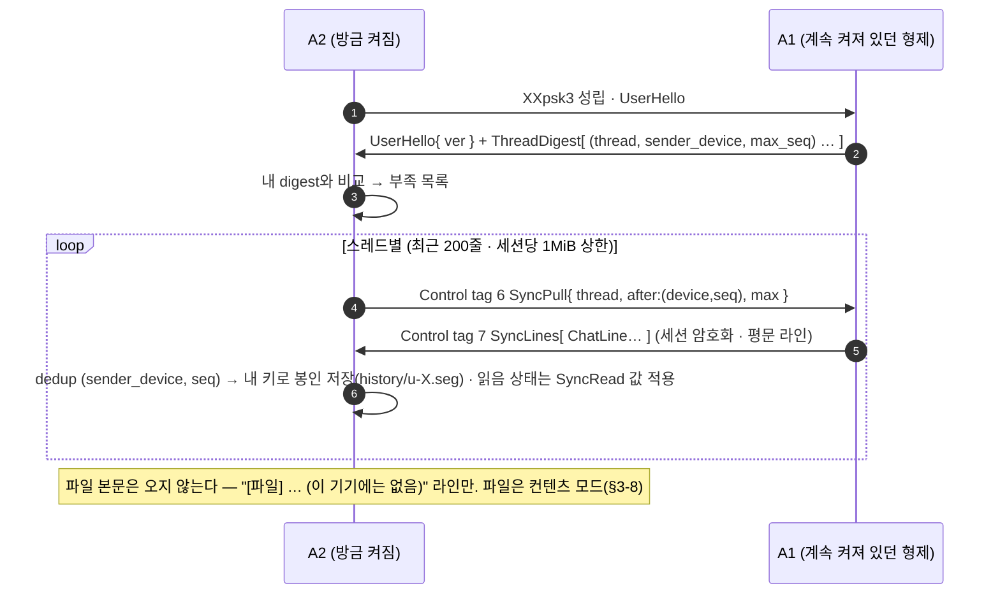

### 3-7. 암호 변경 vs 기기 분실 — 무엇이 바뀌고 무엇이 안 바뀌나

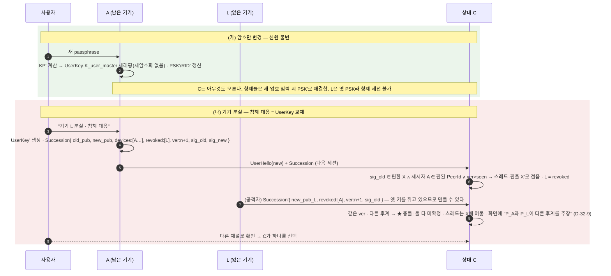

### 3-8. 컨텐츠 모드 — 동기 저장소와 파일 (S5 · 별도 결정)

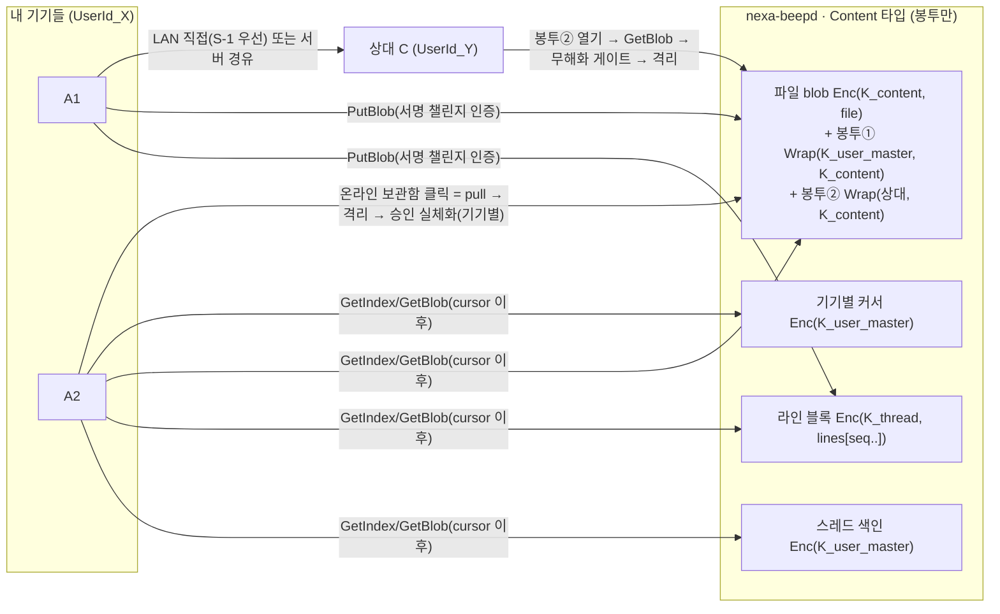

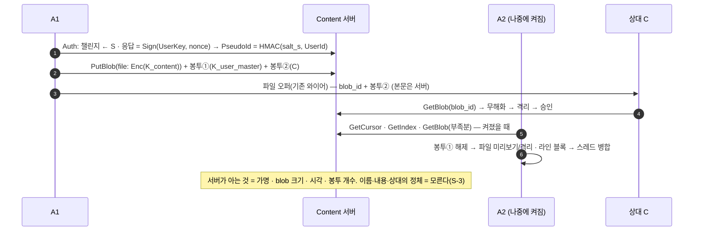

### 3-9. 기기 소속 상태도

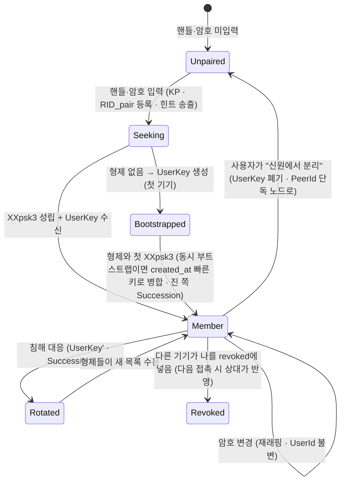

---

## 4. 결정별 상세 — 설계 변경 · 기능 · 성능 · 보안

### 4-1. D-32-1 소속 증명 = XXpsk3 + 서명 목록 (권고 확정)

| 항목 | 내용 |
|---|---|
| **설계 변경** | `nbeep-crypto::noise`: `PARAMS_PSK = "Noise_XXpsk3_25519_ChaChaPoly_BLAKE2s"` · `initiate_psk(link, id, psk)`/`accept_any(link, id, psk_opt)`(§3-2 판별) · msg1 payload 마커. `nbeep-core`: `UserHello`(Control 4) 인코더/서명 검증 · `TrustRecord.user/list_ver/seen_max`. 문서: 46 §3-2·§5-3 개정, [08 ADR-0002](08-adr-0002-discovery-transport.md) §4에 "psk 변종" 절 추가 |
| **기능** | 형제 기기 = 승인 0회(요구 R-2 근거) · 제3자는 서명 목록으로 기기 N대를 한 행으로 접는다 · 힌트 없어도 폴백(§3-4)으로 성립 |
| **성능** | XXpsk3는 XX와 **DH 횟수 동일**(psk는 해시 혼합) → 핸드셰이크 비용 ≈ 동일 · 판별 = 해시 2회+AEAD 1회 · 폴백 경로는 핸드셰이크 1회 추가(형제 첫 만남 1회뿐) · Ed25519 검증 ≈ 0.1ms/UserHello(세션당 1회) |
| **보안 +** | 사람의 SAS 대조가 빠진 자리를 **암호학적 증명**이 채운다 · 도청자는 핸드셰이크 기록으로 암호를 검증 못 한다(온라인 추측만) · A-1(남의 기기 편입 주장)은 **서명**으로 막힌다(46 원안의 "재확인"보다 강함) |
| **보안 −/잔여** | **PSK 실패 오라클**: 응답자가 "psk 불일치"로 끊는 사실 자체가 추측 1회의 답 → 실패 백오프 필수(§3-2) · 형제 세션은 **전방 비밀성은 유지**(임시 DH)하나 PSK 유출 = 이후 모든 형제 세션 성립 가능(=암호 유출과 동일) · 서명 키 유출(=UserKey) = 제3자에게 기기 편입 가능 → 47 §3-3 |

### 4-2. D-32-8 UserId = H(무작위 UserKey.pub) · 전 기기 복제 (권고 확정)

| 항목 | 내용 |
|---|---|
| **설계 변경** | `nbeep-crypto::userkey`: Ed25519 생성·서명·검증(`ed25519-dalek 2`) · `user.key` 봉인 파일(sealed · 도메인 `user-key-v1` · K_wrap_user) · 형제 세션 성립 시 `UserKeyBlob` 동기(Control 9) · 동시 부트스트랩 병합 규칙(created_at → pub 사전순) · 46 §3-1 파생식에서 `UserId` 줄 교체 |
| **기능** | 암호·핸들 변경이 신원을 안 바꾼다 · 어느 기기에서든 기기 추가 · 복구 시드 불필요(암호+살아 있는 기기 1대) |
| **성능** | 키 생성 1회 · 파일 +100B · 세션당 서명 1회/검증 1회 · 무시 가능 |
| **보안 +** | 선점 불가(256비트 무작위) · 서버 이름공간은 서명 챌린지 · 후계 증명서로 연속성(47 §3-2) |
| **보안 −/잔여** | **UserKey가 전 기기에** → 기기 1대 침해 = 서명 능력 탈취 → 폐기 경쟁(47 §3-3) · 완화 = 정직한 충돌(D-32-9) + 암호 동시 변경으로 형제 세션 차단 · **v2 주 기기 승격** 경로 유지 |

### 4-3. 🔴 D-32-3 제약 해제 범위

| 해제 후보 | 권고 | 기능 영향 | 보안 영향 |
|---|:--:|---|---|
| TOFU 첫 접촉 절차 | 해제 | 형제는 즉시 `Verified` 표시 | 근거 = PSK(4-1) · 위험 없음 |
| SAS/`/verify` | 해제 | 권유 줄 없음 | 동일 |
| 파일 **승인**(미왕래 강등 포함) | 해제 | 형제가 보낸 파일 = 자동 승인 → 격리 | **격리는 유지**되므로 실행 위험 없음. 잔여 = 형제 기기가 침해됐을 때 악성 파일이 격리함까지는 자동으로 들어온다(실체화는 여전히 사람) |
| 원격 인바운드 요청 대기(FR-S-25) | 해제 | 다른 망의 내 기기가 모달 없이 붙는다 | 근거 = PSK · 위험 없음 |
| 원격 파일 차단(대조 전) | 해제 | 다른 망의 내 기기와 파일 | 동일 |
| OS 알림 무음 | 해제(단 sender copy는 무알림) | 형제 메시지 알림 정상 | — |
| **격리·무해화·기기별 실체화** | **유지** | "일반 메신저"와의 마지막 차이 | DR-13 · 발신자 무관 |
| **차단 단위** | PeerId → UserId | 상대 사용자 차단 = 기기 전부 | ADR-0007 §9-2 |

> 물음: 파일 승인까지 자동으로 할지(권고) vs 남길지. 남기면 "형제가 보낸 파일도 승인 창"이 뜬다 — 요구 R-2와 충돌하지만 침해 기기 방어는 한 겹 더 남는다.

### 4-4. 🔴 D-32-4 동기화 1차 범위

| 안 | 기능 | 성능 | 보안 |
|---|---|---|---|
| ⓐ sender copy만 | 켜져 있는 기기끼리만 같은 대화 · 꺼졌던 기기는 그 기간이 **비어 남는다** | 발신 대역 × (형제 수) | 형제 세션 안 · 추가 면 없음 |
| **ⓑ + 따라잡기 200줄** | 꺼졌던 기기도 복귀 시 최근 대화 복원 · 읽음 상태 동기 | 복귀 시 스레드당 ≤200줄 · 세션당 ≤1MiB(설정) · 대량 이력은 컨텐츠 모드 | 형제 세션 안 · **침해 형제가 라인 주입 가능**(dedup 키가 같으면 무시 · 새 seq면 들어온다) → 형제는 이미 전면 신뢰이므로 새 면이 아님 |
| ⓒ + 전체 이력 | 전 기록 복원 | 대량 · 예산 위험 | 동일 |

### 4-5. 🔴 D-32-5 컨텐츠 모드 착수 시점

| | 지금(S4 직후) | **실기 후 별도 결정** |
|---|---|---|
| 필요한 것 | beepd `Content` 와이어 5종 · 저장·쿼터·TTL · 서명 인증 · 배포(`beepd-v*`) · 실 NAT 실기 · 보관함 온라인(X-3) | S0~S4를 2-PC로 실기해 **따라잡기만으로 충분한지** 먼저 본다 |
| 성능 | 서버 디스크·대역(쿼터 설계 없이는 무제한) | — |
| 보안 | 서버가 **사용자별 암호문 덩어리를 장기 보관**(L1 90일 기본) · 가명 이름공간 · 쿼터 소진 공격 · 서명 챌린지 재생 방지 | — |
| 권고 이유 | "일반 메신저처럼"의 마지막 조각이지만 **범위가 다른 마일스톤**이고, 사용자 마스터 키(암호 = 전 기록의 열쇠)라는 **새 위협 모델**을 함께 열어야 한다 | |

### 4-6. 🔴 D-32-6 패스프레이즈 저장

| 안 | 내용 | 보안 |
|---|---|---|
| **ⓐ `profile.sec` 봉인**(권고) | 기존 PII 사이드카(기기 키 파생 봉인 · 0600) | 폴더 복사만으로는 못 읽는다(identity.key 동반 필요 — 그건 이미 신원 탈취) |
| ⓑ `settings.cfg` 평문(clip 동일) | 설정 백업/복원에 그대로 포함 | 백업 파일·동기화 폴더에 평문 노출 |
| ⓒ 저장 안 함(매 기동 입력) | — | 제로컨피그·자동 실행과 충돌 |

### 4-7. 🔴 D-32-7 강도 정책

온라인 추측만 가능(§4-1) + 실패 백오프 → 초당 시도가 수 회로 제한된다. 12자 자동 추천(≈59비트)이면 실질 안전. 사용자가 짧은 암호를 고르면 **경고만**(clip D-29 동일). 강제 최소 길이는 "내 기기끼리 묶는 데 왜 이렇게 복잡하냐"는 이탈을 부른다.

### 4-8. D-32-9 폐기 경쟁 = 정직한 충돌 (권고 확정)

설계 변경: `trust.seg`에 `pending_succession[]` · 목록/카드에 "후계 충돌" 배지 · 대화창 시스템 라인 · 사용자 선택 시 다른 후보는 `revoked` 처리. 기능: 정상 경우(경쟁 없음)엔 아무것도 안 보인다. 보안: 자동 승자를 두지 않는 것이 유일하게 공격자가 못 이기는 규칙.

---

## 5. 성능 종합 (DR-5 예산 게이트 대조)

| 항목 | 현행 | 변경 후 | 예산 |
|---|---|---|---|
| 세션 수 | 상대 기기 1:1 | 상대 기기 수 × 내 기기 수 + 형제 세션 | 그룹 팬아웃과 같은 성질(ADR-0007 §10) · 유휴 RSS 영향 = 세션당 수 KB |
| 핸드셰이크 CPU | XX | XXpsk3 ≈ 동일 · 판별 +해시 2·AEAD 1 · Ed25519 검증 1회/세션 | 무시 |
| KDF | — | PBKDF2 60k **부팅 1회**(≈30~80ms · 워커) · 암호 변경 시 1회 | 무시 |
| 발신 대역 | 1× | (상대 기기 수 + 형제 수)× — 텍스트는 무시 · **파일은 상대 기기 수만큼**(형제에겐 안 보냄) | UI 명시 |
| 따라잡기 | — | 복귀 시 ≤1MiB/세션 | 설정 |
| 발견 패킷 | ≤512B | 힌트 패킷 별도(+약 60B · 광고 주기의 1/3) | 예산 안 |
| 릴레이 등록 | RID 3 | RID 6 | `MAX_RIDS 8` 안 · 서버 무변경 |
| 저장 | `{peer}.seg` | + `u-{uid}.seg` · `user.key` 100B · trust 레코드 +80B | 무시 |
| 산출물 | 2.84MB | + `ed25519-dalek 2`(추정 +50~80KB · **실측 T-2**) | ≤10MB |
| 의존 | — | +1(퍼미시브 BSD-3 · DR-12 ✅) | 런타임 의존 0 유지 |

---

## 6. 보안 종합 — 위협 모델의 변화

### 6-1. 변하지 않는 것(불변식)

| | 유지 근거 |
|---|---|
| E2E — 릴레이·컨텐츠 서버는 평문을 못 본다(DR-7 · S-3) | PSK·UserKey·마스터 키 전부 종단에만 · 서버는 봉투 |
| 수신 파일은 누가 보냈든 실행하지 않는다(DR-13) | 형제 파일도 격리 · 실체화는 사람 |
| 제로컨피그(DR-1 · S-0) | 핸들·암호는 **옵트인** · 안 넣으면 현행 그대로 |
| 신원 신뢰는 키에(DR-28) | 핀·후계 판정의 앵커 = PeerId |
| 발견 패킷은 힌트(08 §2) | LAN_tag는 힌트 · 판정은 핸드셰이크 |

### 6-2. 새로 생기는 공격면과 방어

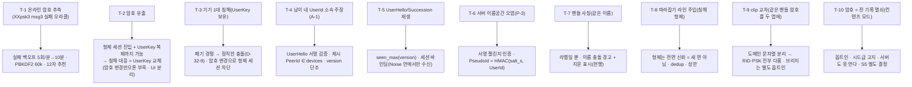

### 6-3. 약해지는 것(감수) · 강해지는 것

| 약해지는 것 | 강해지는 것 |
|---|---|
| 형제 기기 사이의 신뢰가 **비밀 하나**에 걸린다(종전 = 기기마다 SAS) | 재설치·기기 교체가 사칭 경고를 띄우지 않는다(ADR-0007 §3 ③의 이득이 앞당겨진다) |
| 기기 1대 침해 = 서명 능력(전 기기 복제) | 제3자에 대한 기기 편입 주장이 **서명**으로 검증된다(현행은 아무 검증도 없음) |
| 컨텐츠 모드에서 암호 = 전 기록 열쇠 | 선점 불가 · 후계 연속성 · 서버 이름공간 서명 잠금 |

---

## 7. 실측 항목 (착수 시 게이트)

| # | 항목 | 통과 기준 |
|:--:|---|---|
| T-1 | snow XXpsk3 msg1 AEAD 판별(§3-2) | 인메모리 링크 회귀: psk↔psk 성립 · psk→XX 폴백 · XX→psk 실패 · PSK 불일치 = msg3 실패 · 추가 왕복 0 |
| T-2 | `ed25519-dalek 2` 산출물·트리 | `cargo tree` 중복 0 · 산출물 증가 ≤100KB · lockdown 무관 |
| T-3 | PBKDF2 60k 시간(3-OS) | ≤100ms · 워커 · UI 무정지 |
| T-4 | 2-PC 실기 | Win↔mac 같은 핸들·암호 → "내 기기" 배지 · 승인 0회 파일 · sender copy · 꺼졌다 켜기 = 따라잡기 · 암호 변경 후 재결합 · 침해 대응 후 상대 화면 병합 |
| T-5 | 힌트 없는 LAN(구버전 상대 섞임) | 폴백(§3-4) 성립 · 구버전은 힌트 패킷 폐기 · 미지 Control 태그 무시 |

---

## 8. ✅ 사용자 답변(09-06) — 4문항 전부 권고안 확정 → [46 §9](46-adr-0015-userid-handle-passphrase.md) 표

1. **D-32-3** 파일 승인까지 자동인가(권고) · 승인 창은 남기는가.
2. **D-32-4/5** 1차 = sender copy + 따라잡기 200줄(권고) · 컨텐츠 모드는 실기 후 별도 결정(권고) — 아니면 지금부터 S5까지 한 마일스톤으로.
3. **D-32-6/7** 암호 = `profile.sec` 봉인(권고) · 강도 = 경고만(권고).
4. **D-32-8** UserKey 전 기기 복제(권고 · 아무 기기에서나 추가 · 폐기 경쟁은 충돌 표시) vs ADR-0007 주 기기 전용(경쟁 없음 · 주 기기 켜야 추가 · 복구 시드).
